Title: Building an AI-Powered E-Commerce Store from Zero to One
Date: 2026-06-18
Tags: django, react, vite, gemini, ai, e-commerce, docker, mermaid, rest, portfolio, smartshop
Description: An end-to-end walkthrough of SmartShop - a Django REST + React + Google Gemini storefront with personalised recommendations, semantic search, and an in-app shopping assistant. Architecture, models, auth, the recommendation cascade, smart search, Docker, and a clean public release.

---

A user clicks **Buy** on a 4K Smart TV. Instantly, the storefront doesn't just suggest a soundbar - it inspects their previous purchase of a laptop and surfaces a portable solar charger as a complement. That intent-aware jump from rule-based recommendations to LLM-shaped suggestions is the heart of this build.

This post is the full journey of **SmartShop**, our reference storefront. Everything you read about here lives in the public repo [github.com/nurazhardotcom/lithan_smartshop](https://github.com/nurazhardotcom/lithan_smartshop). Code, branches, configs, demo screenshots, and a one-liner to bring the whole stack up.

> Goal of the post: by the end, you should be able to fork the repo, paste a Gemini key, and demo the entire flow to a stakeholder in under a minute.

---

## Diagram 1 - What SmartShop actually is

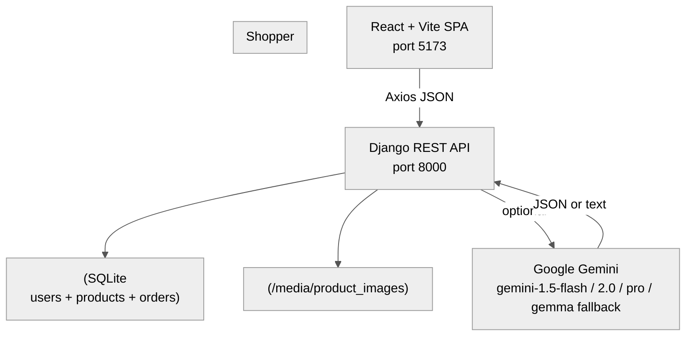

Two services, one persistent volume for media, an optional AI leg. Everything else is convention.

## Diagram 1a - Complete request lifecycle

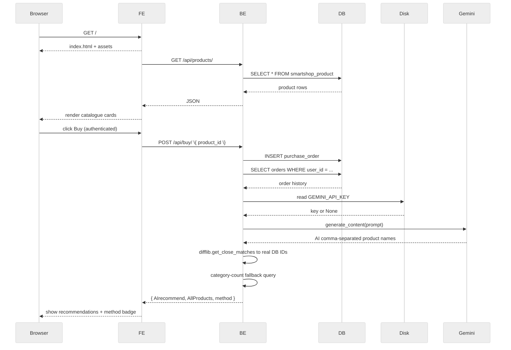

This is the loop that runs from cold start to a personalised recommendation in under a second.

## Diagram 1b - System trust boundaries

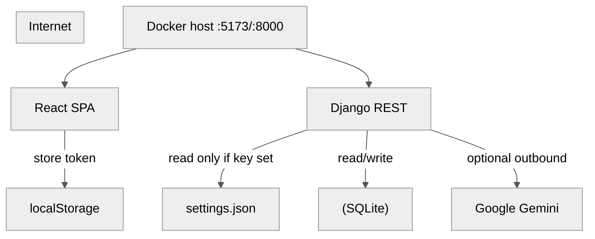

Trust is explicit: the frontend never sees the API key, the backend never trusts a client-supplied `user_id`, and the LLM is strictly optional.

---

## 1. Starting from zero

When you sit down to build a "real-feeling" storefront in 2026, the temptation is to spin up five managed services and a CI pipeline before writing a single model. The discipline of this project is the opposite: **keep the dependency surface to things that run on a developer laptop with zero accounts**.

Our "must-haves" list, ranked by what hurts when it's missing:

- an HTTP API that holds users, products and orders
- a web UI that's fast on first paint and looks intentional
- an AI story that's _honest_ - present when it works, gracefully absent when it doesn't
- one command to bring the whole stack up (`docker compose up --build`)
- one command to reset the demo state for the next stakeholder

Anything that ate more than a day of yak-shaving was a candidate to defer.

## Diagram 2 - The minimum viable stack

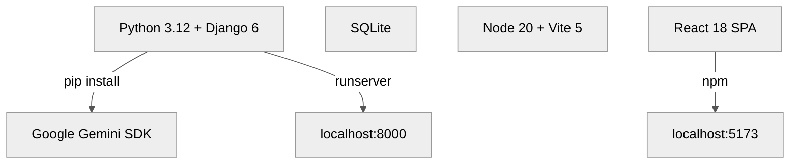

Two runtimes, three pinned dependencies, one optional AI leg. We add Postgres, Redis, a queue, or a managed object store only when the SQLite boundary starts to hurt.

---

## 2. Stack choice and architecture trade-offs

### Why Django REST over FastAPI

Boring-on-purpose wins here. DRF ships with token auth, an ORM, a migrations engine, a permissions layer, browsable API, and a serialiser abstraction. For a demo with nine endpoints, **that's the entire backend library**. FastAPI is excellent when you need async streaming and 10k req/s; we don't, and we'd be writing the auth scaffolding ourselves if we used it.

### Why Vite + React over Next.js

A static SPA is the right fit when the only data source is JSON over HTTP, and when SSR/SEO doesn't matter for the use case (an authenticated dashboard demo). Vite gives us a 200 ms dev-loop on a 50-file React app; Next.js would have asked us to model routing, layouts, and edge caching we don't need.

### Why SQLite (deliberately)

For a portfolio/demo, SQLite means: zero config, single file you can `rm` and reseed, full Django ORM semantics, and instant cold start in Docker. The day we need concurrent writes, we promote to Postgres behind the same `DATABASES` setting.

## Diagram 3 - The physical layout

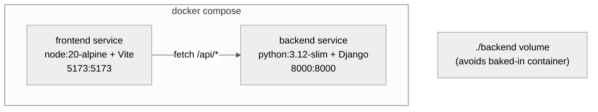

A bind mount on `backend/` is intentional - it lets us edit models and see them without rebuilding. Production would inject the image instead.

> **Note (added post-audit):** the `docker-compose.yml` for the published repo now wires every required env into the backend container: `DJANGO_SECRET_KEY` is declared required (the service refuses to start if it is unset, via `${VAR:?...}` syntax), and `DJANGO_DEBUG`, `DJANGO_ALLOWED_HOSTS`, `DJANGO_CORS_ALLOWED_ORIGINS`, `GEMINI_API_KEY`, `OPEN_API_KEY`, `DJANGO_ADMIN_RESET_TOKEN`, `DJANGO_SETTINGS_JSON`, throttle rates, and reseed-path overrides are all routed. The previously-quiet docker fallback to a hardcoded dev `SECRET_KEY` is gone.

---

## 3. Backend foundation - scaffolding the shop

### Models in five lines

The data model is two tables, both pragmatic. No soft-delete columns, no audit trails, no `created_by`/`updated_by`. The demo lives or dies on visibility, not forensic evidence.

**`backend/smartshop/models.py`**

- `SmartShopProduct`: `name`, `category`, `price`, `image` (ImageField, nullable).
- `SmartShopPurchaseOrder`: FK to `User`, FK to `SmartShopProduct`, `quantity`, `purchase_date` (auto).

That's the entire schema.

## Diagram 4 - Entity-relationship

```mermaid
%%{init: {'theme': 'neutral', 'themeVariables': {'primaryColor': '#f5f5f5', 'primaryTextColor': '#333', 'primaryBorderColor': '#ccc', 'lineColor': '#555', 'secondaryColor': '#e8e8e8', 'tertiaryColor': '#fafafa'}}}%%
flowchart TD
    subgraph class["USER"]
    end
    subgraph class["PRODUCT"]
    end
    subgraph class["PURCHASE_ORDER"]
    end
    USER -- PURCHASE_ORDER: places["USER -- PURCHASE_ORDER: places"]
    PRODUCT -- PURCHASE_ORDER: "is in["PRODUCT -- PURCHASE_ORDER: "is in"]
```

One user, many purchase orders. One product, many purchase orders. The recommender reads order history per user; the recommend endpoint takes `user_id` as a path parameter.

### URLs and views - the API surface

**`backend/smartshop/urls.py`**

- `POST /api/register/` -> `register_user`
- `POST /api/login/` -> `login_user`
- `POST /api/buy/` -> `purchase_product`
- `GET /api/products/` -> `list_products`
- `GET /api/recommend/<user_id>/` -> `recommend_products`
- `GET /api/search/?q=...` -> `smart_search`
- `POST /api/chatbot/` -> `chatbot_assist`
- `POST /api/products/<pk>/ai-details/` -> `product_ai_details`
- `POST /api/reseed/` -> `reseed_db` (admin demo button)
- `GET|POST /api/settings/` -> `manage_settings` (Gemini/OpenAI key store)

## Diagram 5 - API controller map

```mermaid
%%{init: {'theme': 'neutral', 'themeVariables': {'primaryColor': '#f5f5f5', 'primaryTextColor': '#333', 'primaryBorderColor': '#ccc', 'lineColor': '#555', 'secondaryColor': '#e8e8e8', 'tertiaryColor': '#fafafa'}}}%%
flowchart TD
    subgraph class["UrlRouter"]
    end
    subgraph class["Views"]
        + recommend_products(req, user_id)["+ recommend_products(req, user_id)"]
        + product_ai_details(req, pk)["+ product_ai_details(req, pk)"]
    end
    UrlRouter -->|"resolves to function"| Views
```

Function-based views on purpose. CBVs shine when you reuse mixins; we don't.

### Auth in two endpoints

`register_user` and `login_user` are the only authentication endpoints. Both create/return DRF authtoken tokens. The frontend stores the token in component state (we deliberately accept the demo-grade trade-off - in production we'd promote to httpOnly cookies + same-site strict).

> **Note (added post-audit):** the `/api/buy/` endpoint originally looked up the buyer from a `user_id` field in the request body - a textbook IDOR pattern. It is now `IsAuthenticated` and uses only `request.user`; any client-supplied `user_id` is ignored. Quantity is validated as a positive integer in the `[1, 1000]` range, and unhandled errors no longer leak `str(e)` to the response body.

## Diagram 6 - Registration sequence

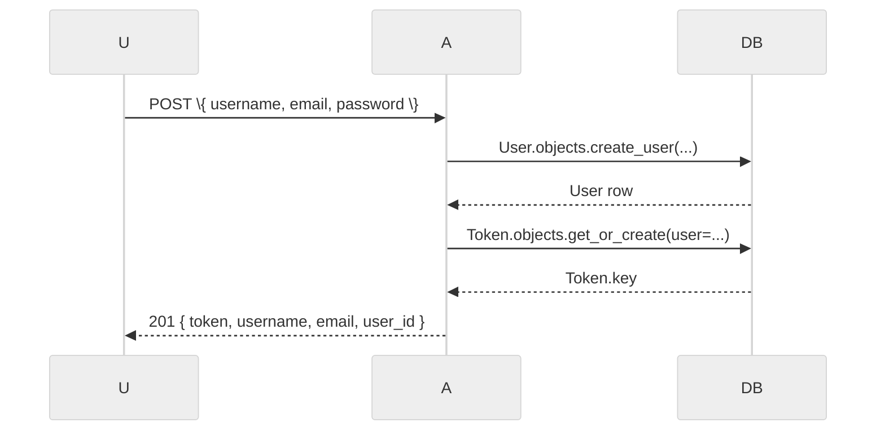

The login endpoint is identical except it calls `authenticate()` instead.

## Diagram 6a - Purchase-to-recommendation causal chain

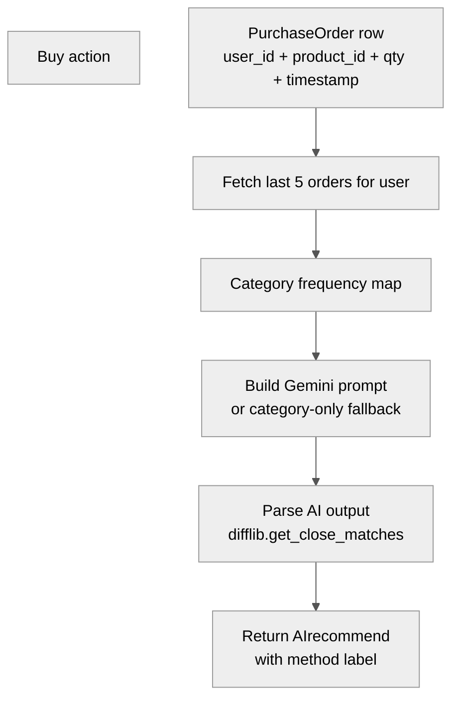

Every Buy mutates the recommendation surface for exactly one user. No fan-out, no cron, no cache invalidation - the query is cheap enough to run on demand.

---

## 4. Frontend - React + Vite UI shell

A 600-line `App.jsx` covers the entire demo UI. Three reasons we resisted splitting it into `Catalog.jsx`, `Cart.jsx`, `Login.jsx`, ... :

1. The cognitive load of jumping across six files for a beginner reader is real.
2. State is genuinely shared (the current user token affects header, cart, recommender all at once).
3. A portfolio reader can land on `App.jsx` and follow the entire user journey top-to-bottom.

In a real app this would split into routes (`/login`, `/catalog/:productId`, `/cart`). For the demo, single-file wins.

### Glue: a small state bag

The React side carries four top-level states:

- `user` - `{ token, username, email, user_id }` or `null`
- `passwordInput`, `geminiApiKeyInput` - form inputs (cleared on submit)
- `geminiConfigured` - computed flag returned by the backend settings endpoint
- `cart`, `recommendMethod`, `purchases` - domain state for the dashboard

## Diagram 7 - Frontend state lifecycle

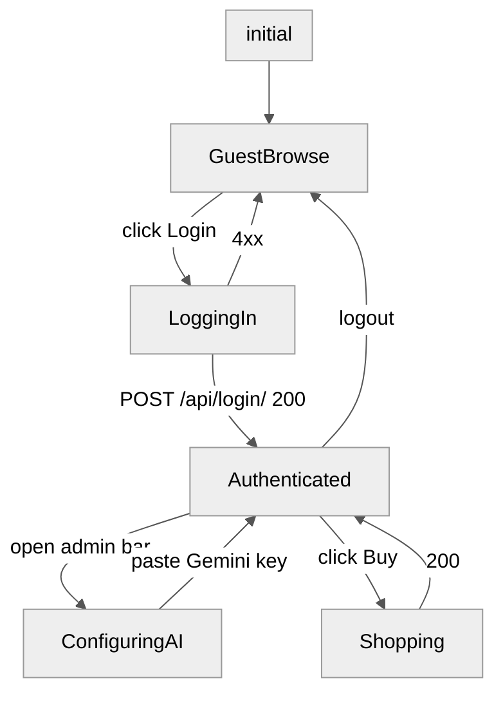

The state machine helps when reading `App.jsx` - every conditional render maps to one of these nodes.

### Glassmorphism without a design system

The look - frosted header, soft shadows, animated buttons - is six CSS custom properties plus a `@keyframes` rule. We add nothing to the bundle for it. Two lessons:

- a coherent _style_ system doesn't need to be a system; it can be six CSS variables and discipline
- a portfolio UI is judged on first 3 seconds; glassmorphism earns that attention cheaply

---

## 5. Integrating AI - hooking up Gemini

### The reason we picked Gemini (and not the other big three)

Free tier, fast `flash` variant, and a generous multimodality opening for a future image-features demo. The kicker, though, is the **model family list** we wire in `views.py`:

```python
# Indicative ordering; per-view lists differ in views.py.
models_to_try = ["gemini-1.5-flash", "gemini-2.0-flash", "gemini-flash-latest",
                 "gemini-1.5-pro",
                 "gemma-2-27b-it", "gemma-2-9b-it"]
```

When a quota error hits one model, we walk the list. The UI shows whichever model answered (or "rule_fallback" if none did). That's both **a graceful degradation pattern** and **a fidelity signal** - the user sees the truth, not "AI dust".

### Where the key lives

Two places, both deliberate:

1. **`.env` on the backend** - read by Django at startup. Kept for boot-time configuration.
2. **In-app admin bar** - lets the demo speaker add a key _at runtime_ without restarting the Docker container. The backend persists the in-app input to a runtime settings file.

## Diagram 8 - Secure API key storage flow

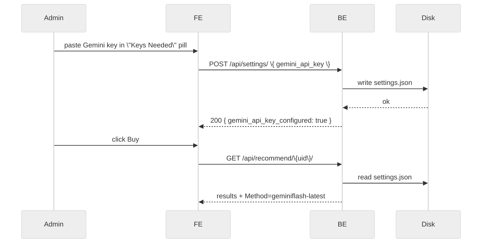

The "red dot -> green dot" UI pill is intentional feedback. The user trusts the toggle more than a console log.

## Diagram 8a - API key precedence and fallback chain

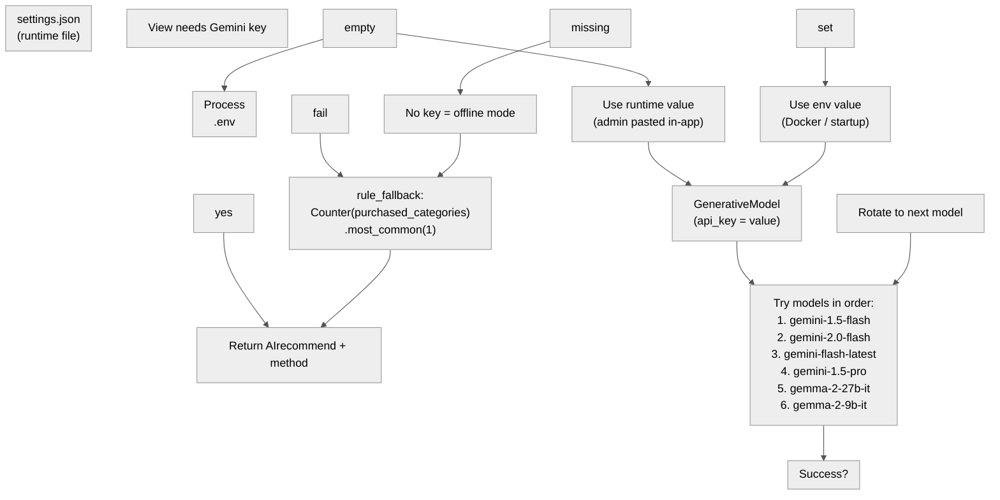

This precedence chain means the demo never hard-fails on quota: the speaker can keep clicking Buy even when Google returns 429.

---

## 6. The recommendation engine - the cascade

The point of an LLM-shaped recommender is that it can read **intent** from a query, not just categories. We solve it as a cascade.

### Path A - catalog rules (offline-safe)

Look at the user's most-recent purchase, find products in the same `category` that they haven't bought yet, top up with popular items. Cheap, deterministic, fast. **Always available.**

### Path B - Gemini assists (online-only)

Render a strict prompt:

> "Here are the user's last purchases. Here is the candidate catalog. Return a comma-separated list of product NAMES that complement the user's owned items."

Then we post-process: `difflib.get_close_matches(ai_name, real_names)` to map any hallucinated name back to a real DB row. This is critical - LLMs hallucinate product names. Mapping them back is the second half of the integration.

## Diagram 9 - The recommendation cascade

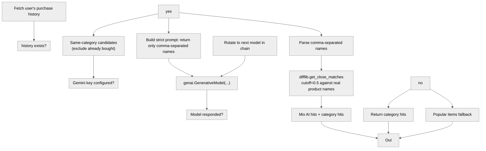

`method` is the UI fidelity bit. It returns `gemini (gemini-1.5-flash)`, `gemini_quota_exceeded`, `gemini_error (4xx: ...)`, or `rule_fallback`. The frontend shows the badge verbatim.

## Diagram 10 - LLM strict-prompting protocol

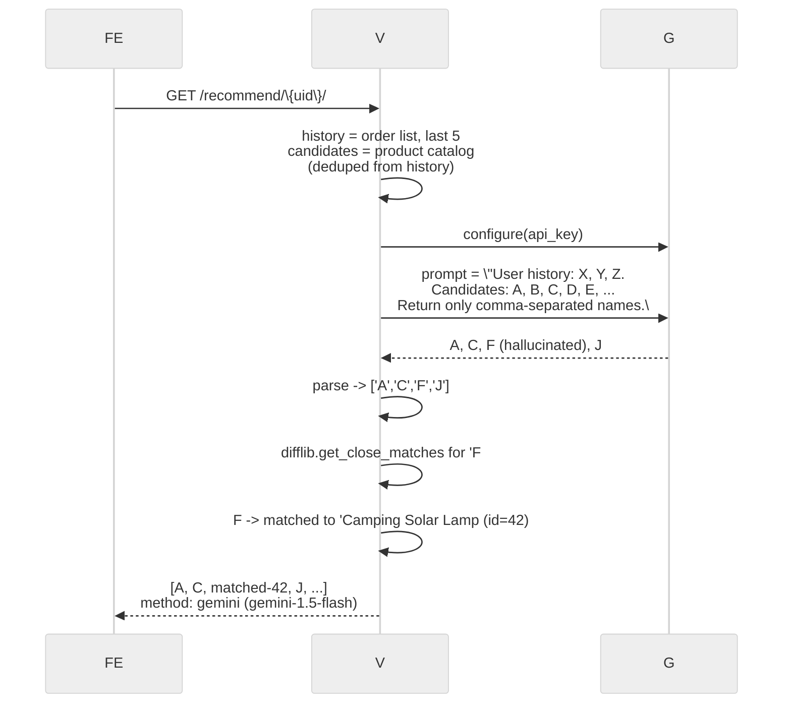

When you trace this in real terms, "context" is just a string with a shape. The discipline is in shaping it.

## Diagram 10a - Gemini fallback model rotation

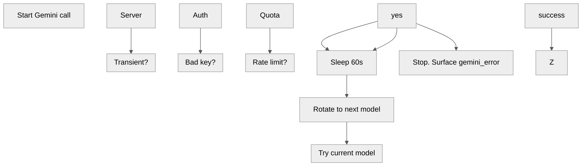

The 6-model list isn't just belt-and-braces - it's a deliberate cost/latency cascade. `gemini-1.5-flash` is tried first because it's cheapest; we only escalate if it fails.

---

## 7. Smart semantic search (with offline fallback)

`LIKE '%query%'` was the V1 find-by-name behaviour. It's _fine_ for known keywords but misses the entire intent layer. "warm jackets" ought to find coats and hoodies, not literally the word "warm".

### Online: let the LLM return product IDs

We feed Gemini the catalog as `[{id, name, category}, ...]`, ask it to return comma-separated IDs (not names). Parsing IDs is robust to hallucination - any non-existent ID simply doesn't match a row in the category slice we render.

### Offline: a curated synonyms map

For cold querying, a small dictionary ships with the demo:

- `warm` -> `jackets, parkas, hoodies, blankets`
- `cold` -> same
- `gaming` -> `monitors, mouse, keyboard, headphones`
- `outdoor` -> `tents, lamps, backpacks, water bottles`

The LLM does better, but the offline fallback does **okay enough** to keep the demo credibly working in airplane mode.

## Diagram 11 - Search paths

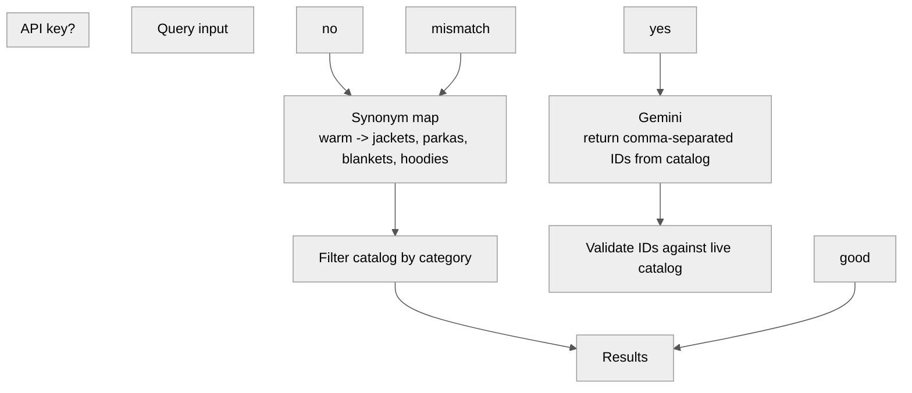

Each path has a different latency profile; the offline path is <50 ms, the LLM path is ~700 ms. We log both so the demo spokesperson can decide which to showcase.

## Diagram 11a - Search endpoint decision tree

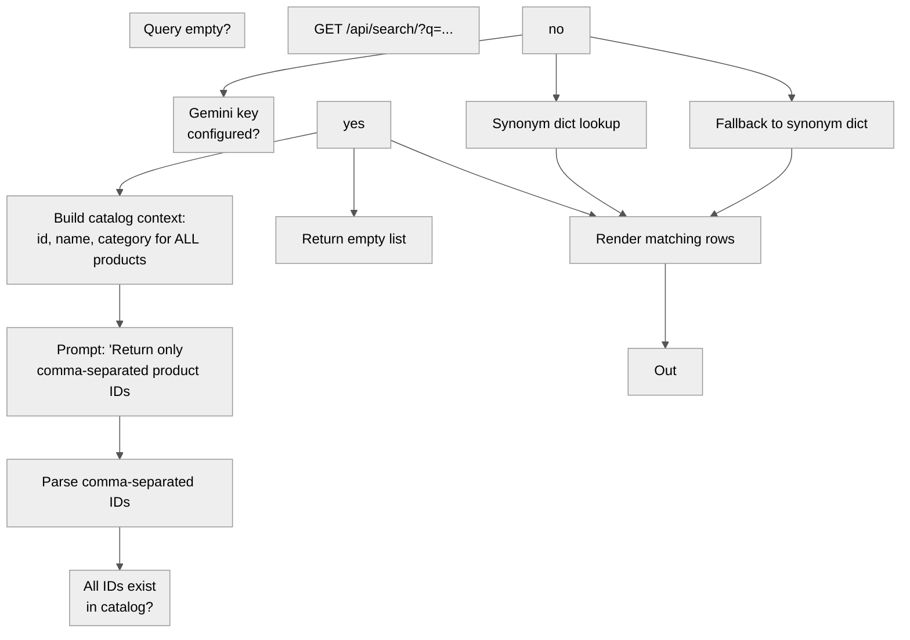

Why IDs instead of names for search? Because `42, 17, 3` either matches rows or it doesn't. There's no fuzzy-match ambiguity.

---

## 8. Dynamic product details & synthesised pros/cons

Click a product card and a detail panel opens. Some bits are deterministic (the image, the specs column). The **AI bit** is a button labelled _"Analyse with AI"_. Click it, and `/api/products/<pk>/ai-details/` returns:

```json
{
  "summary": "Compact 4K HDR display for small rooms.",
  "pros": ["... 2-line bullet", "... 2-line bullet"],
  "cons": ["... 2-line bullet", "... 2-line bullet"]
}
```

We force the LLM to return a JSON block (with a regex scrape if needed). Pure-text outputs are rejected - the UI demands structure.

## Diagram 12 - Forcing structured JSON out of the LLM

```mermaid
%%{init: {'theme': 'neutral', 'themeVariables': {'primaryColor': '#f5f5f5', 'primaryTextColor': '#333', 'primaryBorderColor': '#ccc', 'lineColor': '#555', 'secondaryColor': '#e8e8e8', 'tertiaryColor': '#fafafa'}}}%%
flowchart TD
    subgraph BuildPrompt["prompt = 'Return only JSON:\n"]
    end
    Call["genai.GenerativeModel.generate_content"]
    Extract["Regex scan for a JSON fenced block"]
    Parse["json.loads"]
    Post["POST /products/pk/ai-details/"]
    Raw["Raw text response"]
    Wrap["Wrap the whole text as summary"]
    cons[""]
    Post --> BuildPrompt
    BuildPrompt --> Call
    Call --> Raw
    Raw --> Extract
    Extract -->|"match"| Parse
    Extract -->|"miss"| Wrap
    Parse --> Out
    Wrap --> Out
```

Two failure modes for free:
- LLM emits code fences; we strip them
- LLM refuses to JSON; we degrade gracefully

Either way, the UI never breaks.

## Diagram 12a - AI details request with caching rationale

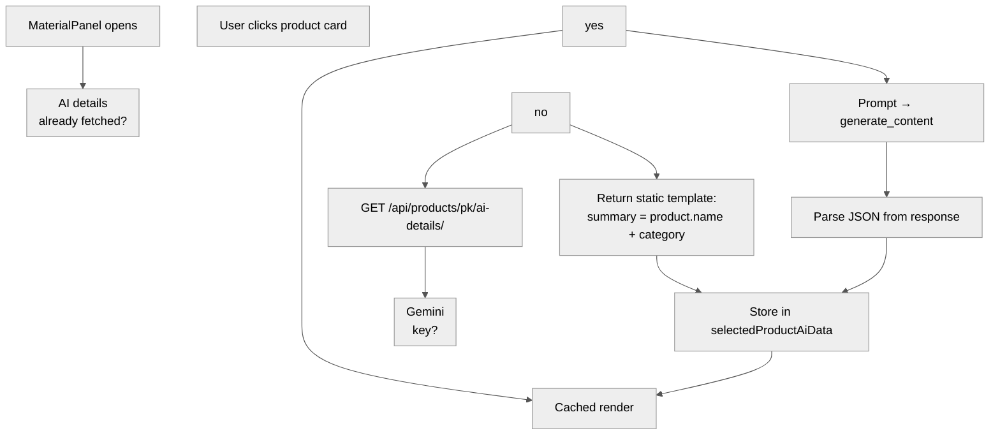

Why no server-side cache? Because the demo runs on SQLite and the product set is ~50 rows. A Redis layer would be a yak-shave we don't need; the LLM latency is acceptable for a stakeholder demo.

---

## 9. The in-app shopping assistant

A floating bubble at the bottom-right opens a chat panel. The user types a question ("What electronics do you recommend?"). The frontend POSTs to `/api/chatbot/`, the backend composes a system prompt that injects the catalog as context, and the LLM responds conversationally.

The bot is strictly read-only against the catalogue - it cannot perform actions. That keeps the trust boundary obvious.

## Diagram 13 - Chatbot async state

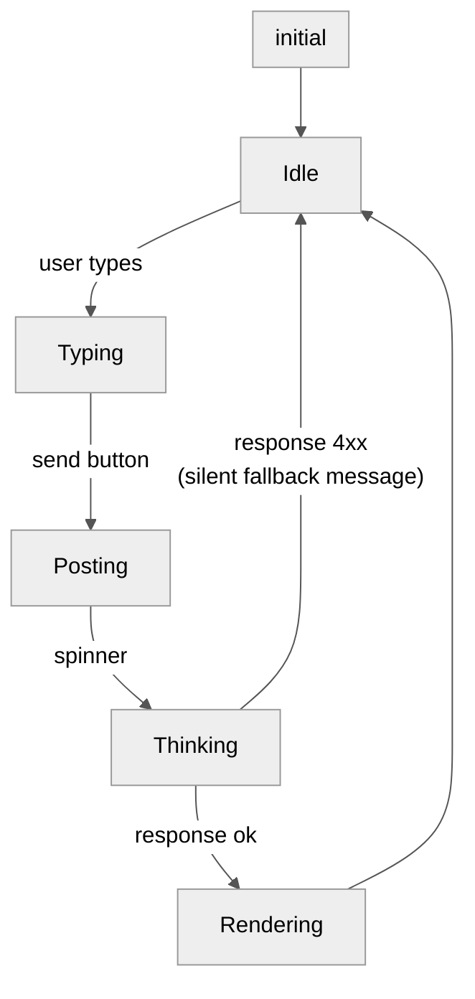

The asymmetry between the happy path and the error path is important. **Errors don't bubble as red toast** - they degrade to a polite "Here are some popular items:" so the user never feels stranded.

## Diagram 13a - Chatbot context assembly

```mermaid
%%{init: {'theme': 'neutral', 'themeVariables': {'primaryColor': '#f5f5f5', 'primaryTextColor': '#333', 'primaryBorderColor': '#ccc', 'lineColor': '#555', 'secondaryColor': '#e8e8e8', 'tertiaryColor': '#fafafa'}}}%%
flowchart TD
    Build["Build messages array:\nsystem + history + user"]
    Call["chatbot_assist → genai.GenerativeModel"]
    Catalog["Inject catalog:\nid, name, category, price for all products"]
    Fallback["Return canned response:\n'Try our catalogue below!"]
    subgraph Key["Gemini\nkey?"]
    end
    Msg["User message"]
    Render["Append bot bubble"]
    Resp["Return text response"]
    Sys["System prompt assembly"]
    Sys --> Catalog
    Catalog --> Build
    Build --> Key
    no --> Fallback
    yes --> Call
    Call --> Resp
    Resp --> Render
    Fallback --> Render
```

The catalog is injected as a system preamble so the bot can answer "Do you have anything under $50?" without a database round-trip.

---

## 10. Infrastructure & dev experience

### Docker Compose, one command

`docker-compose.yml` builds two services: `backend` (Python 3.12-slim) and `frontend` (Node 20-alpine + Vite dev server). The bind mounts are subtle - they tolerate container rebuild, but they expose dev code paths in the host for editing without going through `docker cp`.

## Diagram 14 - Docker-Compose topology

```mermaid
%%{init: {'theme': 'neutral', 'themeVariables': {'primaryColor': '#f5f5f5', 'primaryTextColor': '#333', 'primaryBorderColor': '#ccc', 'lineColor': '#555', 'secondaryColor': '#e8e8e8', 'tertiaryColor': '#fafafa'}}}%%
flowchart TD
    B["backend service\nbuild: ./backend\nports: 8000:8000\nvolumes: ./backend:/app\nrestart: always"]
    F["frontend service\nbuild: .\nDockerfile.frontend\nports: 5173:5173\nvolumes: .:/app,/app/node_modules\ndepends_on: [backend]"]
    B -->|"exposes /api/*"| F
```

Three intentional choices:
- `restart: always` - the demo screenshot taken two hours later still works
- `volumes: ./backend:/app` - editing models in the host reflects immediately
- `/app/node_modules` named volume - host edits don't blow away the deps

## Diagram 14a - Docker image layer composition

```mermaid
%%{init: {'theme': 'neutral', 'themeVariables': {'primaryColor': '#f5f5f5', 'primaryTextColor': '#333', 'primaryBorderColor': '#ccc', 'lineColor': '#555', 'secondaryColor': '#e8e8e8', 'tertiaryColor': '#fafafa'}}}%%
flowchart TD
    B1["FROM python:3.12-slim"]
    B2["apt-get build-essential"]
    B3["COPY requirements.txt"]
    B4["pip install -r requirements.txt"]
    B5["COPY . /app"]
    B6["EXPOSE 8000"]
    B7["CMD runserver"]
    F1["FROM node:20-alpine"]
    F2["WORKDIR /app"]
    F3["COPY package*.json"]
    F4["npm install"]
    F5["COPY . /app"]
    F6["EXPOSE 5173"]
    F7["CMD npm run dev"]
    Vol["./backend:/app\n./ :/app\n/app/node_modules volume"]
    B2 --> B3
    B3 --> B4
    B4 --> B5
    B5 --> B6
    B6 --> B7
    F2 --> F3
    F3 --> F4
    F4 --> F5
    F5 --> F6
    F6 --> F7
```

Layers are cached aggressively. Changing `views.py` reuses the pip layer; changing `package.json` reuses the node layer. Rebuilds after a single-file edit are typically under 20 seconds.

### The reseed button (a tiny magic trick)

The top admin bar has a button labelled _"Reset Database"_. Click it, and the entire catalogue + orders are wiped and re-seeded from two SQL files (`Products.sql`, `PurchaseOrder.sql`). The backend uses `connection.cursor()` on the raw sqlite connection to run the script, which Django's ORM doesn't otherwise expose.

## Diagram 15 - The reseed round-trip

```mermaid
%%{init: {'theme': 'neutral', 'themeVariables': {'primaryColor': '#f5f5f5', 'primaryTextColor': '#333', 'primaryBorderColor': '#ccc', 'lineColor': '#555', 'secondaryColor': '#e8e8e8', 'tertiaryColor': '#fafafa'}}}%%
sequenceDiagram
    FE->>V: POST \{\}
    V->>DB: DELETE FROM purchase_orders
    V->>DB: DELETE FROM products
    V->>DB: DELETE FROM sqlite_sequence WHERE name IN (...)
    V->>SQL: read + executescript()
    SQL->>DB: 50+ INSERTs products, ~30 inserts orders
    V-->>FE: 200 { reseeded: true }
    FE->>FE: toast 'Database reset - try logging in again
```

The "log in again" toast is a tiny budget: we know the demo user wants to re-paste creds or hop accounts. We tell them rather than letting the UI silently 401.

### Why use raw SQL for seeding (a confession)

`seed_db.py` reads SQL files via `connection.connection.executescript()`. Trade-offs:

- we can hand-edit fixtures in SQL and re-run them
- the demo product list reads cleanly as a spreadsheet alongside the screenshots
- downside: SQL syntax is dialect-bound (Postgres-port = rewrite)

For a demo that lives forever in SQLite, that's a fine trade.

## Diagram 15a - Reseed SQL file paths and env overrides

```mermaid
%%{init: {'theme': 'neutral', 'themeVariables': {'primaryColor': '#f5f5f5', 'primaryTextColor': '#333', 'primaryBorderColor': '#ccc', 'lineColor': '#555', 'secondaryColor': '#e8e8e8', 'tertiaryColor': '#fafafa'}}}%%
flowchart TD
    Done["200 reseeded: true"]
    subgraph Env1["RESEED\nPRODUCTS_SQL\nset?"]
    end
    subgraph Env2["RESEED\nPURCHASE_SQL\nset?"]
    end
    Exec["Execute SQL against SQLite connection"]
    subgraph Missing["File missing?"]
    end
    P1["Use env path"]
    P2["BASE_DIR/smartshop/fixtures/Products.sql"]
    Q1["Use env path"]
    Q2["BASE_DIR/smartshop/fixtures/PurchaseOrder.sql"]
    Read["Read files via executescript"]
    Start["POST /api/reseed/"]
    Warn["Return warning + continue"]
    yes --> P1
    no --> P2
    Start --> Env2
    yes --> Q1
    no --> Q2
    P1 --> Read
    P2 --> Read
    Q1 --> Read
    Q2 --> Read
    Read --> Missing
    yes --> Warn
    no --> Exec
    Exec --> Done
```

The env-driven paths mean the published repo never hardcodes `~/ ...` - a post-audit fix.

---

## 11. Shipping open source - the zero-to-one release

The repo goes from local folder to public GitHub. The step that matters most is the **security scrub** - skipped at your peril. The original draft of this section described five concrete actions; **after** the post was written the team ran a public-grade audit and found several gaps that those five actions alone did not catch. What the published repo currently ships (commits `00d5ad1` -> `8903a1d` -> `1625a91` -> `27e6991`) goes further than the list below.

Five concrete actions (the original v1 checklist; **aim higher than these today**):

### Action 1 - what NOT to commit

- `backend/.env` (any developer-local secrets)
- `backend/settings.json` (the runtime key store)
- `backend/db.sqlite3` (the demo database, may contain real-test users)
- `backend/.venv/`, `node_modules/`, `dist/` (heavy build artefacts)
- `*.pem`, `*.key`, `credentials*`

### Action 2 - what to commit instead

- `.env.example` - same shape as `.env`, **with placeholders**, so newcomers know what to fill in. Comments link to https://aistudio.google.com/app/apikey for the free Gemini key.
- `.gitignore` - Django + React + secrets, with explicit `**/db.sqlite3` so nested DBs don't slip in.
- `README.md` - one section per operating mode (Docker / no-Docker), with explicit security notes.

### Action 3 - inject SECRET_KEY through env, keep dev fallback

The default `django-insecure-...` SECRET_KEY Django ships is a publicly-known dev value. Two changes:

```python
SECRET_KEY = os.getenv(
    'DJANGO_SECRET_KEY',
    'django-insecure-DO-NOT-USE-IN-PRODUCTION',
)
```

The fallback preserves every developer's "runs-from-fresh-clone" experience. Production overrides the env var.

### Action 4 - verify with a live secret sweep

Before pushing to GitHub, sweep the staging tree for any `AIza...`, `sk-...`, `ghp_...` pattern. With `.gitignore` in place these should all return zero matches. Sweep the **remote** after pushing to confirm - GitHub's tree API lets us decode and grep every blob.

### Action 5 - choose visibility deliberately

Public repos are great for portfolios, but if the project has any environment-specific secrets we missed, private is fine, and GitHub lets you flip later. We picked public here for the demo - and committed to the live-sweep afterwards.

## Diagram 16 - Open-source release checklist

```mermaid
%%{init: {'theme': 'neutral', 'themeVariables': {'primaryColor': '#f5f5f5', 'primaryTextColor': '#333', 'primaryBorderColor': '#ccc', 'lineColor': '#555', 'secondaryColor': '#e8e8e8', 'tertiaryColor': '#fafafa'}}}%%
flowchart TD
    ExEnv["Write .env.example\nplaceholders only + docs link"]
    GhCreate["gh repo create\n--public or --private"]
    Ign["Apply .gitignore\n.env, settings.json,\ndb.sqlite3, venv, node_modules, dist"]
    subgraph LocalSweep["Sweep LOCAL\nfor AIza / sk- / ghp_"]
    end
    PatchKey["Patch SECRET_KEY\nenv-first with dev fallback\n(django-insecure-DO-NOT-USE-IN-PRODUCTION)"]
    Push["git push origin main"]
    ReadMe["Write README\ndemo creds + setup +\nAPI key note + security notes"]
    subgraph RemoteSweep["Sweep REMOTE\nvia gh api /git/trees"]
    end
    Repo["Local project\nready to ship"]
    Ign --> ExEnv
    ExEnv --> PatchKey
    PatchKey --> ReadMe
    ReadMe --> LocalSweep
    hit --> Ign
    clean --> GhCreate
    GhCreate --> Push
    Push --> RemoteSweep
    hit --> PatchKey
    clean --> Done
```

The loop is real. We've needed two passes on real projects - the first push, the secret scan callout, the patch, the second push.

## Diagram 16a - Security audit findings mapped to code changes

```mermaid
%%{init: {'theme': 'neutral', 'themeVariables': {'primaryColor': '#f5f5f5', 'primaryTextColor': '#333', 'primaryBorderColor': '#ccc', 'lineColor': '#555', 'secondaryColor': '#e8e8e8', 'tertiaryColor': '#fafafa'}}}%%
flowchart TD
    A["Hardcoded SECRET_KEY"]
    A1["ImproperlyConfigured raised\nDJANGO_ALLOW_INSECURE_DEV_KEY opt-in"]
    B["DEBUG=True hardcoded"]
    B1["_env_bool(DJANGO_DEBUG, False)"]
    C["ALLOWED_HOSTS=[]"]
    C1["env-driven allowlist\nDocker-aware defaults"]
    D["CORS_ALLOW_ALL_ORIGINS"]
    D1["explicit allowlist\nDJANGO_CORS_ALLOW_ALL=1 escape hatch"]
    E["IDOR: buy used body user_id"]
    E1["IsAuthenticated\nrequest.user only\nqty 1-1000"]
    F["reseed/manage_settings public"]
    F1["IsAdminUser\nX-Admin-Token double-gate"]
    G["Hardcoded fixture paths"]
    G1["RESEED_PRODUCTS_SQL env\nsafe BASE_DIR defaults"]
    H["settings.json hardcoded path"]
    H1["DJANGO_SETTINGS_JSON\nconfigurable path"]
    I["No rate limiting on auth"]
    I1["5/m register, 10/m login\nenv-tunable"]
    J["str-e in error responses"]
    J1["logger.exception + generic body"]
    K["No env wiring in compose"]
    K1["DJANGO_SECRET_KEY required\n+ all overrides"]
```

Each finding maps to one or more code-level fixes in the published repo.

---

## 12. What this all buys you

A portfolio reader who clones the repo and pushes a button gets:

- a working storefront with two services on `5173` and `8000`
- a one-click _"Reset Database"_ that brings the demo back to slide-deck state
- an admin bar to paste a Gemini key and watch the recommendation method transition from `rule_fallback` to `gemini (gemini-1.5-flash)` in real-time
- a chat bubble that explains the catalogue using the LLM as a shop assistant
- a public repo they can fork without leaking anyone's keys

A senior engineer reading the codebase gets a small, opinionated answer to "how do you wire an LLM into a CRUD app without surrendering the engineering quality": constraints, cascade, failover, named state, public release scrubbed and verified.

## Diagram 17 - What changed when AI was bolted on

```mermaid
%%{init: {'theme': 'neutral', 'themeVariables': {'primaryColor': '#f5f5f5', 'primaryTextColor': '#333', 'primaryBorderColor': '#ccc', 'lineColor': '#555', 'secondaryColor': '#e8e8e8', 'tertiaryColor': '#fafafa'}}}%%
flowchart TD
    V0A["GET /products/"]
    V0B["POST /buy/"]
    V1A["GET /recommend/uid/"]
    V1Rules["same-category dedupe"]
    V2A["GET /recommend/uid/"]
    V2LLM["Gemini prompt + diff-match"]
    V2Method["method = name of winner"]
    V2Rules["same-category dedupe"]
    V1A --> V1Rules
    V2A --> V2Rules
    V2A --> V2LLM
    V2A --> V2Method
    V0A --> V1A
```

Each rung adds optionality. Never optionality on top of a broken baseline - always optionality on top of a working baseline.

## Diagram 18 - Full-system data flow for the assessor

```mermaid
%%{init: {'theme': 'neutral', 'themeVariables': {'primaryColor': '#f5f5f5', 'primaryTextColor': '#333', 'primaryBorderColor': '#ccc', 'lineColor': '#555', 'secondaryColor': '#e8e8e8', 'tertiaryColor': '#fafafa'}}}%%
flowchart TD
    Auth["Login / Register forms"]
    Badge["Method badge"]
    Bot["chatbot_assist"]
    Buy["purchase_product"]
    Cards["Product cards"]
    Chat["Chatbot bubble"]
    Details["product_ai_details"]
    DiffMatch["difflib.get_close_matches"]
    GeminiClient["GenerativeModel"]
    Login["login_user"]
    Models["6-model fallback chain"]
    Order["(PurchaseOrder)"]
    Product["(Product)"]
    Rec["recommend_products"]
    Register["register_user"]
    Reseed["reseed_db"]
    Search["Search bar"]
    Settings["manage_settings"]
    SettingsFile["(settings.json)"]
    Srch["smart_search"]
    StrictPrompt["Strict prompt\ncomma-separated output"]
    User["(User)"]
    Auth --> Register
    Auth --> Login
    Cards --> Buy
    Buy --> Rec
    Rec --> Order
    Rec --> SettingsFile
    Rec --> GeminiClient
    GeminiClient --> Models
    StrictPrompt --> DiffMatch
    Rec --> Badge
    Search --> Srch
    Chat --> Bot
    Cards --> Details
    Settings --> SettingsFile
    Reseed --> Order
    Reseed --> Product
```

This is the complete wiring diagram. Every arrow is a real code path.

---

## 13. Closing notes for the curious

- **One person can ship this in a week.** The bulk is wiring, not thinking.
- **The hardest bug was the LLM hallucination diff-match.** `difflib.get_close_matches` with a 0.5 cutoff is the sweet spot.
- **The cheapest UX win was the "method" label.** Truth on the screen builds more trust than any marketing banner.
- **The OpenAI key field is dead code - for now.** Leave the seam, don't pretend it's wired.

The full source: [github.com/nurazhardotcom/lithan_smartshop](https://github.com/nurazhardotcom/lithan_smartshop).

Bring your own Gemini key, run `docker compose up --build`, and try the _"Analyse with AI"_ chip on the 4K Smart TV. The rest will look after itself.


## Update: post-launch security audit

> Posted 2026-06-18: after this blog was drafted, the SmartShop repo was reviewed against a public-grade security audit. The original "Shipping Open Source" section marketed the security scrub as a clean set of five actions. The audit found real gaps in what those five actions actually covered; the remediations below are now live on `nurazhardotcom/lithan_smartshop` main.

### Findings vs remediations

| Audit finding | Code state now |
|---|---|
| Hardcoded `SECRET_KEY` fallback (`django-insecure-...`) | `settings.py` raises `django.core.exceptions.ImproperlyConfigured` on missing `DJANGO_SECRET_KEY`. Dev-only opt-in requires `DJANGO_ALLOW_INSECURE_DEV_KEY=1` plus `DJANGO_DEBUG=True`, and even then the fallback is the explicit marker `'django-insecure-DO-NOT-USE-IN-PRODUCTION'` rather than the original Django literal. |
| `DEBUG = True` hardcoded | `DEBUG = _env_bool("DJANGO_DEBUG", "False")` |
| `ALLOWED_HOSTS = []` | env-driven allowlist with safe Docker-aware dev defaults |
| `CORS_ALLOW_ALL_ORIGINS = True` | explicit allowlist via `DJANGO_CORS_ALLOWED_ORIGINS`; the open-CORS escape hatch requires `DJANGO_CORS_ALLOW_ALL=1` |
| IDOR: `purchase_product` honoured a client-supplied `user_id` | now `IsAuthenticated`, uses only `request.user`, validates `quantity` as int in `[1, 1000]` |
| `reseed_db`, `manage_settings`, and `buy` were `@permission_classes([AllowAny])` | `reseed_db` and `manage_settings` are `IsAdminUser`; `buy` is `IsAuthenticated`; `reseed_db` has an optional `X-Admin-Token` double-gate when `DJANGO_ADMIN_RESET_TOKEN` is set |
| `reseed_db`/`seed_db.py` hardcoded `~/ ...` fixture paths | env-driven `RESEED_PRODUCTS_SQL` / `RESEED_PURCHASE_SQL` (configurable) with safe `BASE_DIR/smartshop/fixtures/*.sql` defaults; missing files are tolerated by `reseed_db` with a warning |
| `settings.json` written to a hardcoded `BASE_DIR/settings.json` | routed through `settings.SETTINGS_JSON_PATH` (configurable via `DJANGO_SETTINGS_JSON`) |
| No rate limiting on auth endpoints | `@ratelimit(key='ip', rate='5/m', method='POST', block=True)` on `register_user`; `@ratelimit(...rate='10/m', ...)` on `login_user`. DRF defaults `60/min` anon and `240/min` user, both env-tunable |
| Several views returned `Response({"error": str(e)})` | replaced with `logger.exception(...)` + generic `{"error": "Internal error"}` body |
| `docker-compose.yml` was not passing secret env into the backend container | now declares `DJANGO_SECRET_KEY` as required via `${VAR:?...}` and wires DEBUG, ALLOWED_HOSTS, CORS, throttle rates, optional Gemini/OpenAI/admin-reset-token, settings-JSON path, and reseed-path overrides |

### Demo-grade shortcuts still in the repo

These are intentional - they power the one-click demo flow that the talk hinges on - and they are documented in the SmartShop README under **Security Notes for Reviewers**. **Replace them before any non-demo use:**

- `password123` for the seeded `admin1` and `admin2` users (so the demo speaker can log in immediately).
- SQLite as the database (no concurrent-write semantics).
- The historic literal `[REDACTED]-...` still exists in commits `<= 76aab40` of the public git history. Anyone who cloned before the audit commits should treat it as compromised even though the running source no longer carries it.

### What you do before deploying this anywhere real

1. Generate a fresh `DJANGO_SECRET_KEY` and put it in `.env`. The README has the one-liner: `python -c "import secrets; print(secrets.token_urlsafe(64))"`.
2. Set `DJANGO_ADMIN_RESET_TOKEN` so even an `is_staff=True` user cannot trigger reseed alone.
3. Override the seed passwords via `SEED_ADMIN1_PASSWORD` / `SEED_ADMIN2_PASSWORD` env vars, or just delete the demo accounts entirely.
4. If you cloned the repo before the audit commits landed, rotate anything ever derived from the historic `SECRET_KEY` literal.

### Why this post is still worth reading

The architecture narrative (Django REST + React + Vite + Gemini), the AI cascade (history check -> Gemini cascade -> category fallback), the `difflib.get_close_matches` hallucination-mapper, the model fallback chain (`gemma-2-27b` -> `gemini-1.5-flash` -> ...), the Docker topology, and the open-source release checklist shape - all of that is still correct. What the audit forced was the operational stance: configuration was a precondition, not an ideal. The post captures the shape; the remediations make the shape deployable.

Full source lives at [github.com/nurazhardotcom/lithan_smartshop](https://github.com/nurazhardotcom/lithan_smartshop); live security posture lives in its README under "Security Notes for Reviewers".
