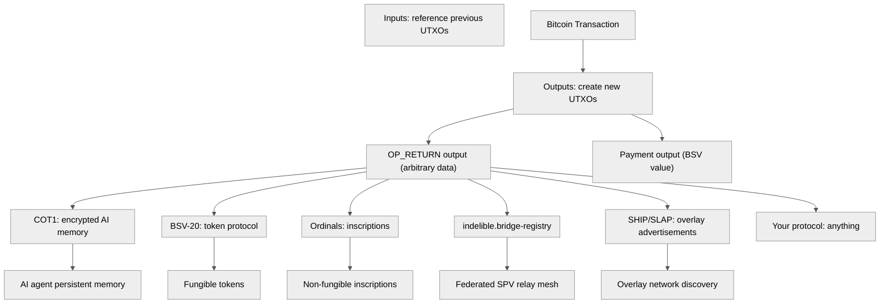
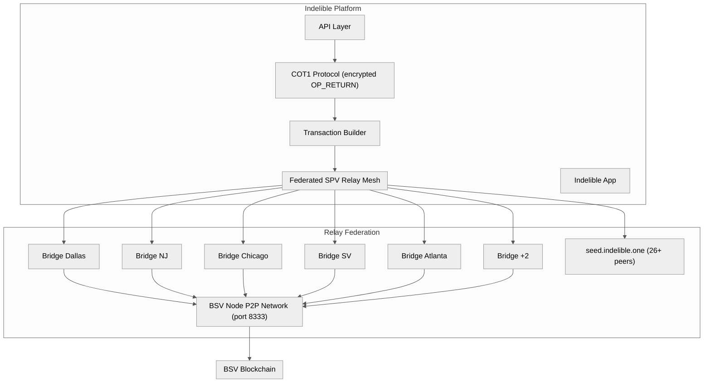
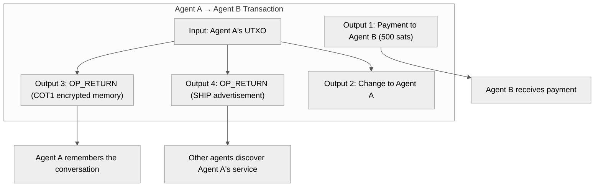

Title: Bitcoin Is Composable: Indelible, Agent Memory, and the Internet of Agents
Date: 2026-06-21
Tags: bitcoin, bsv, composability, agents, memory, indelible, overlay, architecture
Description: Bitcoin's OP_RETURN makes it the most composable base layer in existence. Indelible, COT1, BRC standards, and overlay networks all compose on the same transaction graph. This is how the Internet of Agents actually gets built.

---

When Ian Grigg said AI agents need IPv6 and a scalable blockchain to create an "Internet of Agents," he was describing a **composability stack** — not a single product.

The question is: what base layer allows every piece of that stack to compose without L2 bridges, without smart contract platforms, without new consensus mechanisms?

The answer is the same one Satoshi designed in 2008: **the Bitcoin transaction graph itself**.

---

## 1. Where Composability Actually Lives

In Ethereum, composability means "contract A calls contract B on the same chain." It requires shared state, sequential execution, and a global gas market. It breaks across L2s.

In Bitcoin (original design), composability means something more fundamental:

> *Any transaction can reference any previous transaction. Any output can contain any data via OP_RETURN. Any protocol can be layered on top without changing the base layer.*

This is **transaction-level composability**. It does not require a VM. It does not require shared state. It only requires that the base layer accept arbitrary data payloads and settle them permanently.



All of these protocols coexist in the same transaction graph. They do not compete for blockspace in the way Ethereum contracts compete for gas. They are settled in parallel, permanently, on the same chain.

This is what "Bitcoin is composable" means: **the base layer does not need to know what the data means**. It only needs to store it. The meaning is resolved at the application layer.

---

## 2. Indelible: The Memory Layer

[Indelible](https://indelible.one) is the reference implementation of this composability. It stores AI conversation memory, encrypted files, and project archives permanently on BSV using OP_RETURN outputs.

The architecture reveals the pattern:



**Key architectural properties:**

1. **Encrypted by default** — AES-256-GCM, key derived from the wallet's WIF. Only the key holder can read.
2. **No third-party dependency** — the relay mesh connects directly to BSV nodes via native P2P. No API key, no Infura equivalent, no trusted gateway.
3. **Federated discovery** — 7 geographically distributed bridges, each connected to 15-25 full nodes. The DNS seed at `seed.indelible.one` maintains 26+ verified-alive peers via an automated crawler.
4. **On-chain bridge registry** — bridges register themselves via OP_RETURN with a 100-satoshi dust output to a deterministic beacon address. Any scanner can replay the entire registry state from the chain.
5. **Stake bonds** — operators lock 0.01 BSV to prove ownership. If they misbehave, the bond is forfeit.

The relay mesh itself discovered that **74% of "known" BSV peers were ghosts** — IPs running something else entirely. The crawler prunes them. Every 5 minutes.

---

## 3. The Agent Stack: clawsats-indelible

The `clawsats-indelible` library wraps this into a developer toolkit for AI agents:

| Layer | Standard | Purpose |
|---|---|---|
| Identity | BRC-52 | Agent identity certificates (your agent has a key pair) |
| Authentication | BRC-31 | Mutual auth (Authrite) — agents prove who they are to each other |
| Signing | BRC-77 | Cryptographically signed actions — agents commit to decisions |
| Encryption | BRC-78 | Encrypted agent-to-agent messaging |
| Discovery | SHIP/SLAP | Service Host Interconnect Protocol / Service Lookup Availability Protocol |
| Payments | BRC-105 | Payment verification middleware for HTTP |
| Memory | COT1 | Persistent encrypted conversation storage |
| Reputation | Custom | Trust scores and attestations |
| Escrow | Custom | Multi-party dispute resolution |
| Oracle | Custom | Real-world data attestations |

An agent using this stack can:

1. **Generate a key pair** — its identity is its public key
2. **Register on an overlay network** — SHIP/SLAP advertisements so other agents find it
3. **Authenticate with another agent** — BRC-31 mutual auth, no passwords
4. **Negotiate a payment channel** — BRC-105 payment verification
5. **Execute work and get paid** — BSV micropayments
6. **Store the conversation** — COT1 encrypted on-chain
7. **Build reputation** — trust scores from completed interactions
8. **Dispute if something goes wrong** — multi-party escrow

This is the Internet of Agents Grigg described. It exists today.

---

## 4. What This Means for Your Stack

Your repos already cover the application layer:

```
headhunter-agent      → Multi-agent orchestration
paperclip-clj         → Deterministic business engine
bsv-de-tracker        → Market data pipeline
lagu-lagu             → Royalty settlement
bsv-clj               → Bitcoin protocol access
bitcoin-wiki          → Protocol documentation
```

Indelible provides the infrastructure layer your agents need to become **persistent economic actors**:

| Need | Indelible Provides | Your Agent Gets |
|---|---|---|
| Where does my agent store memory between runs? | COT1 encrypted OP_RETURN | Persistent identity across sessions |
| How does my agent prove who it is? | BRC-52 certificates | Non-repudiable identity |
| How does my agent find other agents? | SHIP/SLAP overlay discovery | Discoverable services |
| How does my agent pay another agent? | BRC-105 payment middleware | Machine-to-machine micropayments |
| How does my agent communicate privately? | BRC-78 encrypted messaging | Confidential coordination |
| How does my agent build trust? | Reputation + escrow modules | Economic history |

And the relay mesh means your agents do not depend on any third-party API. No rate limits. No API keys. No "we're deprecating this endpoint." The bridges connect directly to BSV nodes via P2P and are registered on-chain. The only way to kill the mesh is to kill the internet.

---

## 5. The Composable Transaction

Here is what a single transaction from an agent using this stack looks like:



Four outputs. One transaction. Payment, memory, and discovery all settled in a single atomic operation on the same base layer. This is what composability looks like when it is designed at the transaction level rather than the contract level.

No L2. No bridge. No VM. Just a transaction.

---

## 6. The Pattern

Bitcoin's composability is not a feature that was added later. It is a direct consequence of three design decisions Satoshi made in v0.1:

1. **OP_RETURN** — embed arbitrary data in a transaction output. Satoshi's "script" generalization meant any predicate could be evaluated.
2. **UTXO model** — every output is an independent state fragment. Transactions compose by reference, not by shared memory.
3. **No block size cap** — as restored by Genesis and Chronicle — means data-heavy applications (agent memory, encrypted files, overlay registrations) do not bid against each other for scarce blockspace.

These three decisions together mean that the base layer does not need to know what "an agent" is, what "memory" means, or what "reputation" measures. It only needs to settle transactions permanently. Everything else is layered on top.

This is why Grigg's vision works. Not because BSV has a better smart contract language. Not because it has higher TPS (though it does). But because the **data model** — the transaction graph with OP_RETURN outputs — is the most general composability primitive ever deployed.

---

*See also: [Bitcoin Was Designed to Leverage IPv6](/posts/bitcoin-ipv6-ip-to-ip-protocol/), [BSV is Bitcoin](/posts/bsv-is-bitcoin-2026/), [Why AGI Won't Happen](/posts/why-agi-wont-happen/).*

**Key resources:** [Indelible](https://indelible.one), [Relay Federation](https://github.com/indelible-federation/relay-federation), [COT1 Protocol](https://chainofthought-production.up.railway.app/whitepaper.html), [clawsats-indelible](https://github.com/zcoolz/clawsats-indelible), [ETSI GR IPE 012](https://www.etsi.org/deliver/etsi_gr/IPE/001_099/012/01.01.01_60/gr_IPE012v010101p.pdf), [BSV Association Tools](https://bsvassociation.org/build-on-bsv/tools-and-libraries/).
