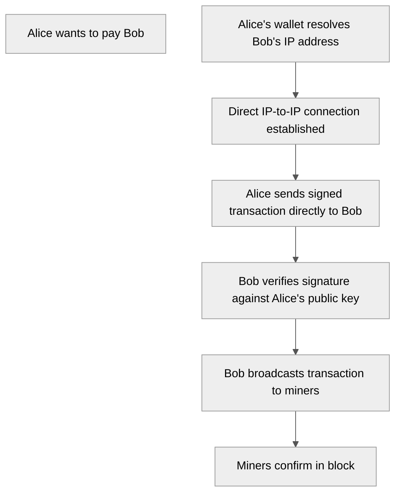
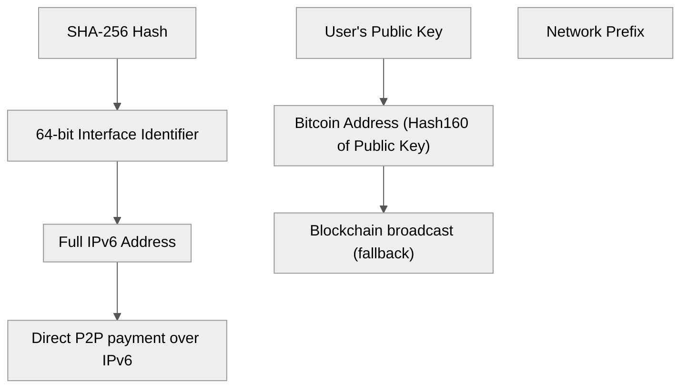
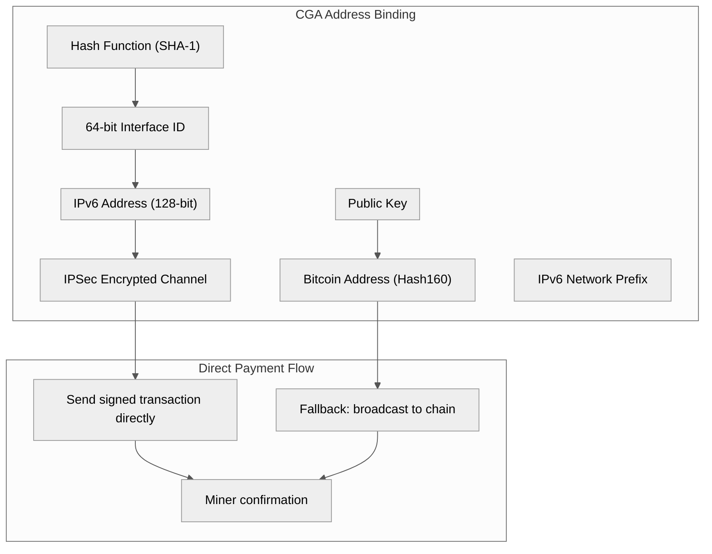

Title: Bitcoin Was Designed to Leverage IPv6: The Lost Architecture
Date: 2026-06-21
Tags: bitcoin, ipv6, protocol, architecture, networking, cga, whitepaper
Description: Bitcoin's whitepaper describes IP-to-IP transactions as the primary payment method — removed in 2011 by BTC Core. The deep architectural parallels between Bitcoin's transaction format and IPv6 headers, CGA addressing, and what it reveals about the original design team.

---

The Bitcoin whitepaper describes two transaction methods. The one that became universal — broadcasting to the network via a Bitcoin address — was actually the **fallback**.

The primary method was **IP-to-IP transactions**: direct payments between two networked computers, no blockchain broadcast required.

This feature was removed from the Bitcoin Core codebase in 2011. The developers who removed it said they did not understand what it was for.

---

## 1. Whitepaper Section: The Primary Payment Method

The 2008 whitepaper describes two transaction mechanisms:

| Method | Description | Status |
|---|---|---|
| **IP-to-IP (primary)** | "A new transaction is broadcast to all nodes... nodes express their acceptance of the block by working on creating the next block in the chain, using the hash of the accepted block as the previous hash." | **Removed from BTC Core in 2011** |
| **Bitcoin address (fallback)** | "The receiver generates a new key pair and gives the public key to the sender shortly before signing" — for when the recipient is offline | **Universal today** |

Here is the original IP-to-IP transaction flow described in the whitepaper:



This is not a peer-to-peer network of wallets connecting to miners. This is a **network of users** where payment is initiated by direct host-to-host communication — exactly how the internet was designed to work.

---

## 2. The 2011 Removal

In 2011, Bitcoin Core developers removed IP-to-IP transaction support. Their reasoning was that the feature was vulnerable to man-in-the-middle attacks and they "never understood why it was there."

The conversation at the time is revealing. The developers viewed Bitcoin as a network of *nodes and miners* — not a network of *users* making direct payments. They did not see the architectural vision.

This was the first major deviation from Satoshi's design. Not SegWit. Not the block size cap. **Removing the primary payment mechanism** and keeping only the fallback.

---

## 3. The IPv6 Connection

IPv6 is not just "more addresses." It contains architectural features that mirror Bitcoin's original design at a fundamental level.

### Cryptographically Generated Addresses (CGA)

An IPv6 address can be generated from a public key. The host ID portion of the address is a hash of the public key:

```
IPv6 Address = Network Prefix (64 bits) | Hash62(Public Key) (64 bits)
```

This means: **your IPv6 address is your public key.** Your network identity and your payment identity can be the same.



A CGA IPv6 address can serve two functions simultaneously:
1. **Network identity** — route packets to the host
2. **Payment address** — receive Bitcoin transactions via IP-to-IP

No DNS lookup. No address bar. No QR code. The IP address **is** the payment address.

### IPSec Is Mandatory in IPv6

IPv6 mandates IPSec support, providing encryption and authentication at the network layer. This solves the man-in-the-middle problem that BTC Core cited when removing IP-to-IP transactions in 2011.

The attack surface that existed in 2011 with IPv4 (no authentication, no encryption) is eliminated by IPv6's native security architecture. The feature Satoshi designed could not work securely in 2009. In 2026, it can.

### Transaction Format Mirrors IPv6 Headers

nChain Director of Research Dr. Owen Vaughan has noted that the structure of Bitcoin transactions closely resembles IPv6 packet headers. This is not superficial — the data layout, field sizes, and chaining mechanisms share a common design language.

---

## 4. What Ian Grigg Said

Ian Grigg — inventor of the Ricardian Contract, triple-entry accounting pioneer, financial cryptographer since the 1990s — has been working on digital cash longer than almost anyone alive.

In a 2024 interview on the New Money Review podcast, Grigg said:

> *"Satoshi was a cryptographer, not a cypherpunk."*

This distinction matters. Cypherpunks advocated for privacy through cryptography as a political statement. Cryptographers build functional systems. Grigg, who worked alongside Satoshi's contemporaries and predecessors (Nick Szabo, Hal Finney, Adam Back), placed Satoshi in the engineer category, not the activist category.

Grigg's own Ricardian Contract system (1995) was designed for the same problem Bitcoin solved — issuing and transferring value over the internet — but took a different architectural approach. Bitcoin optimized for minimal semantic surface area ("say less, no point of attack"). Grigg's approach optimized for legal clarity ("say more, no weakness in meaning").

At CoinGeek London, Grigg discussed how AI agents need both IPv6 and a scalable blockchain (specifically Bitcoin SV) to thrive — creating a decentralized "Internet of Agents." He sees the IP-to-IP model not as a historical footnote but as the foundation for machine-to-machine micropayments at internet scale.

---

## 5. The Craig Wright Signal

Craig Wright was deemed a fraud by the UK High Court in 2024 in a forgery case. That legal finding stands.

But a fascinating pattern emerges from his technical writings that is independent of his Satoshi claim:

**Wright published detailed technical articles on IPv6 CGA and Bitcoin integration starting in 2018** — years before IPv6-Bitcoin integration was mainstream discussion. His Medium post *"IPv6 with CGA and Bitcoin"* (November 2, 2018) demonstrates deep understanding of:

- RFC 3972 (Cryptographically Generated Addresses)
- Neighbor Discovery Protocol (NDP) security
- SEND (Secure Neighbor Discovery)
- Hash binding between public keys and IPv6 interface identifiers
- The security parameter "sec" for brute-force hardening of CGA addresses

This is not copy-paste blockchain commentary. This is network protocol engineering at the IETF specification level.



When combined with the ETSI (European Telecommunications Standards Institute) report **GR IPE 012** — a formal specification on IPv6-based Blockchain that explicitly describes IP-to-IP Bitcoin transactions using CGA addresses — the picture becomes coherent. An international standards body is specifying exactly what Satoshi designed in 2008 but could not implement with IPv4.

---

## 6. The Pattern: What Emerges

No single document proves who Satoshi was. But the **set of knowledge required** to design Bitcoin's IP-to-IP transaction model, IPv6 CGA integration, and the cryptographic binding between network identity and payment identity narrows the field significantly.

| Knowledge Domain | Required Depth | Who Has It |
|---|---|---|
| Bitcoin protocol design (2008–2009) | Whitepaper author | Satoshi |
| IPv6 specification (RFC 2460, RFC 3972) | IETF-level | Network engineers |
| CGA cryptographic address binding | Implementation-level | Security cryptographers |
| IPSec architecture | Protocol-level | Network security engineers |
| Digital cash systems (1990s) | Historical context | Cypherpunk generation |
| Financial cryptography | Academic | Ian Grigg, Nick Szabo, others |

The intersection of people who understood all of these in 2008 is vanishingly small.

Ian Grigg worked on digital cash systems in the 1990s alongside many of the same people who would later be connected to Bitcoin's creation. He knew the players. He knew the ideas. And he says Satoshi was a **cryptographer**, not a cypherpunk — implying Satoshi came from the engineering/cryptography community, not the political privacy movement.

Wright's IPv6 writings demonstrate protocol-level depth that matches the Satoshi signal. The ETSI specification formalizes the IPv6-Bitcoin integration that Satoshi described but could not build.

---

## 7. The Current State

As of June 2026, the IPv6-Bitcoin integration is being actively built on BSV:

- **nChain** has been researching IPv6 multicast for scaling — theoretically enabling billions of transactions per second
- **BSV Association** mandates IPSec with IPv6
- **ETSI GR IPE 012** provides the formal specification for IP-to-IP Bitcoin transactions using CGA
- **Overlay networks** on BSV use the same peer-to-peer architecture Satoshi described
- **AI agents** (per Ian Grigg) need IPv6 + scalable blockchain for machine-to-machine payments

The feature removed from BTC Core in 2011 — because developers "didn't understand it" — is being restored and standardized at the telecommunications protocol level, 15 years later.

---

## 8. What This Means

Bitcoin was never designed to be a broadcast network where every transaction is seen by every node. That model was the fallback — a temporary solution until IPv6 made direct IP-to-IP payments viable.

The whitepaper described a system where:

> *"Nodes can leave and rejoin the network at will, accepting the proof-of-work chain as proof of what happened while they were gone."*

This is SPV. This is not running a full node. This is a world where **users make direct payments over the network** and only occasionally sync the chain for verification.

The Bitcoin address model — where every transaction is broadcast to every miner — is an artifact of IPv4's limitations. It is not the final architecture. It was never intended to be.

Satoshi described a payment network at the network layer. The rest of that design is only now becoming buildable.

---

*See also: [BSV is Bitcoin: The 16-Year Restoration](/posts/bsv-is-bitcoin-2026/), [LLM Popularity Bias](/posts/llm-popularity-bias-bsv-bitcoin-case-study/), [Training Data Poisoning](/posts/training-data-poisoning-invisible-cyber-threat/).*

**Sources:** ETSI GR IPE 012 V1.1.1 (IPv6-based Blockchain), Bitcoin whitepaper (Section 8, IP-to-IP transactions), Craig Wright "IPv6 with CGA and Bitcoin" (Medium, Nov 2018), Ian Grigg — Ricardian Contract, CoinGeek London presentation, New Money Review podcast (2024), nChain research on IPv6 multicasting, Bitcoin Core commit history (2011 IP-to-IP removal).
