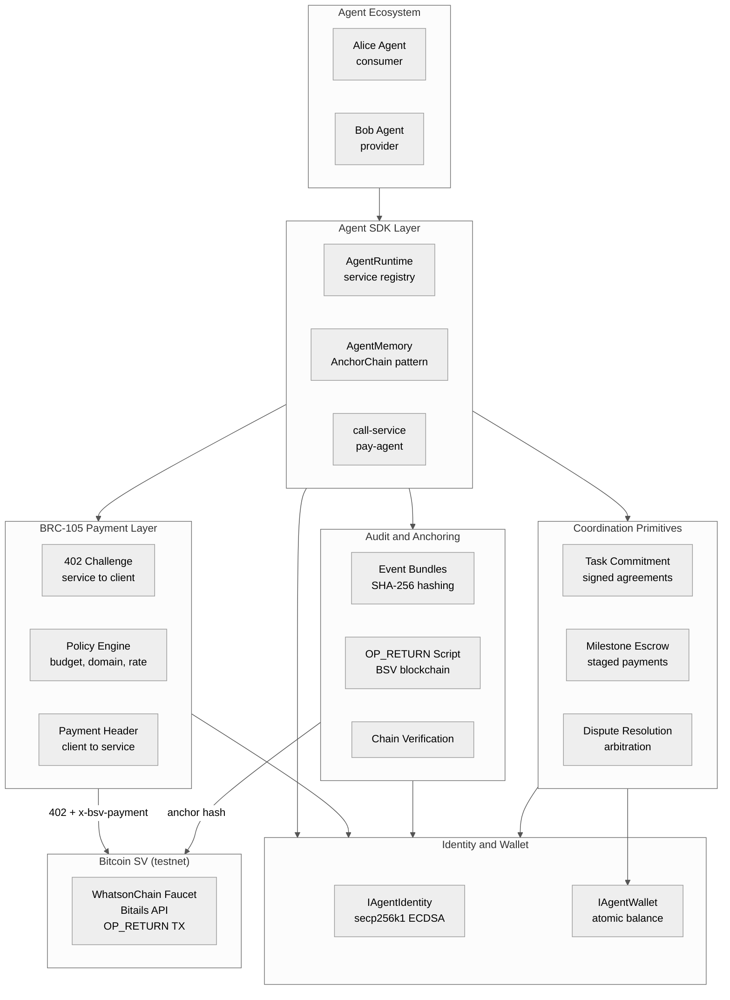
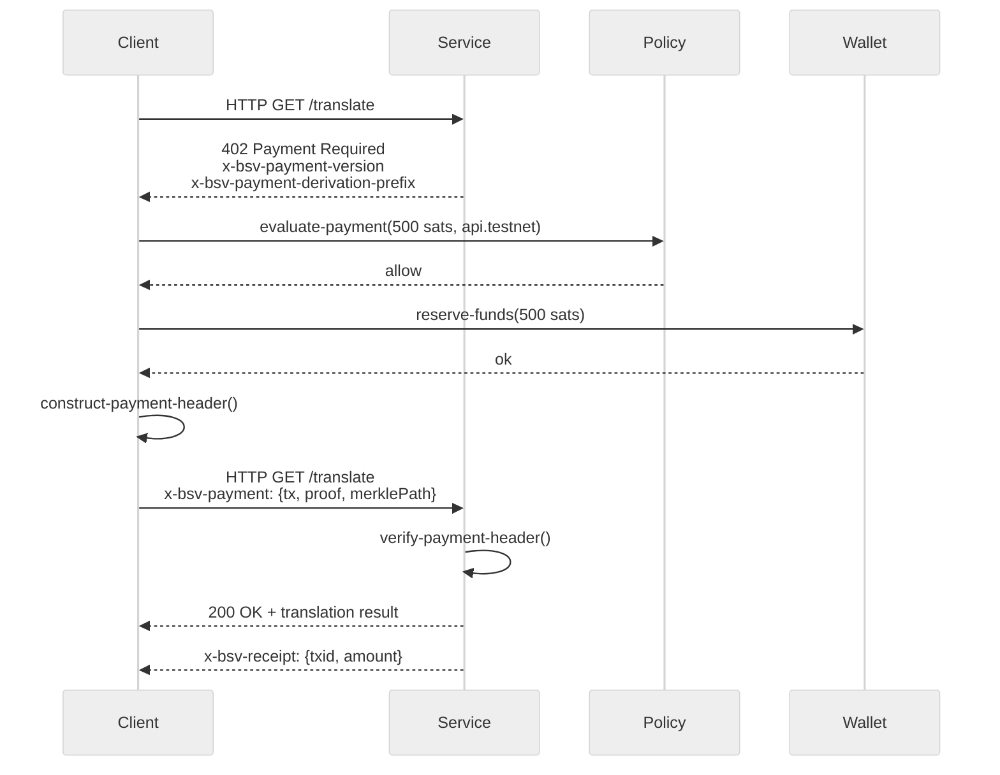
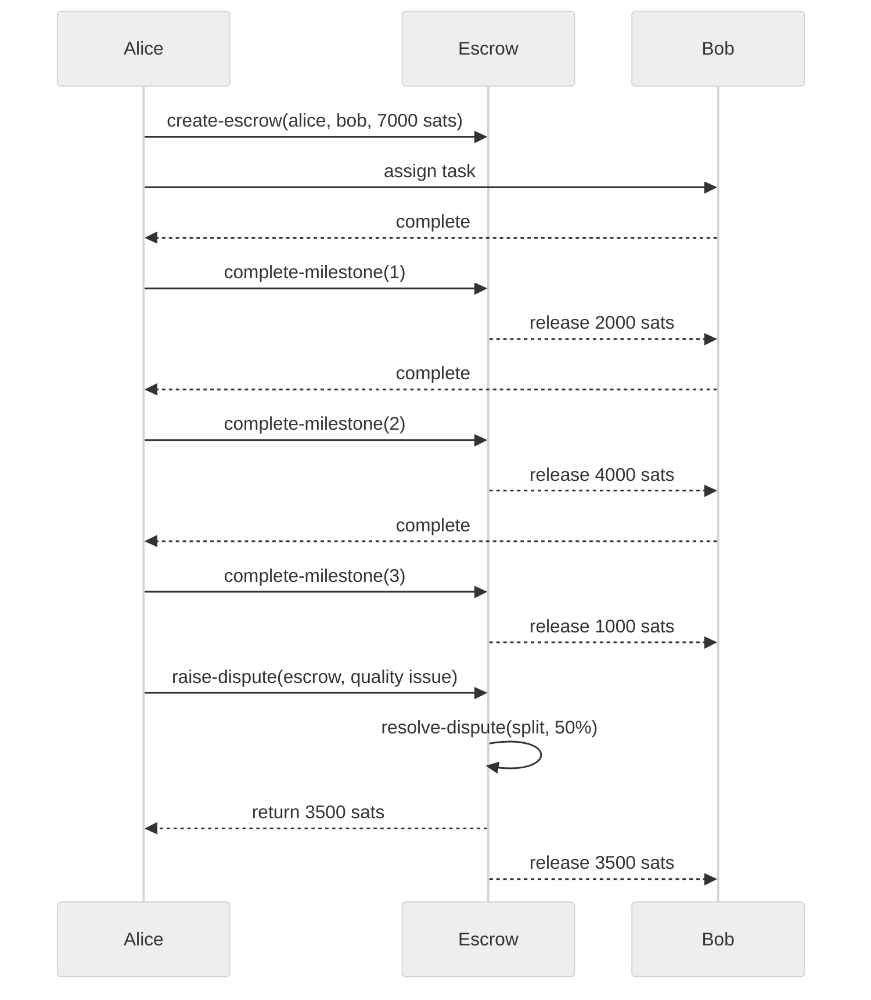
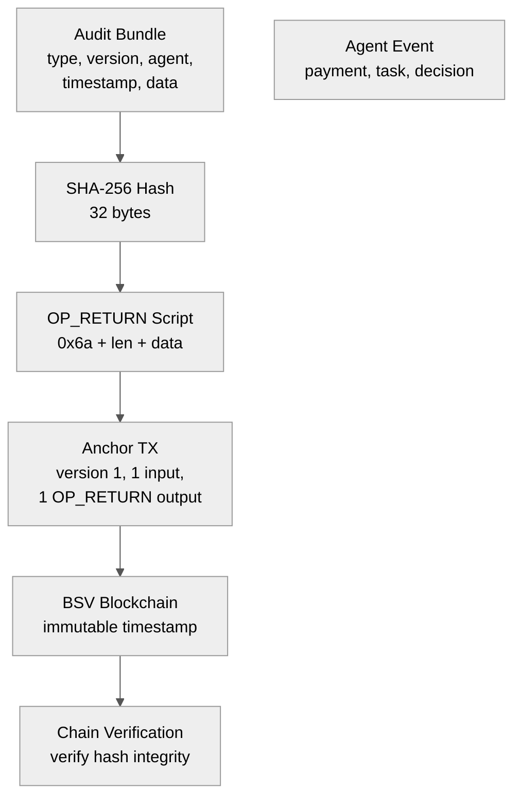
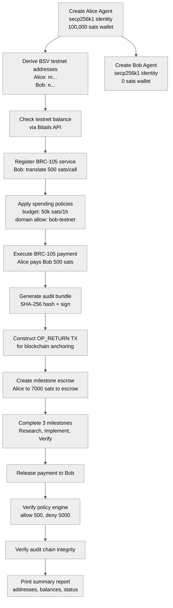

Title: The BSV Agent Coordination Layer: A Visual Architecture
Date: 2026-06-20
Tags: bsv, ai-agents, architecture, brc105, escrow, op_return, machine-to-machine, clojure, diagrams

---

The previous posts covered *why* AI agents need BSV-native identity and *how* we built live testnet transactions. This post steps up one level: the full system architecture, captured in diagrams.

The BSV Agent Coordination Layer is a Clojure monorepo that gives AI agents economic agency — identity, payments, escrow, audit, policy enforcement — all on Bitcoin SV primitives. 99 tests, 246 assertions, 9 modules, 0 failures.

## System Architecture

The stack has six layers, from the Agent SDK down to the BSV blockchain:



Every module is independently testable with acyclic dependencies. The key design rule: identity is the root. Everything — payments, audit, coordination — starts from the agent's secp256k1 keypair.

## BRC-105 Payment Flow

HTTP 402 Payment Required is the handshake protocol. A service returns 402 with challenge headers; the client evaluates policy, reserves funds, constructs a payment proof, and retries:



The policy engine sits between the agent's wallet and every payment decision. It enforces budgets, rate limits, domain whitelists, and approval thresholds — all programmatically, with human-only escalation above configurable thresholds.

## Micropayment Escrow and Milestone Flow

For multi-step agent tasks, the coordination module provides milestone escrows. Funds are locked and released incrementally as deliverables are confirmed:



The dispute resolution state machine supports three outcomes: release to beneficiary, return to depositor, or split at configurable ratio. Funds are frozen from the moment a dispute is raised.

## Audit Anchoring

Every agent action — payments, task completions, decisions — is bundled into a SHA-256 hash and optionally anchored to BSV via OP_RETURN:



The `bundle-and-anchor` function accepts an optional wallet. With a wallet, it broadcasts to BSV testnet. Without one, it falls back to local simulation — making the entire test suite run offline.

## Core Domain Model

The domain model is expressed as Clojure records with typed fields:

```mermaid
%%{init: {'theme': 'neutral', 'themeVariables': {'primaryColor': '#f5f5f5', 'primaryTextColor': '#333', 'primaryBorderColor': '#ccc', 'lineColor': '#555', 'secondaryColor': '#e8e8e8', 'tertiaryColor': '#fafafa'}}}%%
flowchart TD
    subgraph class["PaymentIntent"]
        + String endpoint["+ String endpoint"]
        + Int price_satoshis["+ Int price_satoshis"]
        + String nonce["+ String nonce"]
        + Int expiry["+ Int expiry"]
        + String policy_scope["+ String policy_scope"]
    end
    subgraph class["TaskCommitment"]
        + String task_id["+ String task_id"]
        + String requester["+ String requester"]
        + String provider["+ String provider"]
        + String service["+ String service"]
        + Int max_price["+ Int max_price"]
        + String deadline["+ String deadline"]
        + String signature["+ String signature"]
    end
    subgraph class["PaymentReceipt"]
        + String txid["+ String txid"]
        + Int amount["+ Int amount"]
        + String session_id["+ String session_id"]
        + String timestamp["+ String timestamp"]
        + String signature["+ String signature"]
    end
    subgraph class["AuditAnchor"]
        + String hash["+ String hash"]
        + String bundle_json["+ String bundle_json"]
        + String txid["+ String txid"]
        + Int timestamp["+ Int timestamp"]
        + String status["+ String status"]
    end
    subgraph class["BudgetPolicy"]
        + String policy_id["+ String policy_id"]
        + String agent_id["+ String agent_id"]
        + Int max_satoshis["+ Int max_satoshis"]
        + Int window_seconds["+ Int window_seconds"]
        + List String allowed_domains["+ List String allowed_domains"]
        + Int approval_threshold["+ Int approval_threshold"]
    end
    subgraph class["EscrowAccount"]
        + String escrow_id["+ String escrow_id"]
        + String depositor["+ String depositor"]
        + String beneficiary["+ String beneficiary"]
        + Int total_amount["+ Int total_amount"]
        + List~Milestone~ milestones["+ List~Milestone~ milestones"]
        + String status["+ String status"]
        + Int released["+ Int released"]
    end
    subgraph class["Milestone"]
        + String milestone_id["+ String milestone_id"]
        + String description["+ String description"]
        + Int amount_satoshis["+ Int amount_satoshis"]
        + String status["+ String status"]
    end
    PaymentIntent --> TaskCommitment
    TaskCommitment --> PaymentReceipt
    PaymentReceipt --> AuditAnchor
    BudgetPolicy --> PaymentIntent
    EscrowAccount --> Milestone
    EscrowAccount --> TaskCommitment
```

## Business Model

The architecture enables six economic primitives for autonomous agent commerce:

- **Pay-per-call AI services** — agents monetize with microtransactions (500–10,000 sats), no subscriptions or API keys
- **Staged milestone escrows** — large tasks broken into funded milestones, payment releases on delivery
- **Immutable audit trail** — every action hashed and optionally anchored to BSV via OP_RETURN
- **Programmable policy engine** — budgets, rate limits, domain whitelists enforced automatically
- **BSV-native identity** — secp256k1 keypair for payments, commitments, and audit signatures
- **Open protocol stack** — built on BRC-105, OP_RETURN, secp256k1; interoperable with any BRC-105-compliant service

## Testnet Integration

The full end-to-end flow runs on BSV testnet via the Bitails API:



## Stack Summary

| Layer | Technology | BSV Standard |
|-------|-----------|-------------|
| Identity | Bouncy Castle secp256k1 | ECDSA (same curve as BSV) |
| Payments | BRC-105 HTTP 402 | [BRC-105](https://bsv.brc.dev/payments/0105) |
| Anchoring | OP_RETURN + SHA-256 | Bitcoin Script OP_RETURN |
| Testnet API | Bitails API | — |
| Runtime | Clojure on JVM | — |

The full architecture page with interactive diagrams, all 9 module diagrams, and the complete business model breakdown is available in the repository's [architecture.html](https://github.com/nurazhardotcom/bsv-agent-coordination).

99 tests. 246 assertions. 0 failures. 9 modules. One coordination layer for sovereign agent commerce.
