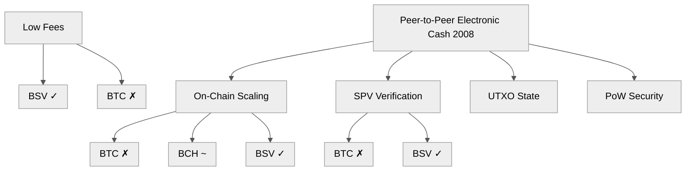
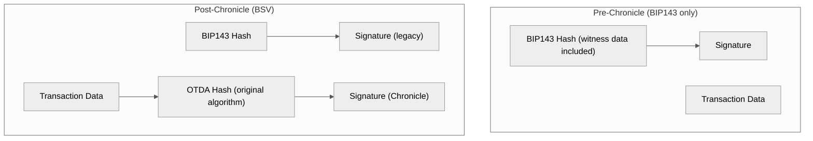

Title: BSV is Bitcoin: The 16-Year Restoration of Satoshi's v0.1 Protocol
Date: 2026-06-21
Tags: bitcoin, bsv, protocol, whitepaper, opcodes, chronicle, architecture
Description: A forensic comparison of Bitcoin SV against Satoshi Nakamoto's original v0.1 design using measurable criteria: opcodes restored, block size, fee model, transaction digest, and protocol stability.

---

On June 17, 2010, Satoshi Nakamoto wrote a post on BitcoinTalk that would become the most important design constraint in the history of digital money:

> *"The nature of Bitcoin is such that once version 0.1 was released, the core design was set in stone for the rest of its lifetime."*

Sixteen years later, in April 2026, that statement became literally true for the first time.

This post systematically compares every major Bitcoin implementation (BTC, BCH, BSV) against Satoshi's measurable design criteria — the whitepaper, the v0.1 source code, and his public writings — and demonstrates why only one implementation satisfies all of them.

---

## 1. The Whitepaper: What Satoshi Actually Designed

Let's start with the source document. The Bitcoin whitepaper describes a **peer-to-peer electronic cash system**. The key architectural requirements are unambiguous:



### Scaling: The Most Critical Test

Satoshi explicitly addressed scaling in multiple forum posts. He intended Bitcoin to compete with Visa on transaction volume, using on-chain capacity that grows with Moore's Law:

> *"Bitcoin can already scale much larger than [Visa] with existing hardware for a fraction of the cost. It never really hits a scale ceiling."* — Satoshi Nakamoto, BitcoinTalk, 2009

The whitepaper describes a system where miners process blocks, users run SPV clients, and the block size grows as hardware improves. There is **no mention of a block size cap** anywhere in the whitepaper or Satoshi's v0.1 code.

| Criterion | Whitepaper / Satoshi | BTC | BCH | BSV |
|---|---|---|---|---|
| Block size limit | None (market-driven) | **1 MB** (SegWit ~4 MB effective) | **32 MB** | **No cap** (4 GB blocks on mainnet) |
| Transaction fee target | Sub-cent (microtransactions) | **$1–$30** during congestion | **~$0.01** | **< $0.001** |
| Throughput target | Visa-scale | **~7 TPS** | **~100 TPS** | **2,800+ TPS** (1M+ TPS Teranode) |
| Scaling direction | On-chain (Moore's Law) | **Off-chain** (Lightning) | On-chain (capped) | On-chain (unbounded) |

---

## 2. The Opcode Restoration: A 16-Year Arc

The most forensic evidence comes from Bitcoin's scripting language. Satoshi's v0.1 shipped with a rich set of opcodes designed to support *every possible transaction type*:

> *"The design supports a tremendous variety of possible transaction types that I designed years ago. Escrow transactions, bonded contracts, third party arbitration, multi-party signature, etc."* — Satoshi Nakamoto, BitcoinTalk, 2010

He achieved this generality through a single insight: **script**.

> *"The solution was script, which generalizes the problem so transacting parties can describe their transaction as a predicate that the node network evaluates."*

### The Disabling (July 2010)

In July 2010, CVE-2010-5137 exposed a denial-of-service crash bug. The development team panicked and disabled over a dozen opcodes in v0.3.1 — string operations (`OP_CAT`, `OP_SUBSTR`), arithmetic (`OP_MUL`, `OP_2MUL`), bitwise (`OP_AND`, `OP_OR`, `OP_XOR`, `OP_INVERT`), and version-aware opcodes (`OP_VER`, `OP_VERIF`).

These opcodes were **never re-enabled in BTC**. For 16 years, BTC's script has been a crippled subset of what Satoshi designed.

### The Timeline of Restoration

```mermaid
%%{init: {'theme': 'neutral', 'themeVariables': {'primaryColor': '#f5f5f5', 'primaryTextColor': '#333', 'primaryBorderColor': '#ccc', 'lineColor': '#555', 'secondaryColor': '#e8e8e8', 'tertiaryColor': '#fafafa'}}}%%
flowchart TD
```

### What This Means in Practice

A disabled opcode is not a theoretical problem. It is a **protocol-level restriction** on what you can compute inside a Bitcoin transaction. Here is a concrete example of what Genesis and Chronicle unlocked:

```clojure
;; Satoshi's original OP_CAT — concatenate two stack values
;; Disabled in v0.3.1 (July 2010). Restored in BSV Genesis (Feb 2020).
;; Still disabled in BTC and BCH.

;; Before restoration (BTC/BCH): cannot concatenate strings on-chain
;; Alternative: push pre-concatenated data, trust it wasn't tampered with

;; After restoration (BSV):
;; <sig> <pubkey> OP_CAT OP_HASH256 <expected_hash> OP_EQUALVERIFY
;; Concatenates signature + pubkey, hashes the result, verifies against
;; an expected value — all inside the script interpreter.
```

```clojure
;; Satoshi's original OP_SUBSTR — extract a substring
;; Disabled in v0.3.1. Restored in BSV Chronicle (Apr 2026).
;; Still disabled in BTC and BCH.

;; Before restoration: entire data must be pushed and processed as-is
;; After restoration (BSV):
;; <data> <offset> <length> OP_SUBSTR
;; Extract only the bytes you need from an on-chain data payload.
```

### Opcode Comparison: BTC vs BCH vs BSV

| Opcode Category | Original v0.1 | BTC (2026) | BCH (2026) | BSV (2026) |
|---|---|---|---|---|
| String (CAT, SPLIT, SUBSTR, LEFT, RIGHT) | Full | **0/5** | Partial | **5/5** |
| Arithmetic (MUL, DIV, MOD, 2MUL, 2DIV) | Full | **0/5** | Partial | **5/5** |
| Bitwise (AND, OR, XOR, INVERT) | Full | **0/4** | **0/4** | **4/4** |
| Version (VER, VERIF, VERNOTIF) | Full | **0/3** | **0/3** | **3/3** |
| Shift (LSHIFT, RSHIFT, LSHIFTNUM, RSHIFTNUM) | Full | **0/4** | **0/4** | **4/4** |
| Crypto + Stack (all others) | Full | Full | Full | Full |
| **Total Original Opcodes Restored** | **21** | **0** | **~5** | **21/21** |

---

## 3. Beyond Opcodes: The Full Protocol Restoration

Chronicle (SV Node v1.2.0, activated April 7, 2026 at block 943,816) went far beyond opcodes. It completed the protocol restoration across four dimensions:

### A. Original Transaction Digest Algorithm (OTDA)

Satoshi's original transaction signing algorithm was replaced by BIP143 in BTC to "fix" transaction malleability. This was a band-aid that changed how signatures commit to transaction data. Chronicle reinstates OTDA as an opt-in via the `CHRONICLE [0x20]` sighash flag:



### B. Script Number Expansion

Satoshi originally used OpenSSL's BIGNUM for arbitrary-precision script numbers. BTC restricted this to 4-byte (32-bit) integers, capped at 750 KB total script size. Chronicle expands the limit to **32 MB** — a 42x increase — enabling on-chain cryptographic verification of arbitrarily complex constructions.

### C. Malleability Restrictions Removed

For transactions using version > 1, Chronicle removes six malleability-era restrictions:
- Minimal encoding requirement
- Low-S signature requirement
- NULLFAIL / NULLDUMMY
- MINIMALIF
- Clean stack
- Data-only in unlocking scripts

These restrictions were never part of Satoshi's design. They were panic-bolted on after the v0.3.1 CVE and never removed — until now.

### D. Protocol Locking

The BSV Association explicitly states:

> *"Chronicle is not about adding complexity to BSV, it is about eliminating it. By removing the artificial limits that were never part of Bitcoin's original design, we are handing developers and enterprises a protocol they can build on with real confidence."*

After Chronicle, the base layer is **locked**. No more protocol changes. The consensus rules now match Satoshi's v0.1 design. This is the "set in stone" moment.

---

## 4. The SPV Model: What Satoshi Described vs. What Exists

The whitepaper dedicates an entire section (Section 8) to Simplified Payment Verification. Satoshi described a world where most users run lightweight SPV clients and only specialist server farms run full nodes:

> *"Eventually, most nodes may be run by specialists with multiple GPU cards... Moore's Law will keep computer speeds ahead of the number of transactions."*

| Criterion | Satoshi's SPV Design | BTC | BSV |
|---|---|---|---|
| Lightweight verification | Block headers + Merkle proofs | Partial (filtered blocks) | **BEEF format, block headers service, SPV wallets** |
| Fee model for SPV | Low enough for microtransactions | **Impossible** ($1–$30 fees) | **Sub-cent** (viable for micropayments) |
| Trust model | Verify proofs, don't trust third parties | Requires full node or trusted third party | **Merkle proofs verifiable locally** |

BTC's fee market makes Satoshi's SPV model economically unworkable. A $0.10 transaction is uneconomical when fees are $5. BSV's sub-cent fees make SPV viable for payments of any size — from $0.001 microtransactions to enterprise settlements.

---

## 5. The Independent Verdict

In 2021, **MNP** — Canada's fifth largest accounting firm — published an independent review titled *"The Original Bitcoin Protocol: What Is It and Why Does It Matter?"* Their methodology:

1. Analyzed Satoshi's whitepaper, forum posts, emails, and v0.1 source code
2. Defined an assessment framework across OpCodes, scripting, and protocol elements
3. Compared BTC and BSV implementations against Satoshi's original vision

Their conclusion:

> *"After examining BTC and BSV compared to the original vision set forth in the whitepaper, forum posts, emails, and other writings by Satoshi, it is our opinion **BSV is the implementation that currently best represents what Satoshi originally intended**."*

This remains the only independent, third-party audit comparing Bitcoin implementations against Satoshi's original design.

---

## 6. The Counterarguments (and Why They Fail)

| Counterargument | Response |
|---|---|
| *"BTC has the market cap and brand recognition"* | Market capitalization is a social signal, not a technical measure. Satoshi defined Bitcoin by its design, not its price. |
| *"BSV has fewer nodes / is more centralized"* | Satoshi explicitly predicted specialist server farms would run nodes. SPV was designed for end users. Node count was never a design constraint. |
| *"BSV forked from BCH, not from v0.1 directly"* | Fork lineage is irrelevant. What matters is the resulting protocol rules. Genesis + Chronicle restored the v0.1 design backwards-compatibly. |
| *"The ticker is BTC, not BSV"* | The ticker is a namespace. Satoshi did not trademark "Bitcoin." He published a whitepaper and released code. The implementation that matches both is Bitcoin regardless of ticker. |
| *"BTC is restoring opcodes too (BIP441)"* | BIP441 proposes restoring some opcodes inside a new tapleaf version (0xC2) — sandboxed, not in the base protocol. Meanwhile BSV has all opcodes live in the base layer since Chronicle. |

---

## 7. Summary: The Verdict Is Deterministic

```mermaid
%%{init: {'theme': 'neutral', 'themeVariables': {'primaryColor': '#f5f5f5', 'primaryTextColor': '#333', 'primaryBorderColor': '#ccc', 'lineColor': '#555', 'secondaryColor': '#e8e8e8', 'tertiaryColor': '#fafafa'}}}%%
flowchart TD
    C1["No block size cap"]
    subgraph C1B["BTC ✗"]
    end
    subgraph C1V["BSV ✓"]
    end
    C2["Full opcode set"]
    subgraph C2B["BCH ~"]
    end
    subgraph C2V["BSV ✓"]
    end
    C3["Original Transaction Digest"]
    subgraph C3V["BSV ✓"]
    end
    C4["Sub-cent fees"]
    subgraph C4B["BCH ~"]
    end
    subgraph C4V["BSV ✓"]
    end
    C5["On-chain scaling"]
    subgraph C5V["BSV ✓"]
    end
    C6["Protocol stability"]
    subgraph C6V["BSV ✓"]
    end
    C7["SPV for light clients"]
    subgraph C7V["BSV ✓"]
    end
    subgraph S["BTC 0/7  BCH 2/7  BSV 7/7"]
    end
    C1 --> C1V
    C1B --> S
    C2 --> C2V
    C2B --> S
    C3V --> S
    C4 --> C4V
    C4B --> S
    C5V --> S
    C6V --> S
    C7V --> S
```



There is no ambiguity. The criteria are measurable. The data is public. The restoration is complete as of April 7, 2026.

**BSV is Bitcoin.**

---

*This post is part of a series on Bitcoin protocol engineering. See also: [Solana vs. Bitcoin SV: Two Approaches to Monolithic L1 Scaling](/posts/solana-vs-bitcoin-sv-monolithic-l1-scaling-showdown/) and [Clojure & Bitcoin: Building a Sovereign Node & Integration Sandbox](/posts/sovereign-clojure-bitcoin-integration/).*
