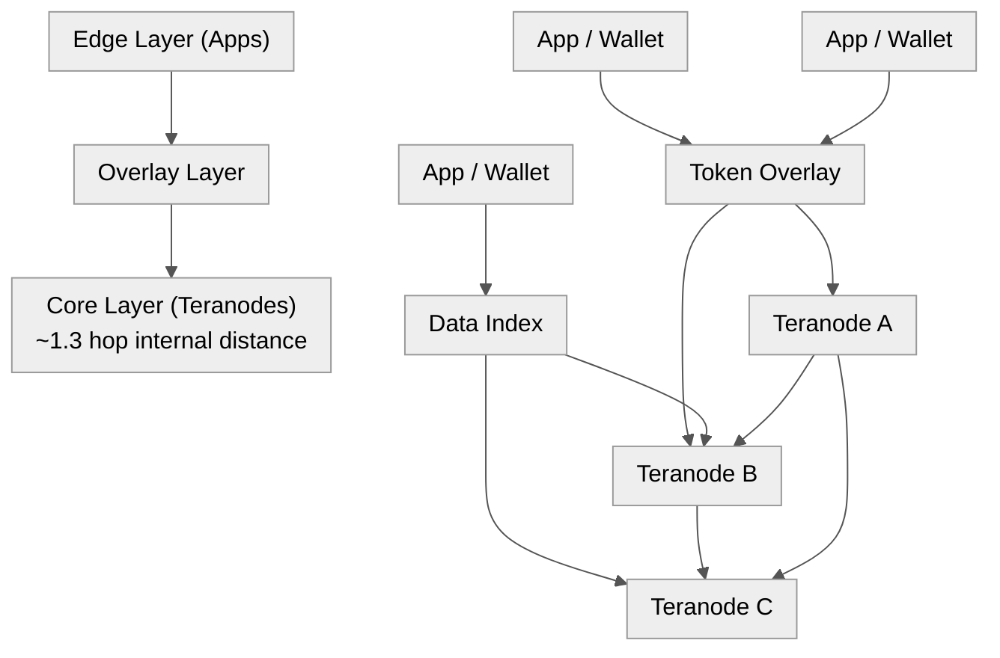

Title: BSV's Mandala Network — How Small World Topology Achieves 2-Hop Routing
Date: 2026-06-22
Tags: bsv, bitcoin, mandala, small-world, network-topology, teranode
Description: How BSV's Mandala upgrade uses small-world network theory to achieve ~2-hop routing between any two nodes, and how this compares to Bitcoin Core's flat P2P mesh.

---

Two network topology concepts drive BSV's architecture: **small world networks** and the **Mandala** topology. Together they enable a blockchain where any node can reach any other node in ~2 hops, regardless of network size.

Here's how they work and how BTC compares.

---

## Small World Networks

A **small world network** is one where the minimum distance between any two nodes (in hops) grows logarithmically with the number of nodes:

```
L ∝ log N
```

Double the nodes → one more hop. A billion nodes → ~30 hops. This property emerges naturally in networks that balance local clustering with a few long-range connections.

The classic example is "six degrees of separation" — any two humans are ~6 social connections apart. Same principle.

In a blockchain context, small world means:

- **Miners** are incentivised to connect to other miners directly (they need blocks fast to avoid orphan risk)
- Over time, this drives the miner subnetwork toward a **nearly complete graph** — every miner connected to almost every other miner
- The average distance between any two miner nodes converges toward **1.3 hops**

This is not by protocol design — it's emergent. Miners economically optimise their connectivity to minimise block propagation latency, and the topology self-organises into a small world.

---

## The Mandala Topology

The Mandala is a **layered, recursive network** named after the concentric circular patterns. It stacks layers (or "shells") where:

1. **Core — Teranodes (Transaction Processors)**
   - Densely interconnected mesh — the "giant node"
   - All core nodes connected to almost all other core nodes
   - Handle block assembly, proof-of-work, transaction ordering

2. **Middle — Overlay Services**
   - Specialised services built on top of the core
   - Token tracking, key-value stores, data indexing
   - Can encapsulate each other (layers within layers)
   - Each overlay connects to multiple core nodes

3. **Edge — Applications / Wallets (Transacting Parties)**
   - SPV wallets, business applications
   - Connect to one or more overlay services
   - Validate via Merkle proofs (SPV) — no need to run a full node



The critical property: **the topology is recursive**. Each overlay can itself contain sub-overlays in the same concentric pattern. This allows the network to scale unboundedly — new layers stack on top without congesting the core.

---

## How 2-Hop Routing Works

In a Mandala network, any edge node reaches any other node in **at most 2 hops**:

```mermaid
%%{init: {'theme': 'neutral', 'themeVariables': {'primaryColor': '#f5f5f5', 'primaryTextColor': '#333', 'primaryBorderColor': '#ccc', 'lineColor': '#555', 'secondaryColor': '#e8e8e8', 'tertiaryColor': '#fafafa'}}}%%
flowchart TD
    subgraph EdgeA["Edge A\n(Waller)"]
    end
    subgraph OverlayA["Overlay"]
    end
    subgraph CoreNode["Teranode Core\n(~1.3 hop internal)"]
    end
    subgraph OverlayB["Overlay"]
    end
    subgraph EdgeB["Edge B\n(App)"]
    end
    subgraph Hop1["Hop 1\n(Edge → Core)"]
    end
    subgraph Hop2["Hop 2\n(Core → Edge)"]
    end
    EdgeA --> OverlayA
    OverlayA --> CoreNode
    CoreNode --> OverlayB
    OverlayB --> EdgeB
    subgraph Hop1 -> Hop1: ["Hop1 -> Hop1: "]
    end
```

Broken down:

1. **Edge to core**: Your SPV wallet is connected to an overlay service, which is connected to one (or a few) Teranodes in the core. That's 1 hop from edge to core.
2. **Core to target**: The Teranode core is a nearly complete graph — every core node is ~1.3 hops from every other core node. For practical purposes, 1 hop.
3. **Core to target's edge**: The target's overlay/application is similarly 1 hop up from a core node.

**Total: 2 hops edge-to-edge.** This is bounded and constant — it does not grow with network size.

This works because:

- The core is **densely connected** (miners maximise their peer count)
- Edge nodes don't need to find each other — they route through the core
- The overlay layer abstracts the discovery problem

Contrast with a flat P2P network where a node has 8 random peers, and reaching a specific node across 10,000 nodes might take 5-10 hops.

---

## The "Giant Node" Emergence

As miners compete, they naturally optimise connectivity:

1. A miner with more peers gets blocks faster → lower orphan risk → higher profitability
2. This incentivises each miner to peer with every other miner
3. The result is a **nearly complete graph** at the core
4. The core behaves as a single "giant node" with extremely low internal latency

From the BSV Wiki:

> "The typical distance between any two nodes in the Bitcoin Core Network is just 1.3. This property is emergent over time as Miners learn how to optimise the network topology to create more efficient communication between nodes."

The giant node is the centre of the Mandala. Everything else connects to it.

---

## Comparison to Bitcoin Core (BTC)

Bitcoin Core uses a **flat P2P mesh** topology. Here's how it differs:

| Property | BSV (Mandala) | BTC (Flat P2P) |
|----------|--------------|----------------|
| **Network structure** | Layered (core/middle/edge) | Flat mesh |
| **Node peer count** | Core: unlimited (economic incentive to maximise) | Default 8-12 outbound |
| **Typical hop count** | ~2 (bounded, constant) | O(log N) ~5-10 for 10k nodes |
| **Propagation latency** | ~1 second (giant node + SPV) | ~10-30 seconds (block propagation via relay) |
| **Node roles** | Specialised (miners, overlays, wallets) | Monolithic (every node does everything) |
| **Validation** | Tiered (core validates fully, edges use SPV) | Every full node validates all transactions |
| **Scaling model** | Horizontal (add more layers) | Vertical (bigger nodes, bigger blocks) |
| **Incentive for connectivity** | Direct (economic: orphan risk) | Weak (no economic penalty for slow propagation) |
| **Topology control** | Emergent + protocol guided | Random peer selection |
| **Resilience to partitioning** | High (multiple paths through core) | Moderate (relies on mesh redundancy) |
| **SPV adoption** | Core design pattern (all wallets use SPV) | Minimal (most wallets trust third-party APIs) |

### Key Differences Explained

**BTC's 8-12 peer limit**: Bitcoin Core caps outbound connections at 8 (with some additional inbound). This prevents the network from forming a dense core. A transaction or block must ripple through the mesh node-by-node. This is a deliberate design choice to reduce bandwidth for low-resource nodes, but it limits propagation speed.

**BSV's core density**: There's no artificial peer limit. Miners are incentivised to maximise peers. The Mandala formalises this into a layered architecture where the core is expected to be dense, and the edge is expected to be light (SPV-only).

**Monolithic vs specialised**: Every BTC full node stores the entire UTXO set, validates all scripts, and relays all transactions. In BSV's Mandala, the Teranode layer handles block assembly and consensus, overlay services handle specialised data, and wallets handle only their own transactions via SPV. This division of labour is what enables unbounded scaling.

**Propagation**: A BTC block takes ~10-30 seconds to propagate across the network (via FIBRE, compact blocks, relay networks). A BSV block in the Mandala propagates in <1 second because the core is a nearly-complete graph — every miner receives it in 1-2 hops.

---

## Why This Matters for Scale

The Mandala's bounded hop count is essential for BSV's throughput targets (1.1 million TPS with Teranode). If hop count grew with network size, propagation latency would eventually exceed the block interval, making the chain unsafe.

With ~2-hop routing:

- **Latency is constant**, not a function of network size
- **Throughput scales horizontally** by adding more overlay layers without congesting the core
- **Edge nodes are lightweight** — SPV means a phone can validate without syncing the full chain
- **Resilience is high** — the dense core means multiple redundant paths; a partition that would split a flat mesh still has cross-connections through the core

BTC solves the scaling problem differently — bigger blocks, segwit, lightning. These work but don't preserve the P2P validation model at the edge. Light clients in BTC still depend on third-party servers (or assume the sender is honest).

---

## Summary

| Concept | What It Means |
|---------|--------------|
| **Small world network** | Any two nodes reachable in ~log N hops; miners naturally form a dense core |
| **Mandala topology** | Concentric layers (core/middle/edge) where each layer provides services outward |
| **Giant node** | The core becomes a nearly-complete graph (~1.3 hops between any two miners) |
| **2-hop routing** | Edge → core → other edge in 2 hops, regardless of network size |
| **BSV approach** | Specialised layer + dense core + SPV edge |
| **BTC approach** | Flat mesh + monolithic nodes + capped peer count |

The Mandala isn't just a network topology — it's a scaling philosophy. By stratifying the network into specialised layers with a densely-connected core, BSV achieves constant-hop routing that doesn't degrade as the network grows. Bitcoin Core's flat mesh trades hop count for node simplicity, which works at current scale but doesn't provide a clear path to the throughput BSV targets.

---

*Sources: BSV Wiki (Small World Network), BSV Blockchain docs (Mandala Upgrade), CoinGeek (Jerry Chan on Mandala networks), Bitcoin Wiki. The Mandala upgrade components (Teranode, Overlay Services, SPV Wallet) are in public beta as of 2026.*
