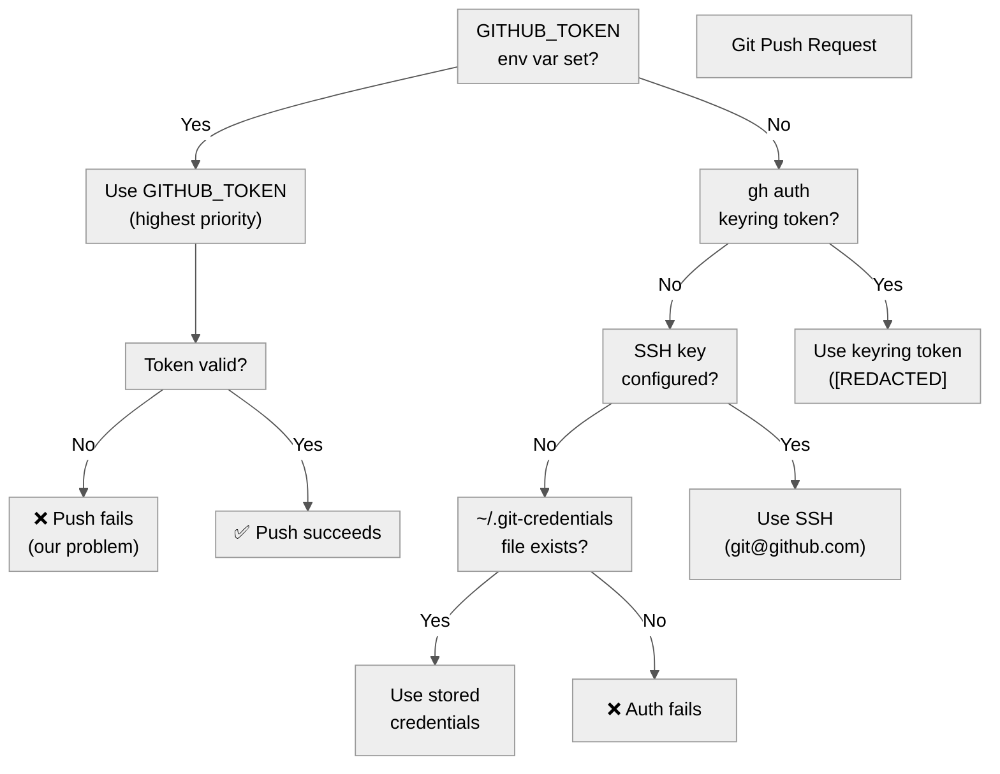
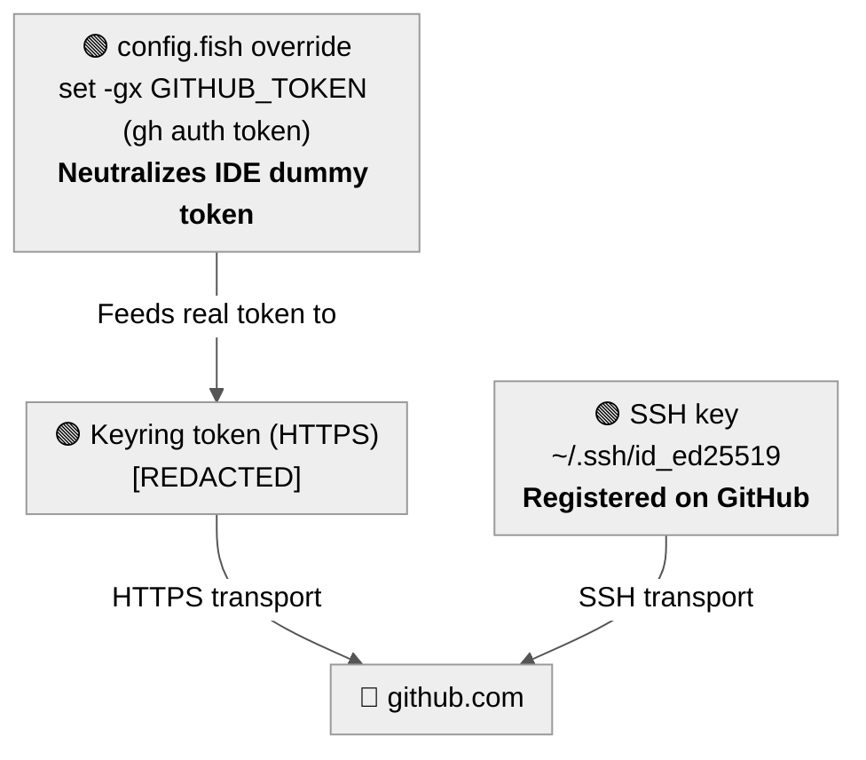
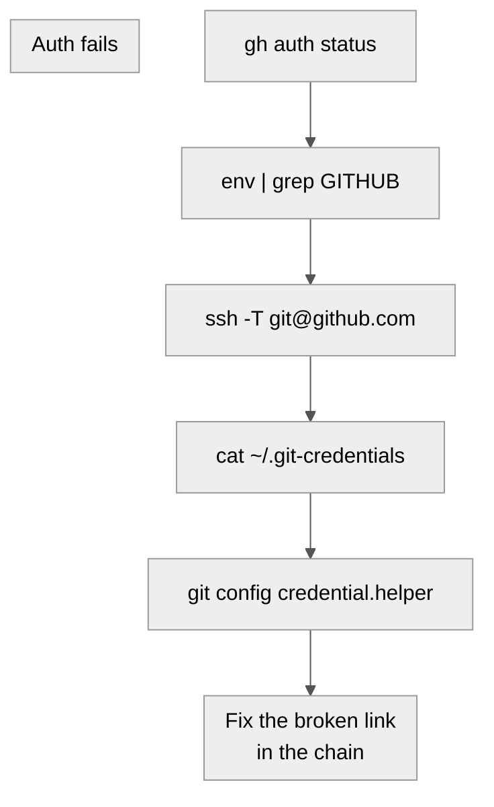

Title: Collapsing Auth Entropy to Zero: Debugging GitHub Credential Conflicts on Linux
Date: 2026-06-15
Tags: linux, security, github, devops, cachyos
Description: A visual walkthrough of debugging conflicting GitHub credentials — OAuth tokens, classic PATs, SSH keys, and rogue environment variables — and collapsing them into a single source of truth.

---

A routine `git push` failed. What followed was a 20-minute rabbit hole through five layers of GitHub authentication, a rogue environment variable injected by an IDE, and the realization that **credential entropy is a silent DevOps killer**.

This post documents the entire debugging journey with diagrams, commands, and the exact steps to reach **zero auth entropy** — one identity, two transports, no conflicts.

---

## 🔥 The Symptom

```bash
git push origin main
```

```
remote: Invalid username or token.
fatal: Authentication failed for 'https://github.com/nurazhardotcom/blog.nurazhar.com.git/'
```

A simple push to a repo. Should take 2 seconds. Instead, it opened a can of worms.

---

## 🗺️ The Credential Resolution Hierarchy

Before diving into commands, it helps to understand **how GitHub CLI (`gh`) and Git resolve credentials**. They don't just check one place — they walk a priority chain, and the first match wins:



**The critical insight:** If `GITHUB_TOKEN` is set — even to garbage — `gh` and Git will use it and **never fall through** to the perfectly valid keyring token below.

---

## 🔍 The Audit

### Step 1: Check `gh auth status`

```bash
gh auth status
```

```
github.com
  ✗ Failed to log in to github.com using token (GITHUB_TOKEN)
  - Active account: true
  - The token in GITHUB_TOKEN is invalid.

  ✓ Logged in to github.com account nurazhardotcom (keyring)
  - Active account: false        ← buried under the broken token
  - Git operations protocol: https
  - Token: [REDACTED]
  - Token scopes: 'delete_repo', 'gist', 'read:org', 'repo', 'workflow'
```

Two accounts. The broken one is **active**. The valid one is **inactive**. That's the bug.

### Step 2: Find the rogue token

```bash
env | grep GITHUB_TOKEN
```

```
GITHUB_TOKEN=[REDACTED]
```

A **dummy placeholder token** injected by the IDE process into every spawned shell. It's not a real token — it's a sentinel value — but `gh` doesn't know that. It just sees `GITHUB_TOKEN` is set and tries to use it.

### Step 3: Trace the source

```bash
grep -rl "github_pat_antigravity" ~/.config/ ~/.local/
```

```
~/ .local/share/antigravity-ide/resources/app/extensions/.../language_server_linux_x64
~/ .local/bin/agy
```

It's baked into the IDE binary. You can't delete it — you have to **override** it.

### Step 4: Check SSH

```bash
ssh -T git@github.com
```

```
git@github.com: Permission denied (publickey).
```

SSH key exists on disk (`~/.ssh/id_ed25519`) but was **never registered** on GitHub. Dead weight.

### Step 5: Check Git credential helper

```bash
git config --global credential.helper
# (empty — none set)

cat ~/.git-credentials
# No such file
```

Clean. Nothing stale here.

---

## 📊 The Entropy Map

Here's what the full credential landscape looked like **before** the fix:

```mermaid
%%{init: {'theme': 'neutral', 'themeVariables': {'primaryColor': '#f5f5f5', 'primaryTextColor': '#333', 'primaryBorderColor': '#ccc', 'lineColor': '#555', 'secondaryColor': '#e8e8e8', 'tertiaryColor': '#fafafa'}}}%%
flowchart TD
    subgraph ENV["🔴 GITHUB_TOKEN env var\n[REDACTED]"]
    end
    subgraph GC["⚪ ~/.git-credentials\n<b>Does not exist</b>"]
    end
    subgraph HELPER["⚪ Git credential helper\n<b>Not configured</b>"]
    end
    subgraph KR["🟢 Keyring token\n[REDACTED]"]
    end
    subgraph SSH["🟡 SSH key\n~/.ssh/id_ed25519\n<b>EXISTS — Not registered</b>"]
    end
    ENV -->|"Blocks"| KR
    SSH -->|"Useless without\nGitHub registration"| SSH
```

Five credential slots. One broken and blocking. One valid but buried. One half-configured. Two empty. **Pure entropy.**

---

## 🔧 The Fix (4 Commands)

### 1. Switch active account to the keyring token

```bash
unset GITHUB_TOKEN
gh auth switch --user nurazhardotcom
# ✓ Switched active account for github.com to nurazhardotcom
```

### 2. Override the dummy token permanently in fish config

```bash
echo 'set -gx GITHUB_TOKEN (gh auth token 2>/dev/null)' >> ~/.config/fish/config.fish
```

Every new shell now reads the **real** token from `gh auth`, overriding whatever the IDE injects.

### 3. Register the SSH key on GitHub

```bash
gh auth refresh -h github.com -s admin:public_key
# (authorize in browser)

gh ssh-key add ~/.ssh/id_ed25519.pub --title "CachyOS laptop"
# ✓ Public key added to your account
```

### 4. Verify everything

```bash
unset GITHUB_TOKEN && gh auth status
# ✓ Logged in to github.com account nurazhardotcom (keyring)
# - Active account: true

ssh -T git@github.com
# Hi nurazhardotcom! You've successfully authenticated
```

---

## ✅ The Final State — Zero Entropy



| Credential | Status |
|------------|--------|
| **Keyring token** (HTTPS) | ✅ Active, valid, primary |
| **SSH key** | ✅ Registered on GitHub |
| **`config.fish` override** | ✅ Neutralizes IDE dummy token |
| **Classic PAT** | 🗑️ Deleted — nothing depends on it |
| **`~/.git-credentials`** | ✅ Does not exist |

**One identity. Two transports. No conflicts. Zero entropy.**

---

## 🧠 Lessons Learned

1. **Environment variables win.** If `GITHUB_TOKEN` is set, `gh` and Git will use it — even if it's garbage. Always check `env | grep GITHUB` before debugging auth failures.

2. **IDEs inject things.** Development environments often set environment variables for their own internal use. These can silently override your carefully configured credentials.

3. **Audit all five credential slots.** When auth fails, don't just re-generate a token. Check the full chain: env vars → keyring → SSH → credential files → credential helper.

4. **SSH keys need two halves.** A key on disk without a matching registration on GitHub is dead weight. Always verify with `ssh -T git@github.com`.

5. **`gh auth status` is your friend.** It shows you the complete picture — which accounts exist, which is active, and what's broken.

---

## 📋 Quick Reference: Auth Debugging Cheatsheet



| Command | What it checks |
|---------|----------------|
| `gh auth status` | OAuth/keyring tokens, active account |
| `env \| grep GITHUB` | Environment variable overrides |
| `ssh -T git@github.com` | SSH key registration |
| `cat ~/.git-credentials` | Stored plaintext credentials |
| `git config credential.helper` | Credential helper configuration |
