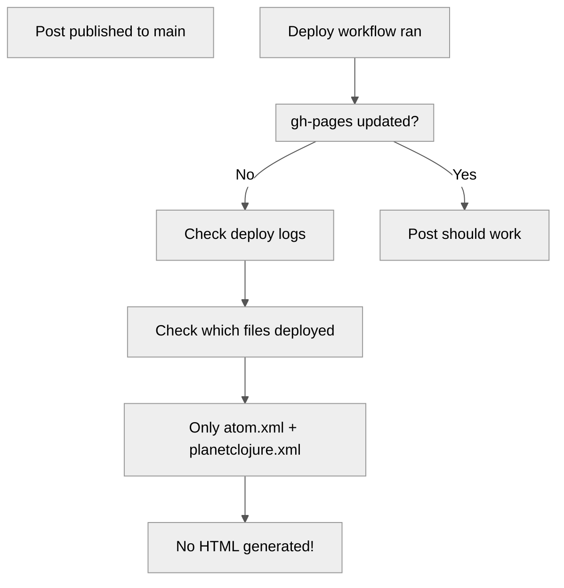
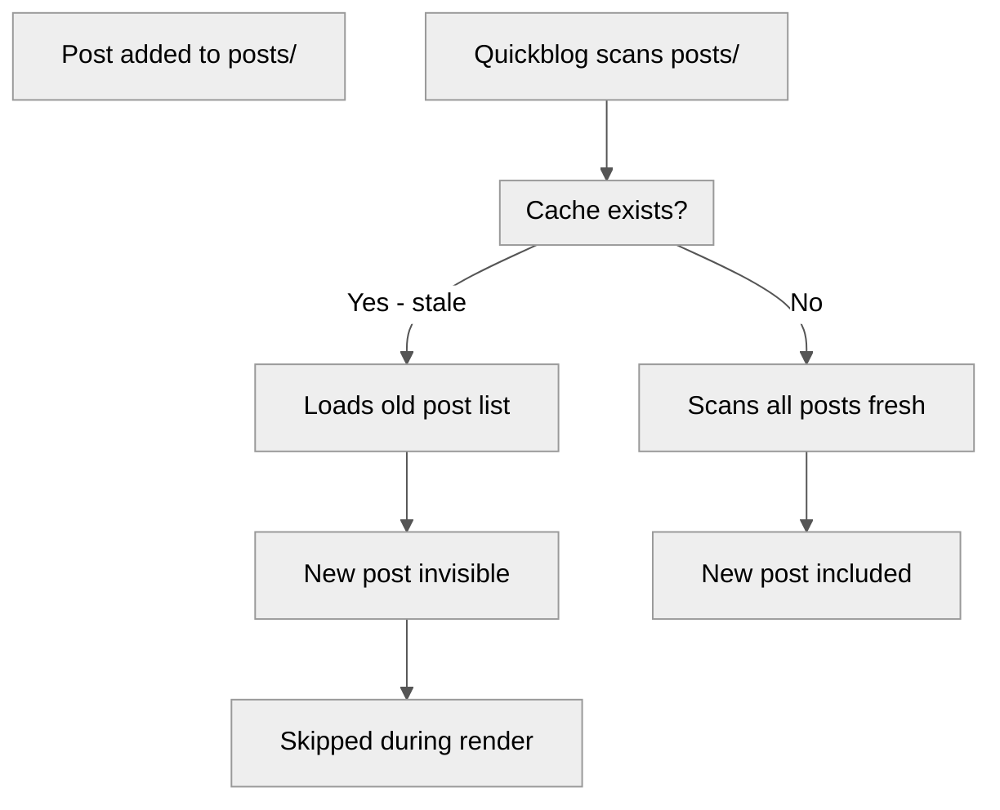
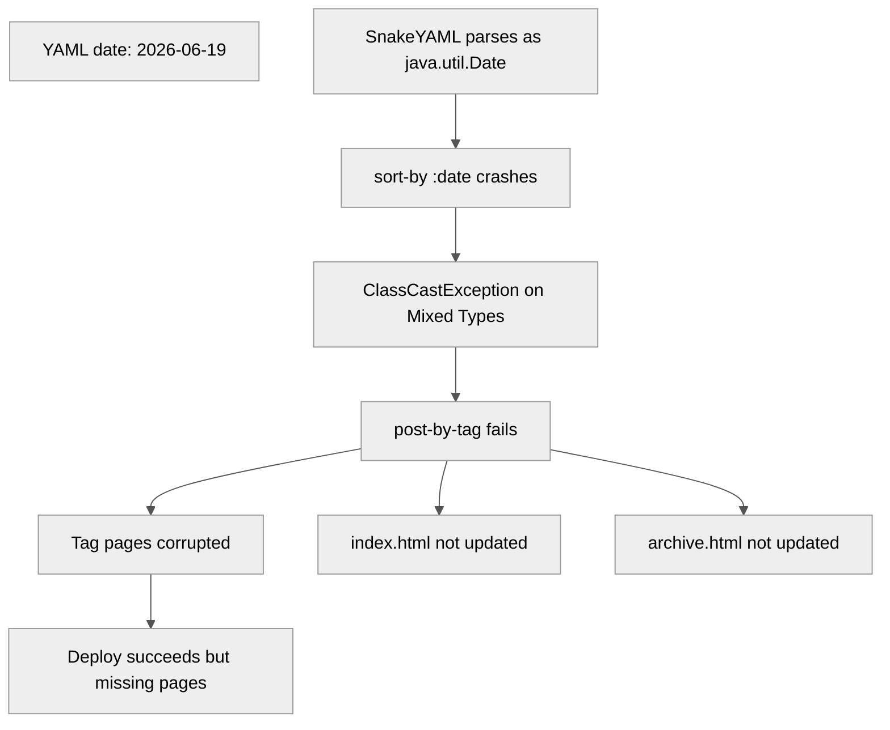
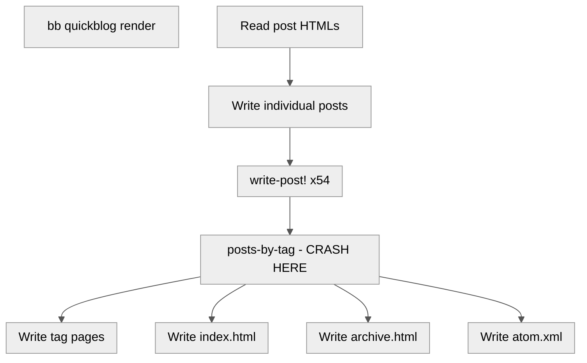
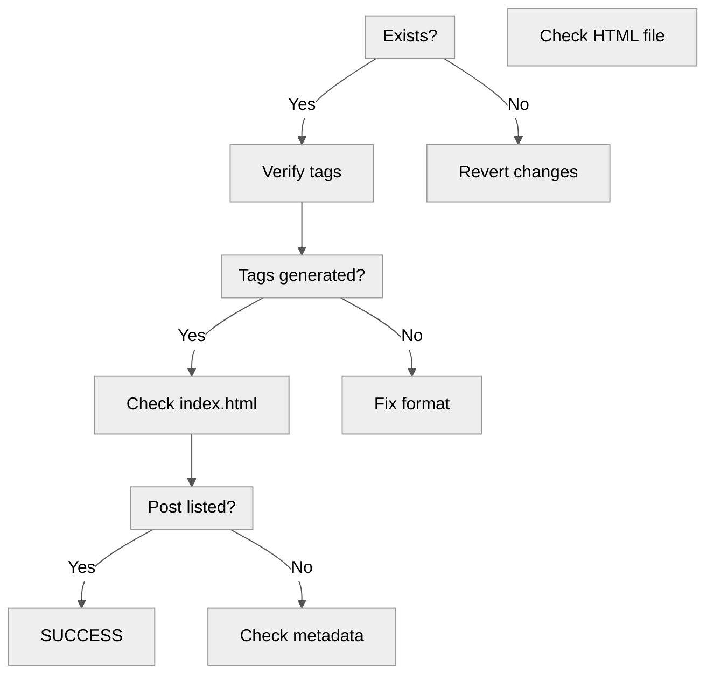
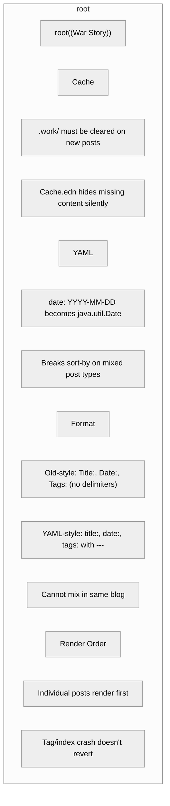

Title: Debugging a Missing Blog Post — Quickblog Cache & YAML Frontmatter
Date: 2026-06-20
Tags: quickblog, clojure, babashka, debugging, blogging, yaml
Description: How a missing blog post revealed a silent cache bug and a YAML format incompatibility that crashes quickblog's tag generation.

---

I published a new post. Pushed to `main`. Watched GitHub Actions deploy succeed with green checkmarks. But the URL returned 404.

## The Investigation Trail



The deploy workflow ran fine — but the `gh-pages` branch only had two files changed: `atom.xml` and `planetclojure.xml`. No new HTML post. Worse, the workflow exit code was `0` (success), but `bb quickblog render` had silently skipped my post.

## Root Cause #1: Stale Cache

Quickblog caches post metadata in `.work/prod/cache.edn`. When I checked, the cache had 54 posts — all created before my new post existed.



Clearing `.work/` forced a fresh scan. The post now rendered — but hit a second error:

```
Skipping post aur-audit-pgp-keys-wkhtmltopdf.md due to exception:
java.lang.IllegalArgumentException: Don't know how to create ISeq from: java.util.Date
```

## Root Cause #2: YAML Date Parsing

My post used YAML frontmatter:

```yaml
---
title: "How I Fixed a Broken AUR Install in 2 Commands"
date: 2026-06-19
tags: ["arch-linux", "aur", "pgp", "troubleshooting"]
---
```

The `---` delimiters trigger SnakeYAML parsing. SnakeYAML interprets `date: 2026-06-19` as a `java.util.Date` object — not a string.

## The Cascade Crash



Quoting the date (`date: "2026-06-19"`) seemed to fix it — but created a twist.

SnakeYAML then returned a `Long` instead of a `Date`. All other 54 posts produce **strings**. Mixing `Long` with `String` in `sort-by` causes:

```
ClassCastException: java.lang.String cannot be cast to java.lang.Character
```

## The Render Lifecycle



The render wrote all 55 post HTMLs successfully — then crashed writing tag pages. I had raw HTML files but no `index.html`, no `archive.html`, no RSS feed.

## Format Comparison

| Format | Delimiters | Date Type | Tags Format | Used By |
|--------|------------|-----------|-------------|---------|
| Old-style | None | String | `Tag1, Tag2` | 54 of 55 posts |
| YAML-style | `---` | `Long`/`Date` | `["Tag1", "Tag2"]` | 1 post (mine) |

The format mismatch was invisible until the type check in `sort-by`.

## The Fix

Convert to quickblog-native format:

```text
Title: How I Fixed a Broken AUR Install in 2 Commands
Date: 2026-06-19
Tags: arch-linux, aur, pgp, troubleshooting
Description: Using aur-audit to diagnose missing PGP keys blocking wkhtmltopdf-bin installation on Arch.

---
```

No `---` delimiters. No YAML parsing. No type ambiguity.

## Manual Deploy Required

Since CI crashed, I deployed manually:

```bash
rm -rf .work
bb quickblog render  # Now generates index.html, tags/, everything
git worktree add /tmp/gh-pages origin/gh-pages
cd /tmp/gh-pages
git rm -rf . && cp -r /path/to/public/* .
git push --force origin HEAD:gh-pages
```

## The Fix Verification

| Step | Status |
|------|--------|
| Post HTML exists | ✅ 10KB file generated |
| Tag pages exist | ✅ `tags/pgp.html`, `tags/archlinux.html` |
| Index includes post | ✅ `grep -c aur-audit-pgp` in `index.html` |
| RSS updated | ✅ `atom.xml` contains entry |



## Lessons Learned



1. **Clear `.work/` on new posts** — stale cache hides content
2. **YAML frontmatter ≠ quickblog format** — `---` delimiters change parsing
3. **SnakeYAML types differ** — `Date` and `Long` vs `String`
4. **CI can succeed partially** — exit 0 but missing critical files
5. **Always verify deploy output** — check `gh-pages` for actual changes

## Next Steps

Report the type-safety bug upstream. Quickblog should handle mixed frontmatter formats gracefully, or provide a clear error message instead of crashing mid-render.

---

*Running on: Babashka quickblog (git sha: c542bdd). CachyOS (Arch-based).*