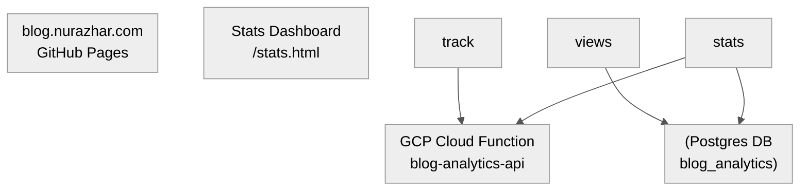

Title: Engineering Spec: Decoupled Zero-Cost Blog Analytics
Date: 2026-06-15
Tags: architecture, database, serverless, devops
Description: The complete technical specification, schema design, and serverless code for our isolated blog analytics tracking engine.

---

This document outlines the complete technical specification, schema design, and serverless code for the isolated web tracking system used on this blog. 

To ensure maximum security and database boundary isolation, this system is **completely decoupled** from my other backend services and payment engines.

---

## 🗺️ System Architecture

The blog remains 100% static on GitHub Pages. It communicates with a dedicated, isolated Cloud Function that stores data in a separate Neon database.



---

## 1. Database Schema (Neon Postgres)

We use a dedicated database instance (`blog_analytics`) with separate credentials.

```sql
CREATE TABLE IF NOT EXISTS page_views (
    id SERIAL PRIMARY KEY,
    page_path VARCHAR(255) NOT NULL,
    referrer VARCHAR(512),
    country VARCHAR(10) DEFAULT 'Unknown',
    user_agent VARCHAR(512),
    viewed_at TIMESTAMP WITH TIME ZONE DEFAULT CURRENT_TIMESTAMP
);

-- Index page_path and viewed_at for fast dashboard queries
CREATE INDEX IF NOT EXISTS idx_page_views_path ON page_views(page_path);
CREATE INDEX IF NOT EXISTS idx_page_views_date ON page_views(viewed_at);
```

---

## 2. Backend (GCP Cloud Function)

The serverless API router exposes two main routes:
1. `POST /track`: Receives page details from the reader's browser. It extracts the client's country using standard Cloud Function headers (`X-Appengine-Country` or Google's geolocation headers) and saves the page view.
2. `GET /stats`: Aggregates views by page, country, and date. To prevent public access, we protect it with a simple query parameter passcode.

### `package.json`
```json
{
  "name": "blog-analytics-api",
  "version": "1.0.0",
  "description": "Isolated analytics tracking endpoint for blog.nurazhar.com",
  "main": "index.js",
  "dependencies": {
    "pg": "^8.11.0"
  }
}
```

### `index.js`
```javascript
const { Pool } = require('pg');

const pool = new Pool({
  connectionString: process.env.DATABASE_URL,
  ssl: { rejectUnauthorized: false }
});

exports.api = async (req, res) => {
  const origin = req.headers.origin || '*';
  res.set('Access-Control-Allow-Origin', origin);
  res.set('Access-Control-Allow-Methods', 'GET, POST, OPTIONS');
  res.set('Access-Control-Allow-Headers', 'Content-Type, Authorization');

  if (req.method === 'OPTIONS') {
    return res.status(204).send('');
  }

  const path = req.path;

  try {
    // 1. Post Track Endpoint
    if (path === '/track' && req.method === 'POST') {
      const { path: pagePath, referrer } = req.body;
      const country = req.headers['x-appengine-country'] || req.headers['x-client-geo-country'] || 'Unknown';
      const userAgent = req.headers['user-agent'] || 'Unknown';

      if (!pagePath) {
        return res.status(400).json({ error: 'pagePath is required' });
      }

      await pool.query(
        `INSERT INTO page_views (page_path, referrer, country, user_agent)
         VALUES ($1, $2, $3, $4)`,
        [pagePath, referrer || null, country, userAgent]
      );

      return res.status(200).json({ status: 'ok' });
    }

    // 2. Fetch Stats Endpoint
    if (path === '/stats' && req.method === 'GET') {
      const code = req.query.code;
      if (!code || code !== process.env.STATS_PASSCODE) {
        return res.status(401).json({ error: 'Unauthorized' });
      }

      const client = await pool.connect();
      try {
        const topPages = await client.query(
          `SELECT page_path, COUNT(*) as views 
           FROM page_views 
           GROUP BY page_path 
           ORDER BY views DESC LIMIT 50`
        );

        const topCountries = await client.query(
          `SELECT country, COUNT(*) as views 
           FROM page_views 
           GROUP BY country 
           ORDER BY views DESC LIMIT 20`
        );

        const viewHistory = await client.query(
          `SELECT DATE(viewed_at) as date, COUNT(*) as views 
           FROM page_views 
           GROUP BY DATE(viewed_at) 
           ORDER BY date DESC LIMIT 30`
        );

        const recentReferrers = await client.query(
          `SELECT referrer, COUNT(*) as views 
           FROM page_views 
           WHERE referrer IS NOT NULL AND referrer != ''
           GROUP BY referrer 
           ORDER BY views DESC LIMIT 20`
        );

        return res.status(200).json({
          pages: topPages.rows,
          countries: topCountries.rows,
          history: viewHistory.rows,
          referrers: recentReferrers.rows
        });
      } finally {
        client.release();
      }
    }

    res.status(404).send('Not Found');
  } catch (err) {
    console.error(err);
    res.status(500).json({ error: 'Internal Server Error' });
  }
};
```

---

## 3. Frontend Integration

We inject this asynchronous tracking script right before the closing `</body>` tag on our base templates:

```html
<script>
  (function() {
    if (window.location.hostname === 'localhost') return;
    
    fetch('https://asia-southeast1-YOUR_GCP_PROJECT.cloudfunctions.net/blog-analytics-api/track', {
      method: 'POST',
      headers: { 'Content-Type': 'application/json' },
      body: JSON.stringify({
        path: window.location.pathname,
        referrer: document.referrer || null
      })
    }).catch(err => console.error('Tracking failed', err));
  })();
</script>
```
