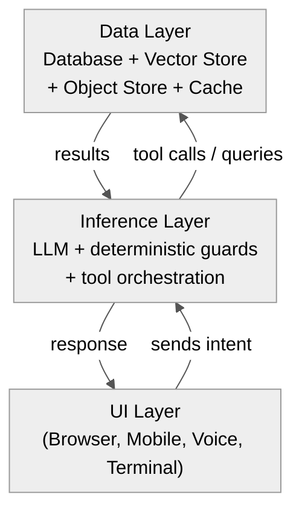

Title: The Future Stack — UI, Inference, Database
Date: 2026-06-22
Tags: architecture, ai-native, inference, serverless, database, stack
Description: What if the traditional backend (REST APIs, business logic, middleware) gets absorbed by inference, leaving only UI, an LLM, and a database?

---

The traditional web stack has been stable for 20+ years:

```
UI → API Gateway → Business Logic → Database
```

Each layer is explicit. The API defines endpoints. The business logic defines rules. The database stores state.

But LLMs change this. An LLM with tool-calling can replace large swaths of the business logic layer. Instead of writing a REST endpoint for "get recent orders for this user", you give the LLM a database connection and say: "fetch the user's recent orders and format them as HTML."

This suggests a radically simpler stack:

```
UI (voice/screen) → Inference → Database
```

Does this make sense? Yes and no. Here's the breakdown.

---

## The Case for the Compressed Stack

### 1. Business Logic Becomes Natural Language

In the traditional stack, every action needs code: a controller, a service, a repository, serialization, validation, error handling. In the inference stack, many of these become prompts:

```sql
-- Traditional: 5 files across 3 layers
-- Controller: GET /api/orders?user_id=X
-- Service: getRecentOrders(userId, limit) { ... }
-- Repository: SELECT * FROM orders WHERE user_id = ? ORDER BY created_at DESC LIMIT ?

-- Inference stack:
-- Schema definition (one file)
-- Prompt: "Fetch the 10 most recent orders for user {userId}
--          and return them as a JSON array with order_id, date, amount, status."
```

The LLM generates the SQL (via tool calling), executes it against the database, and formats the result. The "business logic" is a description of what should happen, not imperative code.

This works today. It's what MCP (Model Context Protocol) enables — the LLM discovers tools (database queries, APIs, file reads), decides which to call, and composes the result.

### 2. Rendering on Demand

Traditional rendering has two modes:

- **Server-side**: backend renders HTML, sends to browser
- **Client-side**: backend sends JSON, frontend renders

Inference-native rendering:

- **LLM-side**: the model decides what to render based on the current state and user intent
- The LLM can output HTML, SVG, Markdown, JSON, or voice — whichever the UI client supports
- The same model generates the content and the format

This is what happens when you ask ChatGPT to "show me a table of my recent orders" — it writes the HTML/Markdown inline. No frontend component needed.

### 3. Voice and Screen as Equal Citizens

In the traditional stack, voice is an afterthought — you need a speech-to-text layer, an NLP layer, and a text-to-speech layer bolted on top.

In the inference stack, voice is native:

```
Audio → STT → LLM → TTS → Audio
              ↓
            Screen (optional)
```

The same model handles text and can drive both voice and screen output. The UI layer becomes thin — just a renderer for whatever the model outputs (audio, HTML, or structured data).

### 4. Database Stays, But Serves Inferences

The database doesn't go away. State is still state. But its role changes:

| Traditional | Inference Stack |
|-------------|----------------|
| DB returns raw rows | DB returns rows the LLM requested via tool calls |
| Schema is an internal detail | Schema is exposed as tool definitions for the LLM |
| Queries are hand-written | Queries are generated by the LLM from natural language intent |
| Joins happen in SQL or code | Joins happen via tool composition (LLM calls multiple tools) |
| Access control in middleware | Access control in tool definitions (describe what the tool can access) |

The DB becomes a **resource the LLM discovers and queries**, not a layer behind explicit API endpoints.

---

## Where It Breaks

### Determinism

If your business logic is "charge the customer's card and update the inventory", you cannot have an LLM decide the SQL syntax. Mistakes cost real money. Traditional backends exist precisely because we need **deterministic, auditable, testable** operations on critical paths.

The inference stack works for **read and transform** — fetching, formatting, summarising, generating. It doesn't work for **write-critical operations** where every transaction must be exact.

### Latency

A traditional API call takes 5-50ms. An LLM call takes 500-5000ms. If every page load required an LLM call, the web would feel broken.

This means:

- **Caching becomes critical** — but LLM outputs are non-deterministic, so caching is harder
- **You need fast models for fast paths** — a small local model for simple queries, a frontier model for complex synthesis
- **Hydration patterns change** — maybe the first render is cached static content, and the LLM enriches it after load

### Cost

| Operation | Traditional | Inference |
|-----------|-------------|-----------|
| Fetch user profile | $0.000001 (DB read) | $0.001 (LLM + tool call) |
| List orders | $0.000001 | $0.002 |
| Render dashboard | $0.0001 (multiple queries) | $0.01 (complex synthesis) |

Inference is 100-1000x more expensive per operation. This is fine for valuable interactions (chat, support, analysis) but wasteful for simple CRUD that a traditional backend handles for near-zero cost.

### State Management

LLMs are stateless by design. Every call is independent. Traditional backends use sessions, caches, queues, and transactions to manage state across requests.

Compressing to UI → Inference → Database means the "state management" layer disappears. But state still exists. Where does it go?

Options:

- **Embed in the prompt** (context window — expensive but works for small state)
- **Embed in the database** (inference layer reads/writes state via tool calls)
- **Client-side state** (the UI manages session, the LLM is stateless)

None of these fully replace a proper backend state machine for complex workflows.

---

## The Compromise: Three-Layer Intelligent Stack

The realistic future isn't two layers — it's three, but with inference in the middle:



The inference layer **replaces the traditional backend** but **splits into two paths**:

| Path | What | Engine |
|------|------|--------|
| **Fast path** | Deterministic CRUD, auth, simple queries | Traditional code or deterministic functions called by LLM |
| **Slow path** | Synthesis, generation, reasoning, format conversion | LLM (possibly expensive/frontier) |

The UI doesn't know which path was taken. It sends intent ("show orders") and gets a result. The inference layer decides: is this a simple DB query (fast path) or a complex synthesis (slow path)?

This is essentially what happens when you call an API today, except the "router" is an LLM or an LLM-orchestrated dispatcher.

---

## Real-World Example: Serverless Inference + Database

```python
# Traditional "get user dashboard" — 3 files, 1 endpoint
@app.get("/dashboard/{user_id}")
def dashboard(user_id):
    user = db.users.find(user_id)
    orders = db.orders.recent(user_id, 5)
    stats = db.analytics.user_stats(user_id)
    return render_template("dashboard.html", user=user, orders=orders, stats=stats)

# Inference stack — tool definitions + prompt
tools = [
    {
        "name": "get_user",
        "fn": lambda id: db.users.find(id),
        "description": "Fetch user profile by ID"
    },
    {
        "name": "get_recent_orders",
        "fn": lambda id, limit: db.orders.recent(id, limit),
        "description": "Fetch recent orders for a user"
    },
    {
        "name": "get_user_stats",
        "fn": lambda id: db.analytics.user_stats(id),
        "description": "Get aggregated stats for a user"
    }
]

# Prompt: "Render the dashboard for user {userId}.
#          Include their name, 5 most recent orders in a table,
#          and their lifetime stats. Output HTML."
```

The LLM calls the tools, gets the data, and generates HTML. The UI just renders whatever the LLM outputs.

This works today (I've built this). The question is not whether it works — it's whether it's **better**.

---

## When the Inference Stack Wins

| Use Case | Traditional | Inference Stack | Winner |
|----------|-------------|-----------------|--------|
| Auth, payments, strict CRUD | Exact, cheap | Expensive, risk of errors | Traditional |
| Data dashboards, reports | Rigid, needs frontend code | Dynamic, natural language | Inference |
| Customer support | Needs full backend | LLM reads DB directly | Inference |
| Email/SMS generation | Template engine | LLM writes each one | Inference |
| Search | Elastic/Postgres FTS | Semantic + SQL | Hybrid |
| Admin panels | Weeks of UI work | Ask the DB in plain language | Inference |
| API for mobile app | REST/GraphQL needed | LLM generates responses | Hybrid |

The inference stack is better when:

- The output is consumed by a human (not another machine)
- The query is ad-hoc or unpredictable (not a fixed set of endpoints)
- The value of natural language output exceeds the cost of inference
- The business logic is descriptive ("show me X") not prescriptive ("charge Y")

---

## The Timeline

| Phase | What Happens | When |
|-------|-------------|------|
| **Phase 1** (today) | Hybrid: traditional backend + LLM on top for chat/synthesis | Now |
| **Phase 2** (1-2 years) | LLM reads DB directly for internal tools, analytics, admin | 2027-2028 |
| **Phase 3** (3-5 years) | Inference layer absorbs most read paths; write paths stay deterministic | 2029-2031 |
| **Phase 4** (5+ years) | Write paths also go through inference with deterministic guards and human-in-loop | 2031+ |

---

## Bottom Line

The stack compresses, but not to 2 layers. It compresses to **3 layers with inference as the middle layer absorbing the traditional backend**:

- **UI** — thin, multi-modal (voice, screen, chat)
- **Inference** — LLM + deterministic guards + tool orchestration
- **Database** — structured + vector + object store, queried by the inference layer

The traditional backend (controllers, services, serialization, middleware) becomes tool definitions and prompts. The database stays, but serves the inference layer directly instead of hiding behind API endpoints.

This works for read-heavy, human-facing, ad-hoc query workloads today. For write-critical, deterministic, machine-facing workloads, traditional backends remain better. The hybrid stack — where inference handles the human-facing parts and traditional code handles the machine-critical parts — is the pragmatic answer.

But the trend is clear: every layer that translates between human intent and data is being absorbed by inference. The database is the only layer that can't be absorbed — it's the source of truth. Everything above it is negotiable.

---

*The author runs a hybrid stack where a Babashka/Clojure backend serves deterministic endpoints and an LLM layer handles synthesis, report generation, and natural language interfaces over the same database.*
