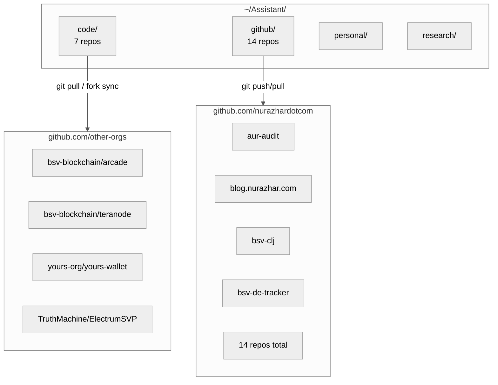
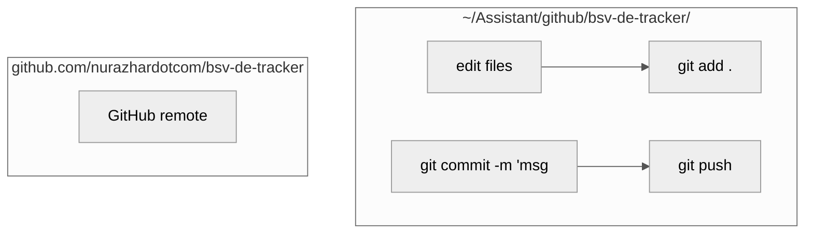
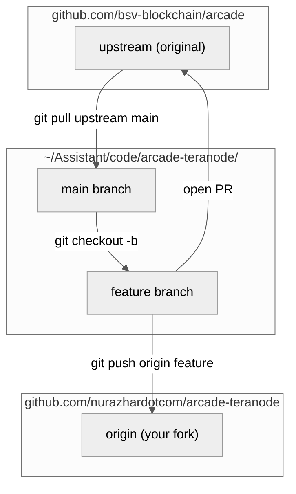
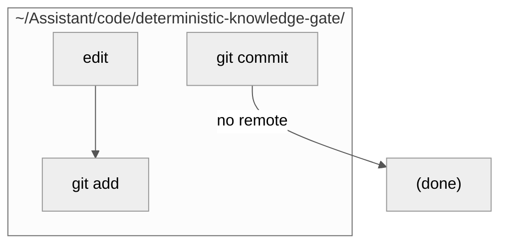
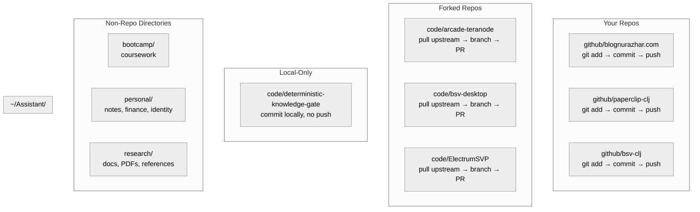
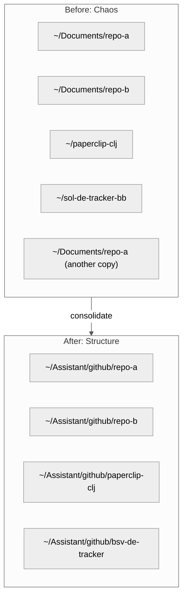

Title: Git Workflow Visual Guide: Organizing Local Code vs GitHub Repos
Date: 2026-06-21
Tags: git, workflow, productivity, developer-experience, organization, cli, diagrams
Description: A visual walkthrough of a local Git workflow that separates your own GitHub projects from upstream forks and local experiments, with diagrams for every stage.

---

If you maintain multiple GitHub projects while also contributing to upstream repositories and tinkering with local experiments, your filesystem can turn into a mess fast. Repos scatter across `~/Documents/`, `~/Projects/`, `~/Desktop/` — and you can never remember which directory has the version you actually pushed.

This post lays out a flat, two-directory structure that maps directly to *ownership*: your repos vs everyone else's.

---

## The Core Idea: One Directory Per Origin

The rule is simple:

| Directory | Contains |
|-----------|----------|
| `~/github/` | Repos **you own** on GitHub — push goes to your profile |
| `~/code/` | Everything else — forks, upstream clones, local experiments |

No nesting. No `~/Documents/Work/Projects/Active/Archived/`. Two top-level folders. That's it.

---

## Directory Layout

Each repo in `github/` corresponds one-to-one with a repo on your GitHub profile. Each repo in `code/` is either a fork you cloned or a scratch project with no remote at all.

---

## Workflow 1: Working on Your Own Repo

This is the simplest path. You own the repo, you work in it, you push.

You never need to think about remotes, forks, or PRs. `git push` goes to your repo on GitHub. That's the entire loop.

---

## Workflow 2: Working on a Fork (Someone Else's Repo)

When you clone a repo you don't own, you need two remotes — `origin` (your fork) and `upstream` (the original).

The key difference: you **pull** from `upstream` to stay synced, and you **push** to `origin` (your fork) to create pull requests.

---

## Workflow 3: Local-Only Experiment

Some projects never touch GitHub. They live in `code/` with no remote at all — same git workflow, just no push step.

Git still tracks history, you can branch and diff and revert — you just skip `git push` because there's nowhere to send it. If you later decide to publish, run `gh repo create` and `git remote add origin <url> && git push`.

---

## The Full Mental Model

Here is the complete lifecycle across both directories:

---

## Cheat Sheet

| You want to... | Go to | Run |
|---|---|---|
| Edit your blog | `~/Assistant/github/blog.nurazhar.com/` | `git add && git commit && git push` |
| Fix a bug in bsv-clj | `~/Assistant/github/bsv-clj/` | `git add && git commit && git push` |
| Contribute to teranode | `~/Assistant/code/teranode-quickstart/` | `git pull upstream main`, branch, `git push origin`, open PR |
| Experiment locally | `~/Assistant/code/deterministic-knowledge-gate/` | `git commit` (no push needed) |
| Read research docs | `~/Assistant/research/` | No git |
| Check if a repo exists locally | `ls ~/Assistant/github/ ~/Assistant/code/` | — |

---

## Why This Works

Three reasons this survives real use:

1. **Flat is faster.** No clicking through 4 levels of nested folders. `ls ~/Assistant/github/` shows every repo you own.
2. **Directory = deployment target.** `github/` repos push to GitHub. `code/` repos don't (unless you explicitly fork). The folder tells you what to do.
3. **No duplicates.** There is exactly one copy of every repo. No `~/Documents/` drift vs `~/Projects/` drift.

---

## The Before and After

Every repo lives in exactly one place. You always know which directory to open. If an agent asks "where is the code?", you answer `~/Assistant/github/` or `~/Assistant/code/` depending on who owns it.
