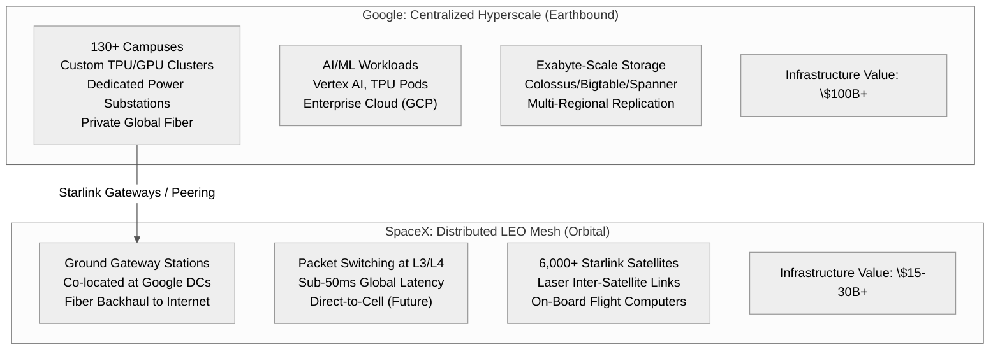
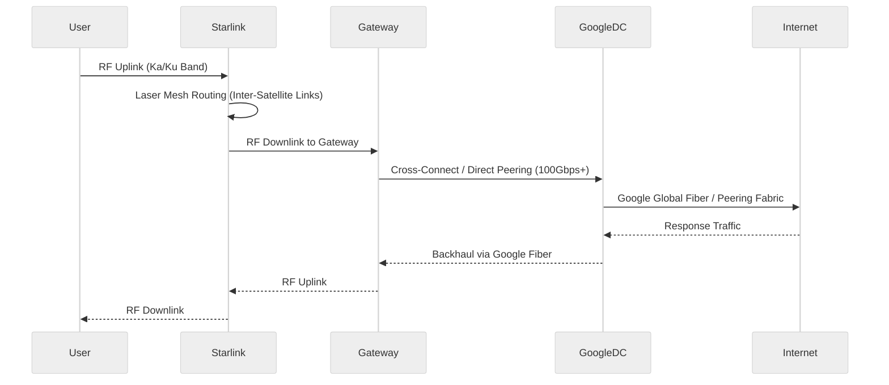
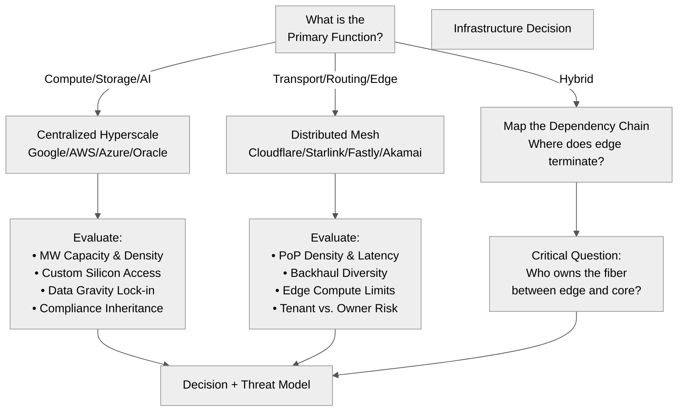

Title: Google vs SpaceX: Infrastructure Economics Compared — A Platform Security Lens
Date: 2026-06-17
Tags: infrastructure, economics, devsecops, security, google, spacex, hyperscale, starlink
Description: A technical breakdown comparing Google's centralized hyperscale data centers against SpaceX's distributed LEO satellite mesh, analyzing infrastructure value, compute economics, and what this means for platform security and DevSecOps decision-making.

---

Last week I asked Gemini 3.5 Flash a straightforward question: *Does Google still control 25% of the world's data centers?*

The answer was a sharp **no** — and the ensuing comparison between Google's earthbound hyperscale empire and SpaceX's orbital mesh network revealed something more useful than a fact-check: a mental model for evaluating infrastructure value that maps directly to the work I do in DevSecOps and Platform Security.

## The 25% Myth: What the Numbers Actually Say

| Metric | Google | Context |
|--------|--------|---------|
| **Physical facilities** | ~130 campuses | 11,400+ global data centers → **~1.1%** |
| **Hyperscale capacity share** | ~14% of cloud market | AWS 28%, Azure 21%, GCP 14% |
| **Big Three combined** | 59% of hyperscale capacity | Google is the *smallest* of the three |

The "25%" figure conflates **Google alone** with the **Big Three combined**. For anyone making infrastructure decisions — whether placing workloads, negotiating contracts, or designing threat models — this distinction matters.

---

## Core Architecture Comparison

---

## Infrastructure Economics: Value Over Volume

The comparison table from the conversation, reframed for infrastructure decision-makers:

| Dimension | Google (Centralized Hyperscale) | SpaceX (Distributed LEO Mesh) |
|-----------|----------------------------------|--------------------------------|
| **Primary Function** | Compute + Storage + AI Processing | Packet Transport + Edge Routing |
| **Compute Density** | Extreme (TPU/GPU pods, MW/rack) | Minimal (satellite flight computers, edge routers) |
| **Power Draw** | 5–10 GW+ (dedicated substations) | ~100–200 MW (solar arrays + gateways) |
| **Capital Intensity** | $100B+ (real estate, cooling, fiber, silicon) | $15–30B+ (launch cadence, satellite manufacturing) |
| **Revenue Model** | Cloud services, Ads, AI | Connectivity subs (B2C/B2B/Gov) |
| **Strategic Moat** | Vertical integration (chips→fiber→software), data gravity | Orbital shell (spectrum rights, launch cadence, physics) |
| **Key Dependency** | **SpaceX is a tenant** — Starlink gateways sit *inside* Google DCs | **Google is the backhaul** — orbital mesh needs terrestrial fiber |

---

## The Partnership Nobody Talks About

This is the critical insight for **Platform Security** and **DevSecOps**:

**SpaceX doesn't compete with Google's data centers — it depends on them.** Every Starlink gateway needs:
- Reliable power (Google's substations)
- Diverse fiber paths (Google's private backbone)
- Physical security (Google's high-security equivalent facilities)

For a **Platform Security Engineer**, this is a supply-chain dependency worth modeling. If you're designing multi-cloud or hybrid architectures, the "last mile" from orbit terminates in someone else's hyperscale facility.

---

## What This Means for DevSecOps / Platform Security

### 1. **Capacity Planning ≠ Facility Count**
Don't evaluate cloud providers by data center *count*. Evaluate by:
- Hyperscale capacity (MW, rack density, GPU/TPU availability)
- Network fabric ownership (private fiber vs. leased circuits)
- Failure domain isolation (blast radius per campus)

### 2. **Edge Is Not Compute**
Starlink proves you can build a *global routing layer* with near-zero compute at the edge. For security architectures:
- **Edge = policy enforcement point** (TLS termination, WAF, DDoS scrubbing)
- **Core = compute/storage/state** (where your Tenable scans, CyberArk vaults, Purview DLP actually run)
- Don't conflate the two in your threat model

### 3. **Vendor Concentration Risk Is Real**
If your "multi-cloud" strategy routes through Google DCs for backhaul (even via Starlink), you have a **single point of physical control**. Map your actual fiber paths, not just your cloud console regions.

### 4. **Infrastructure Value = Leverage**
Google's $100B+ sunk cost in custom silicon, cooling, and fiber creates:
- Pricing power (they set the floor)
- Innovation velocity (TPU generations, Jupiter fabric)
- Compliance inheritance (ISO 27001, SOC 2, FedRAMP — you inherit the stack)

SpaceX's $15–30B creates different leverage: **physics** (latency floor) and **regulatory** (spectrum rights). Different moats, different negotiation positions.

---

## The Analytical Frame I Use

When evaluating any infrastructure decision — cloud vendor, CDN, edge platform, VPN backbone — I run this checklist:

---

## Closing Note: Why I Published This

I didn't write this to dunk on a hallucinated statistic. I wrote it because **infrastructure economics drive security architecture** — and the mental models we use to evaluate them are often inherited, unexamined, or vendor-sponsored.

If you're in DevSecOps, Platform Security, or Infrastructure Automation:
- **Question the denominator** (total facilities vs. hyperscale capacity vs. your actual workload fit)
- **Trace the fiber** (especially where "edge" systems hand off to "core" systems)
- **Model the tenant/owner relationship** (Starlink → Google is a template for many modern dependencies)

The conversation with Gemini was the research accelerator. The analysis above is the deliverable. That distinction — *using AI to accelerate judgement, not replace it* — is the skill worth putting on a resume.

---

*Built with Babashka + Quickblog. Mermaid diagrams render natively in-browser via the template. Source: Gemini 3.5 Flash conversation (June 17, 2026).*