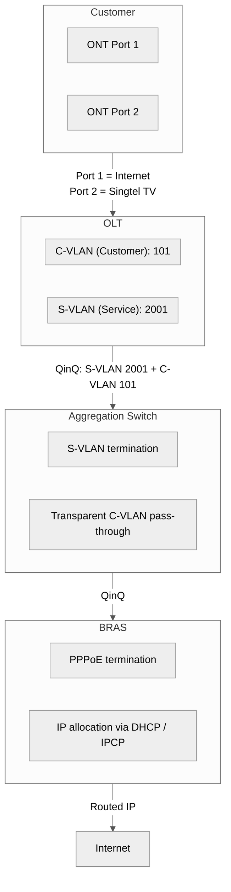

Title: GPON Optical Signal Levels and Singtel BRAS Topology
Date: 2026-06-22
Tags: networking, gpon, singtel, fibre, infrastructure, d2
Description: Mapping the full GPON signal path from ONT to OLT to BRAS, with practical dBm thresholds for Singtel fibre broadband.

---

If you've ever logged into your Singtel ONT (typically ZTE F660/F620 or Nokia ONT) and seen a row of numbers under "Optical Signal Information" — RX power around -19 dBm, TX power around +3 dBm — you probably wondered: *is that good? What do these numbers actually mean?*

This post maps the full path an optical signal takes from your home to the internet, with the signal levels (dBm) at every hop, and what they tell you about your connection health.

--

## The Full Path

```mermaid
%%{init: {'theme': 'neutral', 'themeVariables': {'primaryColor': '#f5f5f5', 'primaryTextColor': '#333', 'primaryBorderColor': '#ccc', 'lineColor': '#555', 'secondaryColor': '#e8e8e8', 'tertiaryColor': '#fafafa'}}}%%
flowchart TD
    subgraph ONT["Optical Network Terminal"]
    end
    subgraph ODN["Optical Distribution Network"]
    end
    subgraph Splitter["1:32 Splitter"]
    end
    subgraph OLT["Optical Line Terminal"]
    end
    subgraph AGG["Aggregation Switch"]
    end
    subgraph BRAS["Broadband Remote Access Server"]
    end
    subgraph IP_Core["Singtel IP Core"]
    end
    subgraph Internet["Internet"]
    end
    subgraph ONT -> Splitter:["ONT -> Splitter:"]
    end
    subgraph Splitter -> ODN:["Splitter -> ODN:"]
    end
    ODN --> OLT
    OLT --> AGG
    AGG --> BRAS
    BRAS --> IP_Core
    IP_Core --> Internet
```

---

## Where the Light Levels Matter

The optical signal only exists in the Passive Optical Network (PON) segment — ONT to Splitter to OLT. Everything after the OLT is electrical (Ethernet).

```mermaid
%%{init: {'theme': 'neutral', 'themeVariables': {'primaryColor': '#f5f5f5', 'primaryTextColor': '#333', 'primaryBorderColor': '#ccc', 'lineColor': '#555', 'secondaryColor': '#e8e8e8', 'tertiaryColor': '#fafafa'}}}%%
flowchart TD
    subgraph ONT["ONT (Your Home)"]
        subgraph Tx_1310nm["TX: +0.5 to +5 dBm"]
        end
        subgraph Rx_1490nm["RX: -8 to -28 dBm (B+)"]
        end
        subgraph Rx_1490nm_Cplus["RX: -8 to -32 dBm (C+)"]
        end
    end
    subgraph Optical_Path["~10 km fibre, 1:32 splitter ~17 dB loss"]
    end
    subgraph OLT["OLT (Exchange)"]
        subgraph Tx_1490nm["TX: +1.5 to +5 dBm (B+)"]
        end
        subgraph Tx_1490nm_Cplus["TX: +3 to +7 dBm (C+)"]
        end
        subgraph Rx_1310nm["RX: -8 to -28 dBm (B+)"]
        end
    end
    subgraph ONT -> Optical_Path -> OLT:["ONT -> Optical_Path -> OLT:"]
    end
```

### Practical signal level guide

| RX Power (dBm) | Status |
|---|--------|
| -15 to -22 | Green / Ideal |
| -22 to -25 | Yellow / Acceptable |
| -25 to -28 | Yellow / Marginal (inspect) |
| Below -28 | Red / Fail |
| Above -8 | Red / Saturated (add attenuator) |

Singtel typically aims for -18 to -22 dBm RX at the ONT for GPON B+ optics. If you see -25 or below, your fibre termination point (FTP) may have a dirty connector or excessive bend loss.

---

## Singtel BRAS Topology

After the OLT terminates the GPON signal, traffic enters the Ethernet/IP domain. Here's how Singtel's network is structured:

```mermaid
%%{init: {'theme': 'neutral', 'themeVariables': {'primaryColor': '#f5f5f5', 'primaryTextColor': '#333', 'primaryBorderColor': '#ccc', 'lineColor': '#555', 'secondaryColor': '#e8e8e8', 'tertiaryColor': '#fafafa'}}}%%
flowchart TD
    subgraph ONT["Customer Premises"]
        ZTE_F660["ZTE F660 / F620 ONT"]
        Nokia_ONR["Nokia XGS-PON ONR"]
    end
    subgraph OLT_Access["OLT Access Layer"]
        ZTE_C600["ZTE C600 (GPON)"]
        Nokia_IXR["Nokia ISAM / IXR (XGS-PON)"]
        Huawei_MA["Huawei MA5800 (GPON/XGS)"]
    end
    subgraph AGG["Aggregation Layer"]
        Metro_E["Metro Ethernet Switch"]
    end
    subgraph BRAS_BNG["BRAS / BNG Layer"]
        Cisco_ASR9K["Cisco ASR 9000 / 9900"]
        Nokia_7750["Nokia 7750 SR"]
        PPPoE_term["PPPoE session termination"]
        Radius_auth["RADIUS auth + accounting"]
        QoS_shaper["QoS policy enforcement"]
    end
    subgraph IP_Backbone["Singtel IP Backbone"]
    end
    subgraph ONT -> OLT_Access: GPON / XGS-PON["ONT -> OLT_Access: GPON / XGS-PON"]
    end
    OLT_Access -->|"10GE / 100GE uplink"| AGG
    AGG -->|"QinQ VLAN (S-VLAN + C-VLAN)"| BRAS_BNG
    BRAS_BNG -->|"BGP peering"| IP_Backbone
    IP_Backbone -->|"Transit / Peering"| Internet
    subgraph BB["Broadband Forum TR-101 / TR-156"]
    end
```

### VLAN architecture (QinQ)



---

## Reading Your ONT's Optical Levels

### ZTE F660 / F620

1. Browse to `http://192.168.1.1`
2. Login (default: `admin` / `admin` or on sticker on ONT)
3. Go to **Status > ONT Info > Optical Signal Information**

You'll see:

```text
RX Power:      -19.2 dBm
TX Power:      +3.5 dBm
Temperature:   42°C
Voltage:       3.31 V
Bias Current:  12.5 mA
```

### Nokia ONR (XGS-PON for 3Gbps / 10Gbps plans)

1. Browse to `http://192.168.1.1`
2. Login (credentials on sticker)
3. Go to **Diagnostics > Optical Module Info**

### What to look for

- **RX Power** should be between -18 and -22 dBm for a healthy connection
- **TX Power** should be between +0.5 and +5 dBm
- If RX drops below -25 dBm, check:
  - Dust cap on the fibre connector at the FTP (wall point)
  - Fibre bend radius (sharp kinks cause loss)
  - Dirty patch cord end at the ONT (use a one-click cleaner)
- If RX rises above -8 dBm, the signal is saturating the receiver — you need an optical attenuator

---

## Quick Reference: GPON Optical Classes

| Class | OLT Tx | OLT Rx Sens. | ONT Tx | ONT Rx Sens. | Max Budget |
|---|--------|-------------|--------|-------------|-----------|
| B+ | +1.5 to +5 dBm | -28 dBm | +0.5 to +5 dBm | -28 dBm | 28 dB |
| C+ | +3 to +7 dBm | -32 dBm | +0.5 to +5 dBm | -32 dBm | 32 dB |
| C++ | +4.5 to +10 dBm | -33 dBm | +0.5 to +5 dBm | -33 dBm | 33 dB |

Singtel's 1Gbps / 2Gbps plans primarily use **GPON B+** optics. XGS-PON (3Gbps and 10Gbps plans) uses **N1 / N2** class optics with a different wavelength (1270 nm upstream, 1577 nm downstream).

---

## Reference: Typical Loss Budget Calculation

For a Singtel GPON connection with B+ optics:

| Component | Loss |
|-----------|------|
| 5 km fibre at 1490 nm (0.3 dB/km) | -1.5 dB |
| 1:32 splitter | -17 dB |
| Connectors (4 × 0.5 dB) | -2 dB |
| Splices (3 × 0.1 dB) | -0.3 dB |
| Safety margin | -3 dB |
| **Total loss** | **-23.8 dB** |

With an OLT transmitting at +3 dBm, the ONT receives: +3 - 23.8 = **-20.8 dBm** — well within the B+ limit of -28 dBm.

---

*GPON signal levels follow ITU-T G.984.2. Singtel network topology based on public documentation, job listings, and ZTE/Nokia OLT deployment info. Singtel currently pilots 50G XGS-PON (January 2026) while maintaining GPON B+ for legacy plans and XGS-PON for 3Gbps/10Gbps enhanced plans.*
