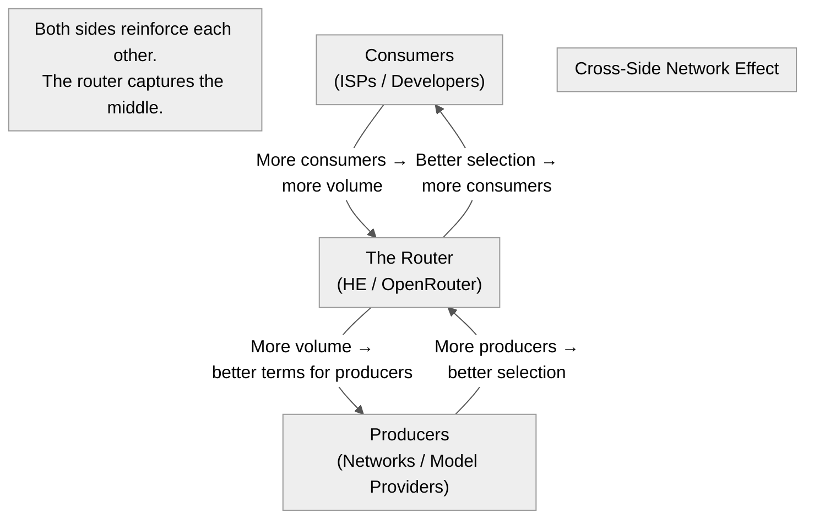

Title: Every Layer Has a Router — Hurricane Electric (Layer 3) and OpenRouter (Layer 7)
Date: 2026-06-22
Tags: infrastructure, hurricane-electric, openrouter, ai, networking, routing, analogy
Description: Hurricane Electric routes packets; OpenRouter routes inference calls. Same business model, different layer of the stack — and both win by being the default pipe.

---

Hurricane Electric (AS6939) routes IP packets. OpenRouter routes API calls to LLM providers. Same job, different layer:

| | Hurricane Electric | OpenRouter |
|---|---|---|
| **Layer** | 3 (IP packets) | 7 (Inference requests) |
| **Product** | IP transit + peering | Unified LLM API |
| **Network** | 10,500+ peered networks | 300+ models from 30+ providers |
| **Pricing** | ~$0.20/Mbps (commodity transit) | 10-30% markup on inference |
| **Adjacent revenue** | Colocation, transport, hardware | Enterprise billing, rate limiting |
| **Strategy** | Loss leader transit → peering empire → colo lock-in | Thin-margin routing → volume → premium features |

---

## The Structural Pattern

Both companies built a **commodity router** at their layer:

1. **Make it cheap** — HE sells transit at or near cost (often below Tier 1 pricing). OpenRouter takes a tiny margin on each API call (often 10-15%).

2. **Make it universal** — HE peers with everyone (open peering policy). OpenRouter adds every model provider (even competitors).

3. **Grow by being the default** — When a Tier 2 ISP needs IPv6, they call HE. When a developer needs to ship an AI feature without evaluating every model API, they call OpenRouter.

4. **Monetize the adjacencies** — HE makes real money on colocation cages and transport circuits, not transit. OpenRouter makes real money on enterprise billing, rate limits, and analytics, not API call margins.

---

## The Network Effect

Both benefit from a **cross-side network effect**:

More networks/providers → more value for consumers → more consumers → more volume → better terms for producers → more providers. The router sits in the middle and captures the spread.

---

## The Defense

HE is hard to displace because:
- 320+ IXP presences are physical — you can't replicate them in software
- 10,500+ peer relationships take years to build
- The colocation cages at Equinix/Global Switch are long-term leases

OpenRouter is hard to displace because:
- Provider integrations (30+ APIs, each with unique auth, formatting, billing) are a moat
- Developer workflows built around the unified API create switching cost
- Volume pricing with providers gets better with scale

Both are **infrastructure middlemen** that win by being the easiest way to access a fragmented supply side.

---

## Why This Matters

This pattern repeats across layers of the stack:

| Layer | Commodity | Router |
|-------|-----------|--------|
| 1 (Physical) | Dark fibre | Neutrona / Equinix Fabric |
| 2 (Data link) | Ethernet | Carrier Ethernet exchanges |
| 3 (Network) | IP transit | Hurricane Electric |
| 7 (Application) | LLM inference | OpenRouter |

Every layer that fragments into many producers and many consumers will eventually produce a commodity router that captures the middle. The router doesn't need to be the best at anything — it needs to be the easiest way to connect *everything*.

---

*Sources: Hurricane Electric network page, OpenRouter docs, HE peering policy (AS6939), OpenRouter pricing page.*
