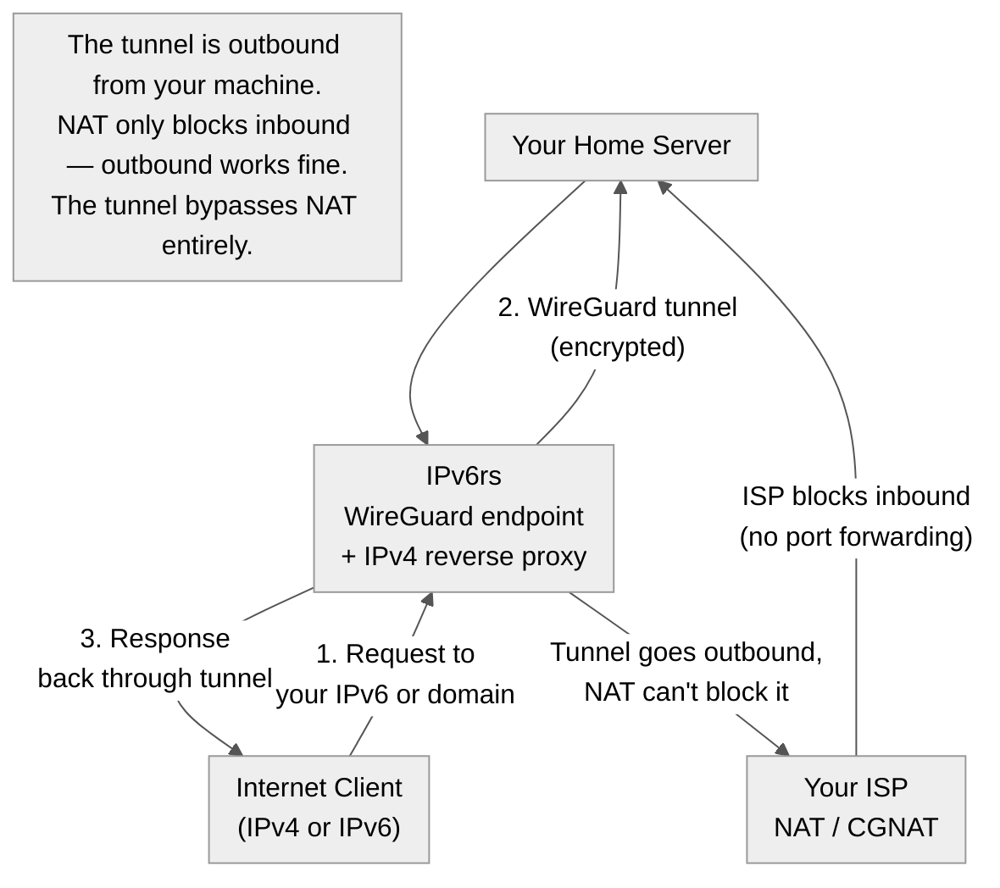

Title: ipv6.rs — Why Pay for an IP When You Already Have One?
Date: 2026-06-22
Tags: ipv6, self-hosting, networking, nat, cgnat, wireguard, homelab
Description: ipv6.rs gives you a globally routable IPv6 address and tunnels it to your home machine. Who pays $3-10/month for this, and why?

---

I came across [ipv6.rs](https://www.ipv6.rs/) and had the same reaction: "Why would I pay for an IP address?"

Then I realized the service isn't selling IPs — it's selling **reachability through NAT**.

---

## What It Actually Does

You sign up. They assign you 5 IPv6 addresses. A WireGuard tunnel connects your home machine to their network. The internet sees your server at their IPv6 address; traffic flows through the tunnel to your machine.

The clever part: the WireGuard connection is **initiated from your machine** (outbound). NAT doesn't block outbound connections, so even CGNAT can't stop it. Once the tunnel is up, it's a bidirectional link, and your machine has a public IP.

---

## The Three Groups Who Subscribe

### 1. People Behind CGNAT

Carrier-Grade NAT means you share a public IPv4 with hundreds of other customers. You cannot port forward. You cannot run a server. Period.

Who has CGNAT?

- **Starlink** — CGNAT by default
- **Mobile ISPs** — all of them
- **Many residential ISPs** — including some Singtel plans
- **T-Mobile Home Internet**, **Verizon 5G Home** — CGNAT

If your ISP uses CGNAT, ipv6.rs is the cheapest way to get a publicly reachable server at home ($3.33/month vs. $5-10/month for the cheapest VPS).

### 2. Privacy-Conscious Self-Hosters

When you rent a VPS, the host has physical access to your RAM and disk. This is a fundamental trust issue:

> "The only thing between your host and your data is trust. Trust is not security."

ipv6.rs lets you run the server on your own hardware. The provider only forwards IP packets — they never touch your storage or memory. Their open-source tunnel software (delorean, shrimp) is auditable.

### 3. People Who Want One-Click Self-Hosting Without Networking

Their open-source **Cloud Seeder** tool installs server software in one click:

- Nextcloud
- Jellyfin (media server)
- WordPress
- Game servers (Minecraft, etc.)
- Matrix/Synapse
- GnuCash

No port forwarding. No DNS config. No reverse proxy setup. Click, wait 30 seconds, your service is live at `https://yourname.ipv6.rs`.

For someone who just wants to run a family Nextcloud instance and doesn't know what a "port" is, this eliminates the friction that kills most self-hosting projects.

---

## When It Doesn't Make Sense

| Scenario | Stick with VPS | Try ipv6.rs |
|----------|---------------|-------------|
| Low upload bandwidth (<10 Mbps) | ✅ VPS wins | ❌ Home upload will bottleneck |
| Need 99.99% uptime | ✅ Data centre SLA | ❌ Home power/internet outages |
| Need DDoS protection | ✅ Cloudflare + VPS | ❌ Nothing between you and attacker |
| Need lots of RAM/disk | ❌ Expensive VPS | ✅ Your home PC's resources |
| Privacy-sensitive app | ❌ VPS host sees your data | ✅ Your hardware, your control |
| Behind CGNAT | ❌ Can't host at all | ✅ Only option for hosting |

---

## The Bigger Picture

ipv6.rs is interesting not for the technology (WireGuard tunnels are trivial) but for the **mission**:

> "Decentralize the internet in order to increase freedom for all mankind."

They open-sourced their entire stack (Cloud Seeder, delorean proxy, shrimp forward proxy, legacydns, hamon). Their pricing is low enough that it undercuts VPS providers for small workloads. They're betting that self-hosting adoption is bottlenecked by networking complexity, not by hardware or desire.

For $3.33/month, they remove the CGNAT barrier. Whether that's worth it depends on whether you value data sovereignty over the convenience of renting someone else's server.

---

*Sources: ipv6.rs website, LowEndBox interview with Chad (2024), LowEndTalk discussion, GitHub (ipv6rslimited/cloudseeder). Not affiliated with ipv6.rs.*
