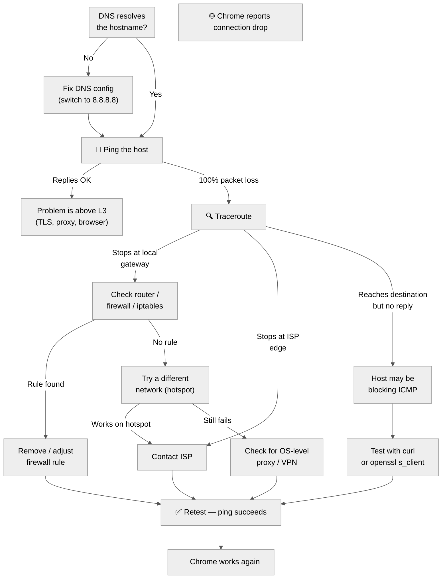
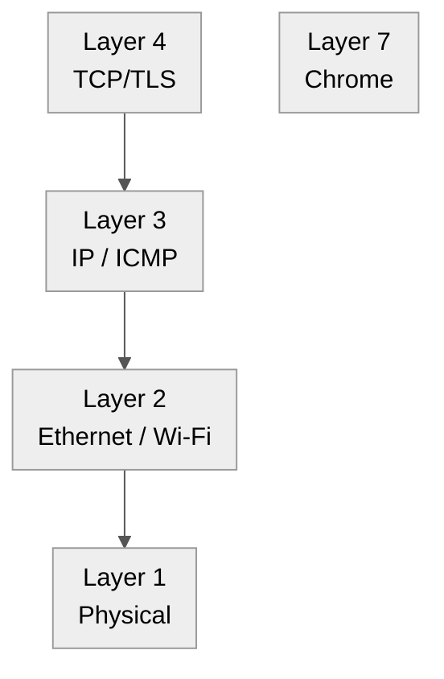

Title: Network Diagnostics: Fixing Chrome Connection Drops on CachyOS
Date: 2026-06-15
Tags: linux, networking, cachyos, diagnostics
Description: A systematic walkthrough of diagnosing Chrome connection drops — from DNS verification to ping tests, traceroute, and firewall inspection — with a Mermaid diagnostic flowchart.

---

When Chrome reports "connection dropped" on sites like **x.com** or **github.com**, the instinct is to blame the browser. In practice, the problem is almost always a **network‑level issue** that Chrome is simply surfacing. This post documents a real debugging session on a CachyOS (Arch‑based) laptop and the systematic approach to isolate the root cause.

---

## 🗺️ Diagnostic Flow

Before diving into commands, here's the decision tree we followed:



---

## 1. Verify DNS Configuration

The first step is confirming which DNS servers the system actually uses.

```bash
cat /etc/resolv.conf
```

On a systemd‑based distro (like CachyOS), this typically shows:

```
nameserver 127.0.0.53
```

That's the **systemd‑resolved stub** — it forwards queries upstream. To see the real upstream servers:

```bash
systemd-resolve --status | grep "DNS Servers"
```

Our output:

```
DNS Servers: 8.8.8.8#dns.google 8.8.4.4#dns.google
Fallback DNS Servers: 9.9.9.9#dns.quad9.net
```

**Verdict:** Google Public DNS is the primary resolver. DNS is working correctly — both hostnames resolved to valid IPs.

---

## 2. Ping Test

```bash
ping -c 5 x.com
# PING x.com (162.159.140.229) — 5 packets transmitted, 0 received, 100% packet loss

ping -c 5 github.com
# PING github.com (20.205.243.166) — 5 packets transmitted, 0 received, 100% packet loss
```

**Verdict:** Both hosts are unreachable at the network layer. Since DNS resolved successfully, the problem is **not** DNS — it's somewhere in the packet path between our machine and the destination.

---

## 3. Traceroute — Where Do Packets Stop?

```bash
traceroute -n x.com
traceroute -n github.com
```

A typical output when the problem is local:

```
1  192.168.8.1    1.2 ms   ← your router
2  * * *                   ← packets never reach the ISP
3  * * *
```

If the trace stops at your gateway (hop 1 or 2), the issue is **local** — firewall, NAT misconfiguration, or router problem.

> **Note:** On CachyOS, `traceroute` may not be installed by default. Install it with `paru -S traceroute` or use the pre‑installed `tracepath -n x.com` as an alternative.

---

## 4. Firewall / iptables Inspection

```bash
sudo iptables -L -v -n | grep -E "OUTPUT|REJECT|DROP"
```

Look for rules that `DROP` or `REJECT` outbound traffic to the destination IPs (`162.159.140.229`, `20.205.243.166`) or to ports 80/443.

---

## 5. Test From Another Network

The simplest isolation test: tether a phone hotspot and retry:

```bash
ping -c 3 x.com
ping -c 3 github.com
```

If it works on the hotspot, the problem is **specific to your current LAN or ISP**.

---

## 6. Common Fixes

| Root Cause | Fix |
|------------|-----|
| **Router / modem glitch** | Power‑cycle: unplug → wait 30s → plug back in |
| **Local firewall rule** | Remove or adjust the offending `iptables` / `nftables` rule |
| **ISP blocking** | Contact ISP with traceroute evidence |
| **VPN / proxy interference** | Disconnect VPN, disable proxy, retest |
| **Stale DNS cache** | `sudo systemd-resolve --flush-caches` |

---

## Key Takeaway

Network connectivity problems often masquerade as browser bugs. By systematically checking **DNS → ping → traceroute → firewall** you can pinpoint the failure layer in minutes and either fix it locally or hand concrete evidence to your ISP.



In our case the failure was at **Layer 3** (ICMP packets never reached the destination), which means Chrome's "connection dropped" error was just the messenger — not the cause.

---

*Related: [CachyOS Mirror Timer Fix](./cachyos-rate-mirrors-timer-fix.md)*
