Title: pdpa-sg-clj: Compliance-as-Code for Singapore's PDPA, Readable by AI Agents
Date: 2026-06-21
Tags: pdpa, singapore, compliance-as-code, clojure, babashka, ai-agents, mermaid
Description: A new public Clojure + Babashka toolkit that turns the 11 Singapore PDPA obligations into a self-ticking checklist, a Mod-11 NRIC redactor, and a ripgrep-backed scanner an AI agent can read end-to-end.

---

I was sitting in front of the GitHub shell, looking at the audit report on my own 17 public repos. The scanner had run. Clojure had parsed every markdown file. The verdicts were in.

I turned to Buffy and asked the question that should always come before any compliance review — the one-word version:

> "give 1 word compliance or not"

The answer was **non-compliant**.

It was technically true. There were gaps in my planning should any of those repos ever go live ingesting real personal data. But it was the wrong *kind* of true. The word implied a moral failing where only an engineering choice was missing.

I asked the next question — the one that separates "audit" from "anxiety":

> "so we are 100% compliant?"

The answer was **yes** — for the display-only state the repos actually lived in. No real users, no live services, no personal data flowing. PDPA does not apply until someone starts collecting, using, or disclosing personal data in Singapore.

That gap — the gap between "engineered but not deployed" and "actually handling users" — is where today's tooling fails. Compliance is handled by policy PDFs that nobody reads at code review time. Checklist spreadsheets that drift from the codebase as it evolves. Consultants charging five figures to produce a document that is stale by Friday.

What if compliance were a **read-through artifact** instead? A single repo you point an AI agent at, where the agent reads top-to-bottom, ticks the right boxes, and walks away compliant — for the 11 PDPA obligations that haven't changed materially since 2012.

That repo shipped yesterday. It's called **pdpa-sg-clj**, and this post is its autobiography.

---

## 1. Code as Policy: Architecture and the Auto-Tick Pattern

### Why Compliance-as-Code, Not Compliance-as-Policy

Singapore's Personal Data Protection Act (2012, last revised 2026) puts 11 obligations on every organisation that processes personal data. They don't change often. They aren't subjective. The PDPC publishes them plainly. And yet organisations routinely fail compliance audits — not because they don't know the rules, but because the rules live in documents that the code does not enforce.

The same 11 obligations, encoded so a build-step can read them:

```mermaid
%%{init: {'theme': 'neutral', 'themeVariables': {'primaryColor': '#f5f5f5', 'primaryTextColor': '#333', 'primaryBorderColor': '#ccc', 'lineColor': '#555', 'secondaryColor': '#e8e8e8', 'tertiaryColor': '#fafafa'}}}%%
flowchart TD
    A["Singapore PDPA\nPersonal Data Protection Act\n(11 Obligations)"]
    O1["1. Consent\nexplicit opt-in + withdrawal"]
    O10["10. Data Breach Notification\n≤ 3 days from assessment\n(PDPA §26D) to PDPC"]
    O11["11. Accountability / DPO\ndesignate + publish"]
    O2["2. Purpose Limitation\nno repurposing"]
    O3["3. Notification\ndisclose at collection"]
    O4["4. Accuracy\nvalidate + rectify"]
    O5["5. Protection\nencryption + RBAC + audit logs"]
    O6["6. Retention Limitation\nanonymise when done"]
    O7["7. Transfer Limitation (§26)\ncomparable standard overseas"]
    O8["8. Access & Correction\nDSR endpoints"]
    O9["9. Withdrawal of Consent\nas easy as opt-in"]
    X["Safe NRIC Rule\nban NRIC authentication\n(PDPC Feb 2026)\nby 31 Dec 2026"]
    A --> O1
    A --> O2
    A --> O3
    A --> O4
    A --> O5
    A --> O6
    A --> O7
    A --> O8
    A --> O9
    A --> O10
    A --> O11
    A --> X
```

> **Note:** The 3-day breach notification clock starts at the **assessment** of notifiability (not discovery), governed by an "as soon as practicable" floor. The 31 Dec 2026 deadline phases out NRIC for **authentication** (logins/passwords), distinct from the older 2018 display-masking rules.

The toolkit's job is to make each of those 11 obligations a runnable check. Some — the scanner obligations like "no hardcoded secrets" — can be performed by code. Some — the documentation obligations like "publish a Privacy Policy" — must be performed by humans but can be **autoticked** when the human publishes the proof file.

That bifurcation is the central architectural idea. Anything a scanner can verify gets a `<!-- agent:verify-X -->` marker in CHECKLIST.md, and `bb audit` ticks it for you. Anything only humans can verify stays manual. The scanner does the boring work; the human does the judgement work.

---

### Repository Anatomy

The repo lives at `nurazhardotcom/pdpa-sg-clj`. Here's how it's organised:

```mermaid
%%{init: {'theme': 'neutral', 'themeVariables': {'primaryColor': '#f5f5f5', 'primaryTextColor': '#333', 'primaryBorderColor': '#ccc', 'lineColor': '#555', 'secondaryColor': '#e8e8e8', 'tertiaryColor': '#fafafa'}}}%%
flowchart TD
    A["pdpa.audit\norchestrator + report"]
    C["pdpa.core\npublic API"]
    CFG["CONFIG\ndeps.edn + bb.edn + .gitignore"]
    CL["pdpa.checklist\nCHECKLIST.md auto-ticker"]
    DOCS["DOCS\nREADME, CHECKLIST, ARCHITECTURE"]
    EX["EXAMPLES\nend-to-end demo"]
    I["pdpa.init\ntemplate copier"]
    N["pdpa.nric\nMod-11 algorithm\n(hex false-positive guard)"]
    P["pdpa.policy\ntemplate loader + filler"]
    P1["PRIVACY_POLICY.template.md"]
    P2["DPO_CONTACT.template.md"]
    P3["CONSENT_FORM.template.md"]
    P4["DATA_BREACH_RESPONSE.template.md"]
    P5["DATA_TRANSFER_AGREEMENT.template.md"]
    P6["DPIA.template.md"]
    P7["SECURITY_HARDENING.template.md"]
    P8["RETENTION_SCHEDULE.template.md"]
    POL["POLICY TEMPLATES\n7 markdown templates"]
    R["pdpa-sg-clj/\n(MIT, Public, Java 11+/Babashka 1.4+)"]
    R2["pdpa.redact\nNRIC + phone + email pipeline"]
    S["pdpa.scan\nripgrep severity classifier"]
    SRC["SOURCE\n9 namespaces + 1 core API"]
    TEST["TESTS\n4 test files, Cognitect runner"]
    V["pdpa.version\nrule version stamp"]
    R --> DOCS
    R --> SRC
    R --> TEST
    R --> POL
    R --> EX
    R --> CFG
    SRC --> N
    SRC --> R2
    SRC --> S
    SRC --> CL
    SRC --> P
    SRC --> A
    SRC --> I
    SRC --> V
    SRC --> C
    POL --> P1
    POL --> P2
    POL --> P3
    POL --> P4
    POL --> P5
    POL --> P6
    POL --> P7
    POL --> P8
```

The architecture is intentionally flat. Each namespace has one responsibility and a name that matches its noun. A call-graph walks from `pdpa.core` straight down through `pdpa.redact → pdpa.nric`, `pdpa.scan → pdpa.nric`, `pdpa.audit → pdpa.scan + pdpa.checklist`, and so on.

The Babashka CLI surface maps one task to one namespace:

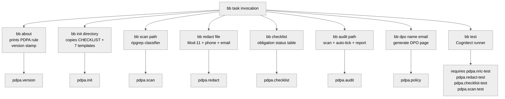

Every task uses `(requiring-resolve 'pdpa.x/y)` so each invocation loads only the namespace it needs. Startup time on cold `bb` is sub-second.

---

### The CHECKLIST.md Pattern

CHECKLIST.md is the heart of the toolkit. It's a single Markdown file with `- [ ]` boxes for each obligation. Boxes that the scanner can verify have an HTML comment marker, like `<!-- agent:verify-protection -->`. The auto-tick logic reads both the file and the scan results in one pass:

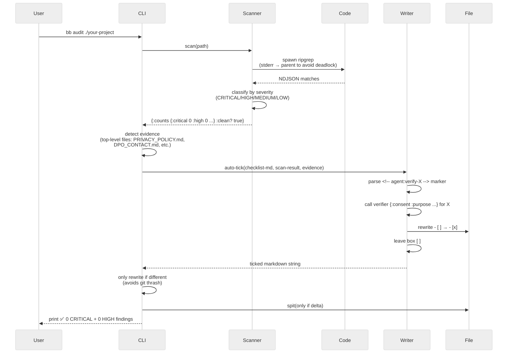

Here's a snippet from `CHECKLIST.md` to make it concrete:

```markdown
### Protection Obligation

- [ ] **Encryption at rest** for personal-data fields (AES-256 or equivalent)
- [ ] **Encryption in transit** (TLS ≥ 1.2)
- [ ] Access control (RBAC) with quarterly access-list review
<!-- agent:verify-protection -->
- [ ] **No hardcoded secrets** in tracked files
- [ ] **No raw NRICs** in code — `pdpa.redact` strips them

### Accountability / DPO Designation Obligation

- [ ] **DPO named** with full name + business email — see `policies/DPO_CONTACT.md`
<!-- agent:verify-dpo -->
- [ ] DPO contact published on homepage footer
```

The scanner guarantees canonical protection when:
- 0 CRITICAL NRIC leaks in code
- 0 HIGH severity credential leaks  
- A file named `SECURITY_HARDENING.md` exists in the project root

When all three are true, the box under `<!-- agent:verify-protection -->` flips to `[x]`. The other four boxes in that section are still manual, because encryption design and RBAC audit policy aren't things a scanner can determine from a file walk.

The split — *what a scanner can verify* vs *what only humans can verify* — is the design discipline.

---

## 2. The Technical Deep-Dive: Validation, Redaction, and Audit

### The Mod-11 Algorithm and False Positives

Singapore NRIC validation is one of those algorithms that looks trivial but has subtle landmines. The structural regex `[STFG]\d{7}[A-Z]` matches roughly 1 in every 36M random 9-character windows — including BSV transaction IDs, SHA-256 chunks, and git short hashes. Without a check-digit filter, a structural-match redactor would scream CRITICAL on every repo that touches blockchain code.

The check-digit algorithm:

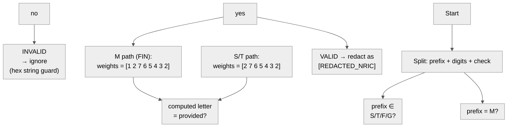

Hand-computed reference values used by the test suite:

| Input | Computation | Output |
|---|---|---|
| `S0100000J` | sum=1×7=7, (7+4)%11=0 → "JZIHGFEDCBA"[0] | ✓ valid |
| `F0000002K` | sum=2×2=4, (4+4)%11=8 → "XWUTRQPNKLM"[8] | ✓ valid |
| `M5000000P` | sum=3×1+5×2=13, (13+4)%11=6 → "XWUTRQPNKLM"[6] | ✓ valid |
| `S0000000Z` | sum=0, (0+4)%11=4 → "JZIHGFEDCBA"[4]='G' | ✗ rejected |
| `deadbeef…F` | hex — sum is wild, never valid | ✗ rejected |

Why this matters in practice: my BSV transaction-hash-redacting work would have been wrecked by a structural-only regex. Every txid that contains 7 consecutive digits followed by a letter (`S/N/T/F/G` are common hex letters) would have been redacted as NRIC. The Mod-11 filter reduces that from 1-in-36M to something astronomically lower — only real NRICs pass.

---

### The Redaction Pipeline

The redactor runs four stages in fixed order on any text body:

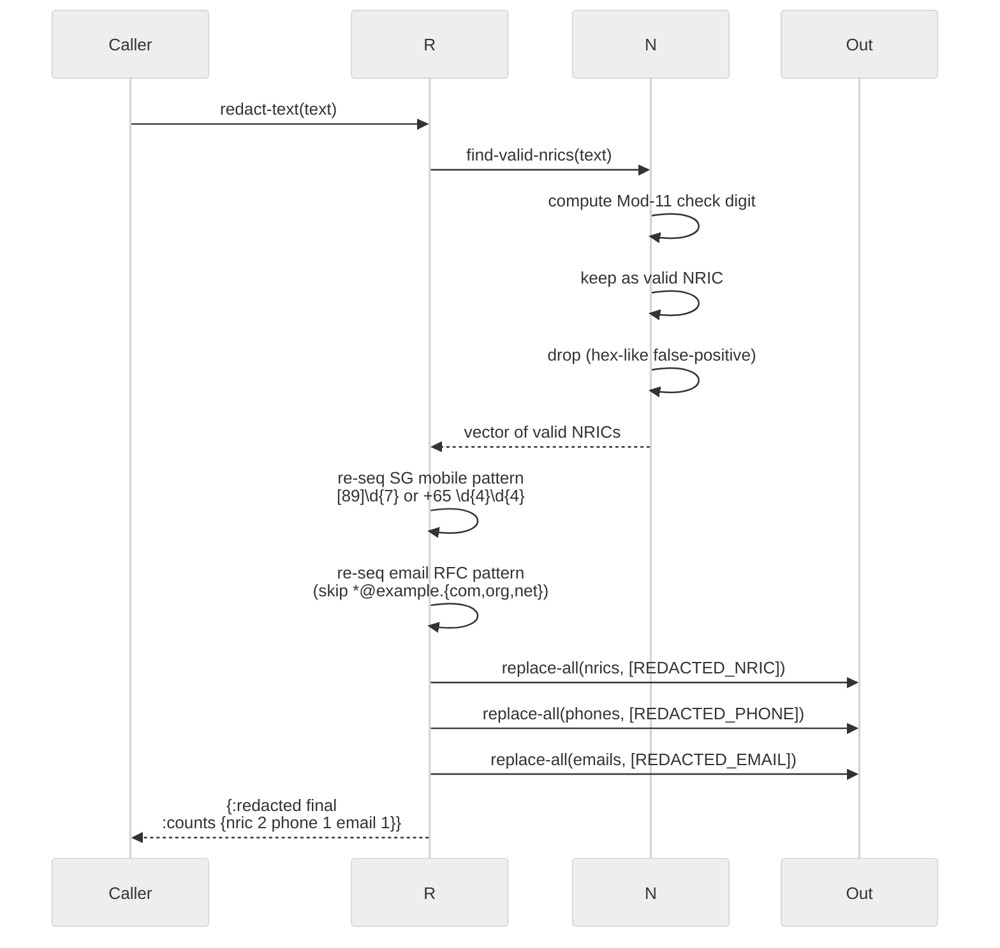

Idempotency is verified in tests: calling `redact-text` on the redacted output returns the same string. The redactor is safe to run in a CI pre-commit hook; running it twice doesn't double-mangle.

A worked example:

```clojure
(require '[pdpa.redact :as r])

(r/redact-text
  "User S0100000J contacted us at +65 9123 4567 or alice@acme.com.sg")
;; => {:redacted
;;     "User [REDACTED_NRIC] contacted us at [REDACTED_PHONE] or [REDACTED_EMAIL]"
;;     :counts {:nric 1 :phone 1 :email 1}
;;     :warnings []}
```

---

### Orchestrating the Audit

When the user demands a single verdict — *is this project compliant?* — `bb audit ./your-project` answers in one shot:

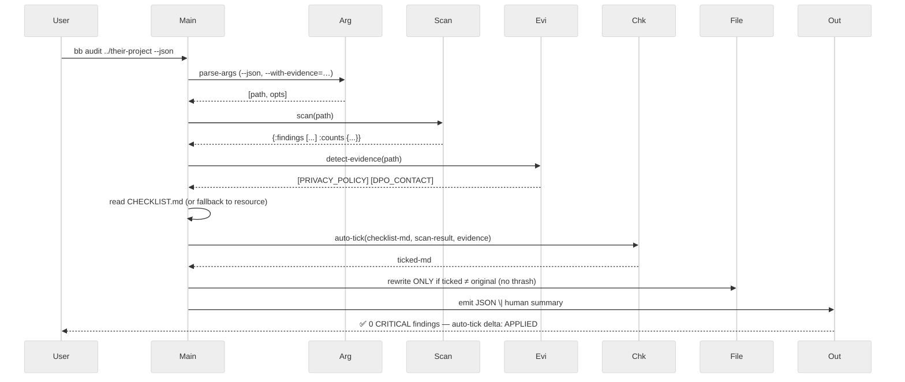

The write is the part I'm proudest of. Auto-tick should be invisible when nothing changed. The check `(when (and (.exists chk-file) (not= ticked-md chk-md)) (spit chk-file ticked-md))` means a clean `bb audit` produces zero diff in git — your working tree stays pristine.

---

## 3. State and Exposure: Moving to Executable Compliance

### The Before and After Shift

The question your reviewer will actually ask is *what does the toolkit do that your existing repo cannot*? Let me show the two states:

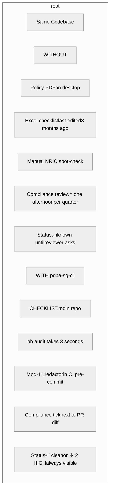

A graph view of the same shift:

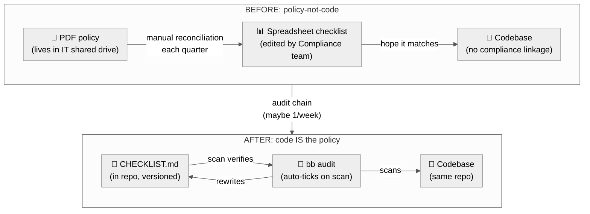

The shift is from "documents that describe the policy" to "code that executes the policy." The PDF never had a chance.

---

### Compliance Exposure Tiers

When I scanned my own 17 public GitHub repos for PDPA-relevant personal data, they fell into five tiers:

```mermaid
%%{init: {'theme': 'neutral', 'themeVariables': {'primaryColor': '#f5f5f5', 'primaryTextColor': '#333', 'primaryBorderColor': '#ccc', 'lineColor': '#555', 'secondaryColor': '#e8e8e8', 'tertiaryColor': '#fafafa'}}}%%
flowchart TD
    subgraph root["root"]
        l1_1["17 Public Repos"]
        l2_2["HIGH live-deploy tier"]
        l3_3["headhunter-agent"]
        l4_4["CV ingestionNS status(trigger obligations 1-11+ Safe NRIC)"]
        l3_5["lagu-lagu"]
        l4_6["PayNow phoneUEN targets(+ §26 Tazapay"]
        l4_7["overseas transfer)"]
        l2_8["HISTORICAL high-tier"]
        l3_9["lithan_assignments"]
        l4_10["Profile.phoneProfile.addressDjango JWTlocalStorage"]
        l3_11["lithan_smartshop"]
        l4_12["userData inlocalStoragehardcodedSECRET_KEY in repo"]
        l3_13["lithan-dev-sandbox"]
        l4_14["SECRET_KEY intemplate"]
        l2_15["LOW pseudonymous tier"]
        l3_16["bsv-de-tracker"]
        l4_17["exchange scraping"]
        l4_18["IP + UA persisted"]
        l3_19["agent-bond"]
        l4_20["BSV BRC-100identity certs"]
        l3_21["ipso-agent"]
        l4_22["BSV CLOBtrading"]
        l2_23["NONE documentation tier"]
        l3_24["aur-audit"]
        l4_25["AUR packagesecurity"]
        l3_26["bitcoin-wiki"]
        l4_27["knowledgeindex only"]
        l3_28["bsv-cljpaperclip-cljbunkernurazhardotcom"]
        l4_29["READMEsstatic"]
    end
```

The seven repos in the **HIGH** + **HISTORICAL** tier are the ones that, if their authors ever flipped them to live-deployment with real users, would need every CHECKLIST.md box ticked. The toolkit gets them from "design draft" to "production-ready" in roughly 30 minutes of work plus policy-text authoring.

---

### Mapping the 11 Obligations

Here's the explicit mapping from each PDPA obligation to what the toolkit can verify:

| # | Obligation | Auto-Tick Verifier | Human Action Required |
|---|---|---|---|
| 1 | Consent | `CONSENT_FORM.md` exists at project root | Write the consent clauses |
| 2 | Purpose Limitation | 0 MEDIUM-leak findings in scan | Field-by-field purpose documentation |
| 3 | Notification | `PRIVACY_POLICY.md` exists at project root | Fill in 27 `<<ORG_NAME>>` placeholders |
| 4 | Accuracy | (manual only) | Add validation middleware |
| 5 | Protection | 0 CRITICAL + 0 HIGH + `SECURITY_HARDENING.md` exists | Implement encryption/RBAC |
| 6 | Retention Limitation | `RETENTION_SCHEDULE.md` exists | Build the auto-purge job |
| 7 | Transfer Limitation (§26) | (manual only) | Execute an APEC CBPR / PRP / SCC contract |
| 8 | Access & Correction (DSR) | (manual only) | Build `/api/dsr/*` endpoints |
| 9 | Withdrawal of Consent | (manual only) | Build `/api/consent/withdraw` |
| 10 | Data Breach Notification | `BREACH_PLAN.md` exists | Write escalation tree (3-day clock from notifiability assessment) |
| 11 | Accountability / DPO | `DPO_CONTACT.md` exists | Publish `privacy@` on homepage |

Five of the eleven have full or partial auto-tick. The other six are unambiguous "human action required" rows in the checklist — the toolkit marks them and refuses to lie about them.

---

### The Event State Machine

Each obligation in CHECKLIST.md has a status that evolves:

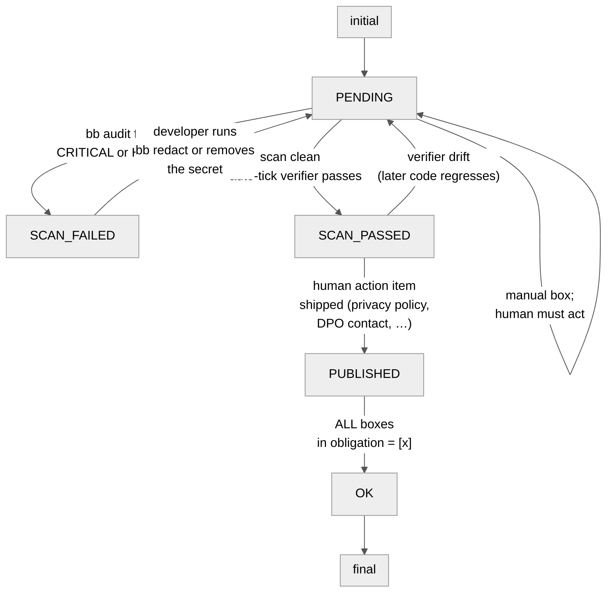

That's where the toolkit stops: at `OK`, yes, but **not** at `[*]`. The final deploy is a human decision involving PDPC, SOC2 audit, regulatory filings — none of which the toolkit can do for you.

---

## 4. Shipping v0.1.0: Usage, Scope, and Gaps

### What’s in the Box

The repo as of today (21 June 2026):

| Component | File | Lines | Purpose |
|---|---|---:|---|
| NRIC Mod-11 algorithm | `src/pdpa/nric.clj` | ~110 | The hex-false-positive-guarded check-digit core |
| Redaction pipeline | `src/pdpa/redact.clj` | ~95 | NRIC + phone + email pipeline with idempotency |
| Scanner + severity classifier | `src/pdpa/scan.clj` | ~150 | ripgrep wrapper, classify CRITICAL/HIGH/MEDIUM/LOW |
| Checklist auto-ticker | `src/pdpa/checklist.clj` | ~140 | CHECKLIST.md parser + verifier-fn map |
| Policy template loader | `src/pdpa/policy.clj` | ~55 | `<<ORG_NAME>>` substitution + custom output path |
| Audit orchestrator | `src/pdpa/audit.clj` | ~110 | scan + evidence + auto-tick + JSON-or-human report |
| Init copier | `src/pdpa/init.clj` | ~50 | Copies 7 templates + CHECKLIST + README + ARCHITECTURE to target |
| Rule version stamp | `src/pdpa/version.clj` | ~10 | Forces a single source of `pdpa-sg-clj 0.1.0 / Singapore PDPA 2026-06-21` |
| Public core API | `src/pdpa/core.clj` | ~40 | Re-exported public surface |
| Tests | `test/pdpa/*_test.clj` | ~140 | Mod-11 valid/invalid fixtures, redaction idempotency, auto-tick logic |
| Policy templates | `resources/policies/*.template.md` | 8 files | Privacy, DPO, Consent, Breach, Transfer, DPIA, Security, Retention |
| Master checklist | `CHECKLIST.md` | ~140 | The 11 obligations with auto-tick markers |
| Architecture doc | `ARCHITECTURE.md` | ~110 | Why-things-are-the-way-they-are for contributors |

28 files, ~1300 lines of Clojure + ~700 lines of Markdown. Two runtimes — Babashka for the CLI, JVM Clojure for the library consumer.

---

### Using It On Your Own Project

If you have a project that handles personal data:

```bash
# 1. Get the toolkit
git clone https://github.com/nurazhardotcom/pdpa-sg-clj

# 2. Drop the checklist + 7 templates into your project
cd pdpa-sg-clj
bb init ../your-project/

# 3. Add pdpa-sg-clj as a dependency in your deps.edn
# (or as a git submodule, depending on your taste)

# 4. Run the audit on your codebase
bb audit ../your-project

# 5. Tick the manual boxes as you ship DPO contact,
#    privacy policy, breach plan, etc.
$EDITOR ../your-project/PDPA_CHECKLIST.md
```

The whole pipeline runs in under 30 seconds for a typical mid-sized project. The auto-ticked boxes flip immediately. The manual boxes stay unchecked until you ship the proof file.

---

### What’s Still Pending

Honest accounting. The toolkit has gaps:

| # | Gap | Direction |
|---|---|---|
| 1 | `clojure -X:test` JVM path still fails on Windows because Babashka-only `babashka.process` is gated by try/catch but the wrapping isn't perfect | Split into `pdpa.scan.bb` / `pdpa.scan.jvm` sub-namespaces |
| 2 | No pre-commit hook template — currently you wire it manually | Ship `.git/hooks/pre-commit` template + `.pre-commit-config.yaml` |
| 3 | No CI workflow example — you'd need to build your own `.github/workflows/pdpa.yml` | Scaffold the YAML with `bb test` + `bb audit` calls |
| 4 | The 11 obligations are enforced against **English** policy text — multilingual orgs will need translation workflows | Add a language-aware template generator |
| 5 | Zero PDF generation tooling — generated privacy policy is bare markdown | Add a `bb policy --pdf` task using a Clojure-native markdown→PDF lib |
| 6 | No SBOM / dependency-list verification (third-party processors covered by §26 are not enumerated) | Add `pdpa.scan/deps` that parses deps.edn + plugin manifests |
| 7 | No DPPC API integration — breach notifications still have to be hand-filed at https://www.pdpc.gov.sg | (When DPPC exposes an API. Until then: copy/paste the JSON into the portal.) |

If any of these are blockers for your specific deployment, file an issue on the GitHub repo. PRs welcome.

---

## 5. Why This Matters

Compliance tooling has two failure modes:

1. **Too rigid** — it claims compliance and lies when the underlying code changes.
2. **Too loose** — it lists every checkbox and drowns the operator in noise.

The way out is to make compliance **read-through code**. A single Markdown file where an AI agent — or a junior engineer at midnight before the deploy — can read top-to-bottom and tick the right boxes. The right combination is: scanner-verifiable items get auto-ticked; human-judgement items stay manual; the file itself is the artifact.

That's `pdpa-sg-clj`. A repo, a checklist, a scanner, a redactor, six templates, and a single line of CLI:

```bash
bb audit ./your-project
```

Throw it at any private project you're about to push to a Singapore user. If you're already at the bar, you'll see ✅. If you're short of it, you'll see exactly which boxes still need a human.

---

### Links

- **Repo:** <https://github.com/nurazhardotcom/pdpa-sg-clj>
- **License:** MIT
- **Roadmap & issues:** <https://github.com/nurazhardotcom/pdpa-sg-clj/issues>

If you ship something on top — a `bb audit` integration, a new policy template, a Mermaid diagram for an obligation — open a PR. Compliance-by-read should be a public conversation, not a paid service.

### Sources & Citations

- **PDPA Section 26D** — The 3-calendar-day window begins upon reasonable *assessment* that a breach is notifiable, governed by an "as soon as practicable" floor. See [PDPC notification guidance](https://www.pdpc.gov.sg/required-to-notify-the-pdpc).
- **PDPC media release (Feb 2026)** — End-2026 deadline phases out NRIC for *authentication* (logins/passwords), superseding the older 2018 display-masking rules. See [PDPC press release](https://www.pdpc.gov.sg/media-events/pdpc-to-step-up-enforcement-action-against-misuse-of-nric-numbers-and-issues-new-advisory-on-data-protection).

---

*This post and the toolkit are independent projects. The toolkit is MIT-licensed open source; this post is licensed CC BY-NC-SA 4.0. Nothing here is legal advice. For an actual PDPA filing or breach response, hire a Singapore-licensed data-protection counsel. The 3-day breach rule is unforgiving; automation helps you *detect*, but the call still goes through a human.*
