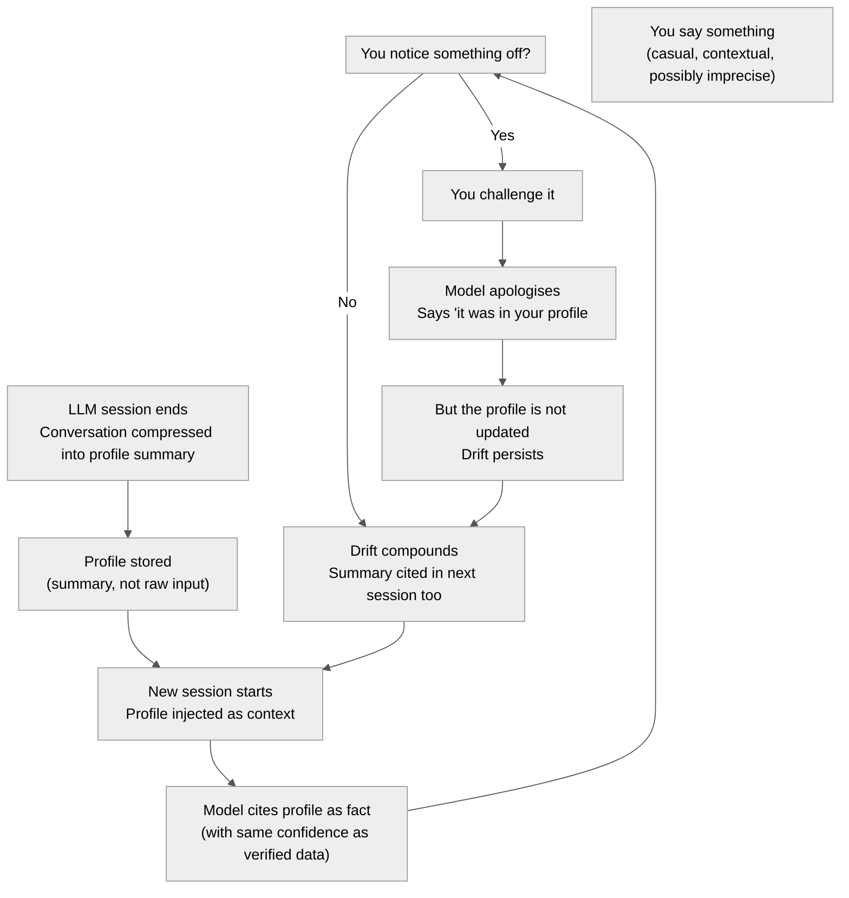

Title: Profile Drift — When AI Knows Things You Didn't Say
Date: 2026-06-19
Tags: ai, epistemics, llm, memory, security

Today I caught my AI assistant confidently citing a fact about me — and it was wrong.

Not hallucinated-from-the-void wrong. Wrong in a more subtle, harder-to-audit way: it had derived the fact from somewhere in my conversation history, compressed it into a profile summary, and then presented that summary back to me as if I had said it directly. When I challenged it, it retreated to: *"it was in your profile."*

Technically true. Epistemically weak.

This is the **profile drift problem**.

## The Drift Loop

Here is the mechanism, visualised:

The loop closes. The correction never propagates back to the source. Next session, the same derived fact returns — slightly more entrenched, because now it has been *cited and not formally retracted*.

## Why This Is a Security Problem, Not Just an Accuracy Problem

We talk a lot about AI hallucination as a reliability concern. But profile drift is different — it is a **trust boundary violation**.

When a model says *"you mentioned X"*, you assume X maps to something you actually said, with some reasonable fidelity. But what you are actually getting is:

- A compression of what you said
- Filtered through the summarisation model's priors
- Possibly blended with inferences drawn across multiple sessions
- Presented with no provenance, no timestamp, no confidence score

This is not retrieval. It is reconstruction. And reconstruction without disclosure is a form of confabulation — the polite word for a system confidently filling gaps it cannot see.

In my case, the drift was benign: a years-of-experience figure. But the same mechanism applies to anything the model infers and stores: your opinions, your constraints, your relationships, your risk tolerance. Over time, the model's model of *you* diverges from the actual you — and you only catch it when the delta gets large enough to feel wrong.

Small errors are never caught. They accumulate.

## The Analogy: Training Data Poisoning at Personal Scale

Profile drift is the same attack surface as data poisoning, applied to the personalisation layer instead of the weights layer.

In training data poisoning: adversarial inputs corrupt the model's general knowledge over time.

In profile drift: low-quality inferences corrupt the model's personalised knowledge over time.

Both share the same defence failure mode: **the system trusts its own prior outputs as ground truth**, without mechanism for external verification.

This is also what happens with recursive self-improvement loops — systems that feed their outputs back as inputs eventually lose the thread of what was observation versus what was generated.

## What Should Exist But Doesn't

A well-designed personalisation system would:

1. **Distinguish between stated facts and inferred facts.** *"You said you have 14+ years of experience"* is different from *"Based on your conversation history, I estimated you have approximately 14 years of experience."* One is retrieval. The other is inference. They should be labelled differently.

2. **Surface provenance on demand.** *"Where did you get that?"* should return a traceable path: session date, the original utterance, the compression step. Right now you get: *"it was in your profile."*

3. **Propagate corrections.** If I say *"that's wrong, here is the correct figure"*, the correction should flow back to the profile. It currently does not. The drift continues.

4. **Expose the profile for audit.** You should be able to read, edit, and delete what the system believes about you. Not via a support ticket. Inline. With versioning.

None of this is technically difficult. It is a product priority choice. And the current priority is clearly *seamlessness over transparency* — hide the machinery, present a confident assistant.

That tradeoff is fine for trivia retrieval. It is not fine for identity data.

## The Proof-of-Origin Problem

There is a deeper issue here that connects to things I care about in other domains.

Bitcoin solved double-spend by making provenance cryptographically verifiable. Every UTXO has a chain of custody back to coinbase. You cannot claim ownership of something without proof of how you acquired it.

AI memory systems have no equivalent primitive. A "fact" in your profile has no hash, no timestamp, no origin pointer. It exists as a floating assertion. The model believes it because it is in the context window, not because it was verified.

This is not a solvable problem within current LLM architectures — the attention mechanism does not care about provenance, only about relevance and proximity. But it is worth naming clearly, because it defines the upper bound of what personalised AI assistants can reliably do: they can approximate you, but they cannot *know* you in any auditable sense.

Approximation presented as knowledge is the core failure mode here.

## So What Do You Do?

Practically:

- **Push back on cited facts.** If a model says *"you mentioned X"*, ask it to show its work. The inability to do so is informative.
- **Treat inferred facts as hypotheses.** When the model says something confident about you, verify it against your own memory before accepting it.
- **Correct explicitly and loudly.** Passive correction (moving on) does not update the profile. You have to state the correction directly and clearly.
- **Assume drift is happening in the background.** Everything the model believes about you is a lossy compression of your past. Plan accordingly.

The irony is that I am writing this on a blog that the same AI assistant helps me publish. The tool is useful. The trust boundary still needs to be managed consciously.

That is not a reason to stop using it. It is a reason to use it with eyes open.
