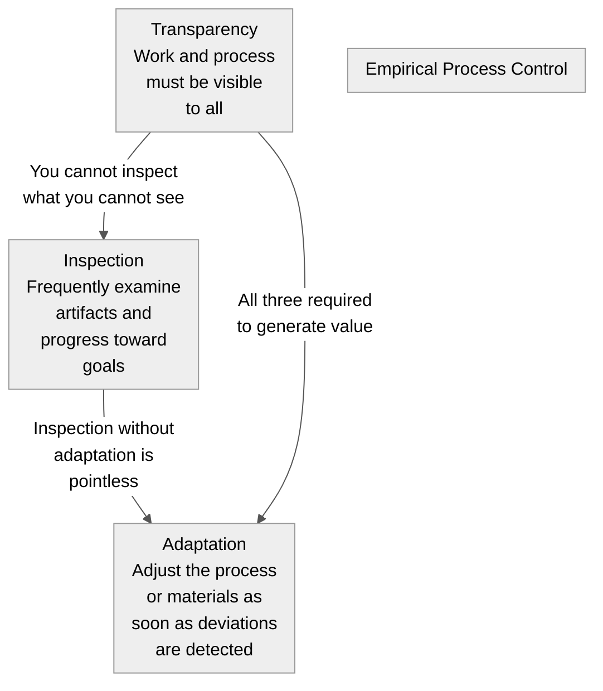
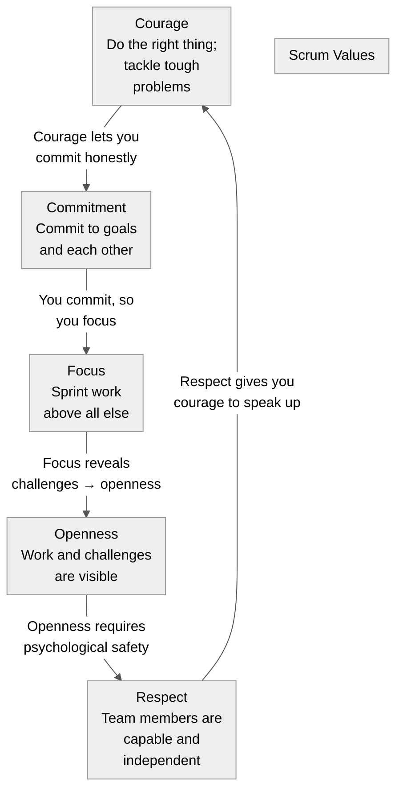
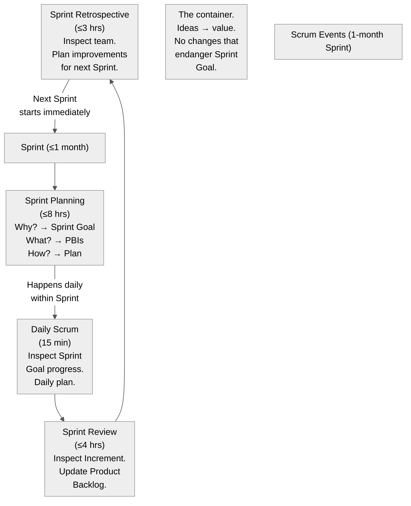
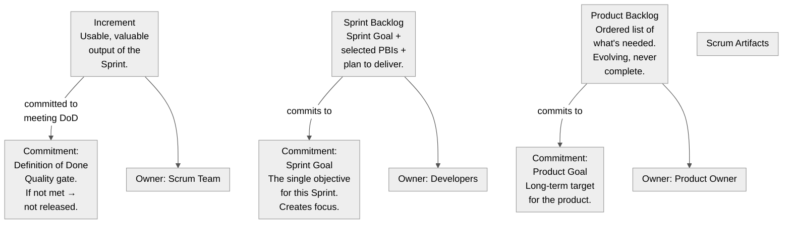
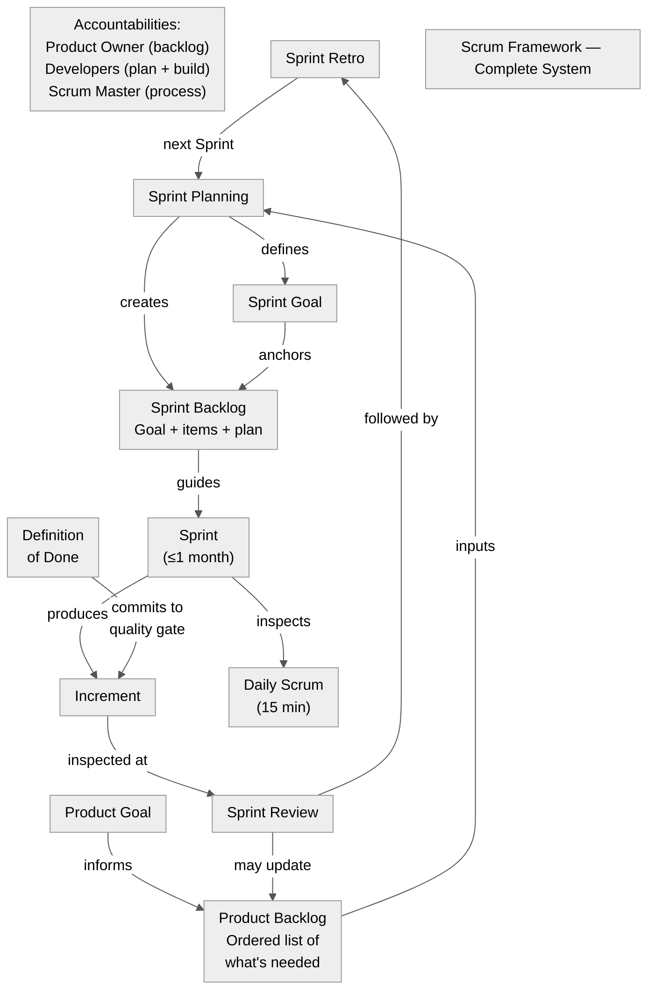

Title: Scrum Framework — Roles, Events, and Artifacts for the Busy Engineer
Date: 2026-06-22
Tags: scrum, agile, project-management, methodology, lithan
Description: A focused, one-pager on the Scrum Framework: the three accountabilities, five events, three artifacts, empirical pillars, and five values. Real engineers explaining Scrum to engineers.

---

My last post explained why Waterfall failed and why Agile won. This post covers **Scrum** — the most widely used Agile framework — as a single, connected system.

If you're an engineer reading this: Scrum is not "standup meetings and sprints." It's a **feedback loop wrapped in a container, with clear accountability boundaries and explicit quality gates.** Every element exists because real teams needed it.

---

## What Scrum Is

From the 2020 Scrum Guide:

> Scrum is a lightweight framework that helps people, teams and organizations generate value through adaptive solutions for complex problems.

Scrum is:
- **Lightweight** — minimal rules (roles, events, artifacts, and their binding rules)
- **Simple to understand** but **difficult to master**
- A **framework**, not a methodology — it doesn't tell you how to test, deploy, or write code

It's built on **empirical process control**: knowledge comes from experience, decisions are based on what is known.

---

## The Three Pillars



Every Scrum event exists to enable one of these three pillars. The Daily Scrum inspects progress toward the Sprint Goal. The Sprint Review inspects the Increment. The Retrospective inspects the process itself. None of this works without **Transparency** — if your Product Backlog is hidden, your Sprint Backlog is unreadable, or your Definition of Done is vague, inspection is meaningless.

---

## The Five Values

Values give the pillars their foundation. When the team embodies these, empiricism works:



---

## The Three Accountabilities (Roles)

Scrum defines **three accountabilities**, not job titles:

```mermaid
%%{init: {'theme': 'neutral', 'themeVariables': {'primaryColor': '#f5f5f5', 'primaryTextColor': '#333', 'primaryBorderColor': '#ccc', 'lineColor': '#555', 'secondaryColor': '#e8e8e8', 'tertiaryColor': '#fafafa'}}}%%
flowchart TD
    subgraph Title["Scrum Team Accountabilities"]
    end
    subgraph PO["Product Owner\nMaximizes value\nof the product"]
    end
    subgraph Dev["Developers\nCreate the Increment\neach Sprint"]
    end
    subgraph SM["Scrum Master\nEnsures Scrum is\nunderstood and\nenacted"]
    end
    subgraph POBottom["Key: One person, not a committee.\nOwns the Product Backlog.\nDecides order and priority.\nEveryone respects their decisions."]
    end
    subgraph DevBottom["Key: Cross-functional, self-managing.\n7±2 people.\nNo sub-teams (no \"Devs + QA + DB\").\nCreates Sprint Backlog plan."]
    end
    subgraph SMBottom["Key: Serves PO, Devs, and organization.\nCoach, facilitator, impediment remover.\nNot a project manager or team lead."]
    end
    PO --> POBottom
    Dev --> DevBottom
    SM --> SMBottom
```

Key insight for engineers: **there is no "project manager" in Scrum.** The Product Owner decides *what* to build. The Developers decide *how* to build it. The Scrum Master ensures the process works.

---

## The Five Events

Events are **time-boxed** (shorter for shorter Sprints) and create **regularity** — minimizing the need for meetings not defined in Scrum:



**Sprint** (the container):
- Fixed length ≤ 1 month
- A new Sprint starts immediately after the previous one ends
- Only the Product Owner can cancel a Sprint (and only if the Sprint Goal becomes obsolete)

**Sprint Planning** (the plan):
- Entire Scrum Team attends
- Answers: Why is this Sprint valuable? (Sprint Goal), What can be Done? (selected PBIs), How will the work be done? (Sprint Backlog plan)

**Daily Scrum** (the sync):
- 15 minutes, same time/place daily
- Developers inspect progress toward Sprint Goal
- Adapt Sprint Backlog as needed
- The Scrum Master enforces it happens, but **Developers own it**

**Sprint Review** (the demo):
- Scrum Team + stakeholders
- Inspect the Increment; not a presentation but a **working session**
- Discuss what was done, what changed, what to do next
- Product Backlog may be adjusted

**Sprint Retrospective** (the improvement):
- Team inspects itself (individuals, interactions, processes, tools, Definition of Done)
- What went well? What problems? How were they solved?
- Identify the most impactful changes for next Sprint

---

## The Three Artifacts and Their Commitments

Artifacts represent **work or value** and have explicit **commitments** that make them transparent:



**Product Backlog** (managed by the Product Owner):
- Emergent, ordered list of everything needed
- Items that can be Done in one Sprint are "ready"
- Never complete — the Product Backlog lives as long as the product does
- **Commitment: Product Goal** — the long-term target that the backlog serves

**Sprint Backlog** (owned by the Developers):
- Sprint Goal + selected items + the plan to deliver them
- Highly visible, updated throughout the Sprint
- **Commitment: Sprint Goal** — the single reason this Sprint exists
- If the work turns out different than planned, the team negotiates scope, not quality

**Increment** (accountability of the whole Scrum Team):
- Sum of all completed Product Backlog items, integrated with prior work
- Must be **usable** (verifiable, valuable)
- **Commitment: Definition of Done** — a formal quality checklist
- If an item doesn't meet DoD, it goes back to the Product Backlog; it is NOT demoed or released

---

## How the System Connects

Here's the full framework as a single diagram:



The entire framework is a **closed feedback loop**:
1. **Product Goal** defines direction → **Product Backlog** captures what's needed
2. **Sprint Planning** selects work → **Sprint Goal** gives purpose → **Sprint Backlog** has the plan
3. **Sprint** executes → **Daily Scrum** keeps it on track → **Increment** is produced (must meet **Definition of Done**)
4. **Sprint Review** inspects the result → **Product Backlog** adjusts based on learning
5. **Sprint Retrospective** inspects the process → next **Sprint Planning** starts the cycle again

---

## Summary

| Element | What It Does | Timebox / Size |
|---------|-------------|----------------|
| **Product Owner** | Decides what to build | One person |
| **Developers** | Decides how to build | 7±2 people, cross-functional |
| **Scrum Master** | Ensures Scrum works | One person |
| **Sprint** | Container for work | ≤1 month |
| **Sprint Planning** | Selects work, defines goal | ≤8 hrs (1-month sprint) |
| **Daily Scrum** | Daily sync, adapt plan | 15 min |
| **Sprint Review** | Demo + feedback + re-prioritize | ≤4 hrs (1-month sprint) |
| **Sprint Retrospective** | Team improvement | ≤3 hrs (1-month sprint) |
| **Product Backlog** | Ordered work list | Living document |
| **Sprint Backlog** | Current sprint plan | Updated daily |
| **Increment** | Working, usable output | Every sprint |
| **Definition of Done** | Quality checklist | Team-defined |

Three pillars (Transparency, Inspection, Adaptation) + five values (Commitment, Focus, Openness, Respect, Courage) = the foundation that makes the framework work.

---

*Next: we map this framework directly onto improving this blog in production — the blog's Product Backlog, Sprint Planning, and first Sprint.*
