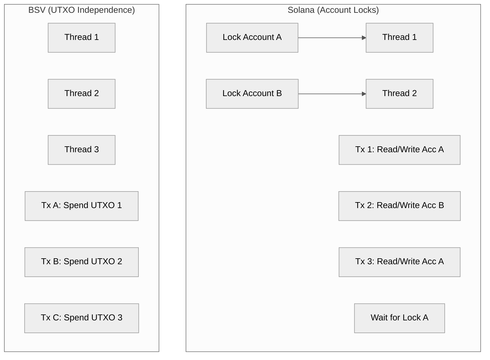

Title: Solana vs. Bitcoin SV: Two Approaches to Monolithic L1 Scaling
Date: 2026-06-15
Tags: systems, architecture, database, blockchain, solana, bitcoin, performance
Description: A deep systems engineering comparison of monolithic L1 scaling: dissecting Solana's account-based parallel execution (Sealevel) against Bitcoin SV's UTXO parallelism and database state designs.

---

When it comes to scaling blockchains, the industry is split into two major camps: the **modular camp** (which offloads transaction execution to Layer-2 rollups, like Ethereum) and the **monolithic camp** (which scales everything on a single, high-throughput Layer-1, like Solana, Bitcoin Cash, and Bitcoin SV).

Inside the monolithic camp, two projects stand out for their polar-opposite approaches to solving the same throughput problem: **Solana ($SOL)** and **Bitcoin SV ($BSV)**.

Both networks aim for sub-cent transaction fees, high throughput, and immediate settlement on the L1. However, their underlying systems architectures are completely different.

Here is a deep-dive systems engineering comparison of Solana's account-based parallel engine against Bitcoin SV's UTXO-based database state.

---

## 1. Concurrency: Solana Sealevel vs. UTXO Parallelism

To process tens of thousands of transactions per second, a blockchain cannot run transactions sequentially on a single thread. It must execute them concurrently. How they achieve concurrency is the core difference between the two architectures.

### Solana: Sealevel and Account Access Lists
Solana is an account-based system (like Ethereum). To prevent two transactions from modifying the same account balance simultaneously, Solana developed **Sealevel**, a parallel smart contract runtime.
* **How it works**: Every Solana transaction must declare exactly which accounts it will read and write to (the "Access List"). 
* **The Scheduler**: The validator's runtime scheduler reads these access lists. If two transactions modify different accounts (e.g., Alice sending to Bob, and Charlie sending to Dave), they are scheduled to run concurrently on separate GPU/CPU cores. If they modify the same account (e.g., both interacting with the same liquidity pool), the scheduler locks the account and executes them sequentially.
* **The Bottleneck**: High-demand accounts (like popular DeFi pools or mint events) create massive locking congestion, degrading performance.

### Bitcoin SV: Native UTXO Parallelism
BSV uses the **UTXO (Unspent Transaction Output)** model. There are no "accounts" or global states to lock.
* **How it works**: A transaction simply consumes specific outputs (UTXOs) and creates new ones. Every UTXO is completely independent.
* **Parallel by Design**: Because UTXOs are discrete, any two transactions that spend different inputs have **zero shared state**. A miner can validate them concurrently on separate threads with absolute safety and zero scheduler overhead. There are no "hot spots" or account locking delays.
* **The Bottleneck**: Concurrency is pushed to the client side. If a user wants to send multiple transactions rapidly, their wallet must manage and split their UTXOs (creating a pool of change outputs) so they don't try to spend the same UTXO twice in parallel.

---

## 2. State Management and Node Hardware

A blockchain's biggest bottleneck is not processing transactions—it is **writing and reading state from disk**.

### Solana: The State Bloat Problem
On Solana, the "Accounts DB" holds the active state of all balances, smart contracts, and storage on the network.
* **Memory Mapping**: To keep up with high speeds, validators must store this state in fast memory (RAM) or highly optimized PCIe Gen4 NVMe SSDs.
* **Hardware Inflation**: Because Solana allows smart contracts to store persistent data on-chain, the size of the state database grows rapidly. This forces validators to run enterprise-grade hardware (minimum 256GB RAM, high-core CPUs, and 1Gbps symmetrical fiber connections). It is practically impossible to run a Solana validator on consumer-grade hardware.

### Bitcoin SV: Lightweight Miners, Heavy Indexers
On BSV, miners do not need to keep track of contract states or account histories.
* **Pruning**: Miners only need to index the active **UTXO set** (which is a fraction of the total blockchain size) to prevent double-spending. Once a transaction is processed, the raw data can be archived or pruned by the miner. 
* **Division of Labor**: BSV separates the *consensus network* (miners) from the *application queries* (indexers). Miners focus solely on processing raw transaction volume, while application-specific indexers (like Gorilla Pool or Babbage) run custom databases to extract and query token states, ordinals, and identities.
* **The Tradeoff**: If indexers are centralized or crash (as happens during wallet downtime), the user-facing apps stop working, even if the mining network is processing blocks smoothly.

---

## 3. Clock Synchronization vs. Block Times

How do nodes agree on the sequence of events without slowing down the network?

| Feature | Solana ($SOL) | Bitcoin SV ($BSV) |
| :--- | :--- | :--- |
| **Clock Mechanism** | **Proof of History (PoH)** (VDF sequencer) | **Nakamoto Consensus** (PoW mining) |
| **Slot/Block Time** | **~400 milliseconds** | **~10 minutes** (with instant 0-conf) |
| **Finality** | Consensus voting (~2 seconds) | Miner block inclusion + proof accumulation |

### Solana's Proof of History (PoH)
Solana uses PoH, a Verifiable Delay Function (VDF) that acts as a decentralized clock. By hashing its outputs continuously, the network creates a verifiable timeline of when transactions occurred. 
* **Result**: Validators can sequence transactions without waiting for global block consensus first. This allows Solana to have **400ms slot times**, delivering incredibly fast UX.

### BSV's Nakamoto Consensus
BSV sticks to Bitcoin's 10-minute block times. However, it scales by allowing **zero-confirmation (0-conf) transactions**.
* **Result**: Because miners propagate transactions peer-to-peer instantly, and double-spending a transaction is economically difficult on a highly connected miner network, dApps accept transactions as "complete" in milliseconds before they are actually mined into a block.

---

## The Architectural Verdict

Solana and Bitcoin SV represent two different answers to the same scaling problem:

* **Solana** is a **hardware-scaling Account machine**. It achieves high performance by demanding elite hardware from its validators and utilizing a complex parallel scheduler (Sealevel) to manage shared state.
* **Bitcoin SV** is a **network-scaling UTXO machine**. It achieves performance by keeping the base protocol simple, leveraging the natural parallelism of UTXOs, and offloading state management and indexing to the application layer.

For developers, **Solana** offers immediate speed and unified state access, but at the cost of high RPC fees, extreme hardware requirements, and account-locking bottlenecks. **Bitcoin SV** offers uncapped parallel throughput and zero-cent fees, but at the cost of managing complex client-side UTXO routing and relying on fragile external indexer infrastructure.
