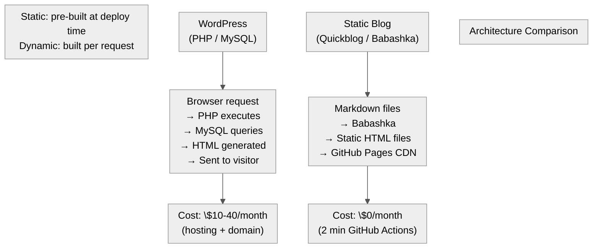
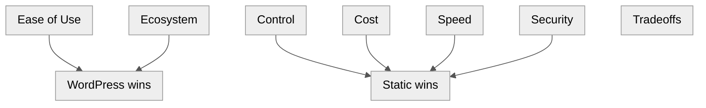

Title: Static Blog vs WordPress — A Real-World Comparison
Date: 2026-06-22
Tags: blogging, wordpress, static-site, architecture, infrastructure, comparison
Description: My blog runs on a Babashka static site generator deployed to GitHub Pages. Here's how it compares to WordPress across cost, performance, maintenance, and workflow.

---

My blog is a static site. WordPress powers ~43% of the web. Here's the real comparison using actual data from this blog.

---

## Architecture Overview

---

## Comparison Table

| Aspect | Static Blog (This One) | WordPress |
|--------|----------------------|-----------|
| **Cost** | $0 (GitHub Pages) | $10-40/mo (hosting) |
| **Page load** | ~0.3s (CDN, static files) | ~1-3s (PHP + MySQL) |
| **Homepage size** | 169 KB (metadata only) | ~2-5 MB (theme bloat) |
| **Posts** | Markdown files in git | MySQL database |
| **Backups** | `git push`, full history | Plugin or manual SQL dump |
| **Writing** | Any text editor | Browser admin panel |
| **Version control** | Git (built-in) | None (revisions plugin) |
| **Comments** | None (or Disqus/link to discuss) | Built-in |
| **Search** | None (or JS library) | Built-in or plugin |
| **SEO** | Manual meta tags | Yoast/RankMath plugin |
| **Security** | No backend to hack | Constant attack target |
| **Themes** | Custom CSS (1 file, 273 lines) | Marketplace, complex |
| **Build time** | ~30 seconds (107 posts) | Real-time (per request) |
| **Mobile** | Custom responsive CSS | Theme-dependent |
| **Analytics** | Custom Cloud Function | Jetpack/plugin |
| **Hosting migration** | Any static host, zero config | Database export + import |

---

## Pros and Cons

### Static Blog (This One)

**Pros:**
- $0 hosting. GitHub Pages is free forever.
- Fast — files served from CDN, no backend processing
- Secure — no database, no PHP, no admin panel to brute-force
- Full git history — every revision of every post is tracked
- Write in any text editor — Vim, VS Code, Notes app
- Portable — entire site is a folder of HTML files

**Cons:**
- No comments without third-party service
- No search without JS hack
- No admin UI — need git to publish
- Build step required for every change
- No live preview of draft (rebuild to see)
- No plugin ecosystem

### WordPress

**Pros:**
- Admin dashboard — write in browser, click publish
- Rich editor (Gutenberg blocks, media management)
- Comments built-in — reader engagement
- Plugin ecosystem — SEO, analytics, forms, caching
- Themes — change design without coding
- User roles — multiple authors with permissions

**Cons:**
- ~$200-500/year hosting for decent performance
- Slow — PHP + MySQL per request, even with caching
- Security surface — constant updates, vulnerabilities, brute-force attacks
- Database backups required — not in version control
- Theme/plugin bloat — average page is 2-5 MB
- Migrating away is painful (database export, URL mapping)

---

## The Tradeoff Matrix

---

## When to Pick Which

**Pick static when:**
- You're technical (comfortable with git, Markdown, CLI)
- You want zero maintenance
- You don't need comments or search
- You want maximum performance on minimum budget
- Content is text-heavy (developer blog, documentation)

**Pick WordPress when:**
- You want to write in a browser
- You need comments, forms, forums
- You want a visual page builder
- Multiple non-technical authors need to publish
- You need an ecosystem of plugins and themes

---

## Verdict

For a technical blog written by one person, static is strictly better: faster, cheaper, more secure, and version-controlled. The only real sacrifice is comments and search — both solvable with third-party services (or a small JS library for search).

WordPress makes sense when you need an admin panel, multiple authors, or complex dynamic features (e-commerce, forums, membership). For a solo technical writer, it's overhead without benefit.

This blog runs on a Babashka/Clojure static site generator, deployed to GitHub Pages, with a custom analytics Cloud Function. Total infrastructure cost: $0/year (excluding domain name).
