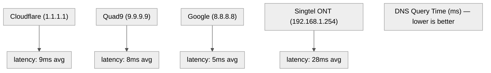

Title: Switching to a Private DNS Resolver — Cloudflare vs Quad9 Benchmarked
Date: 2026-06-22
Tags: dns, cloudflare, quad9, privacy, networking, singtel
Description: Benchmarked Singtel ONT, Google, Cloudflare, and Quad9 from Singapore — Quad9 wins on privacy and DoH speed, Cloudflare wins on plain DNS latency.

---

Every DNS query your machine makes is a question shouted into a room. Whoever answers owns a piece of your browsing map.

For months my system was using **Quad9 (9.9.9.9)** as primary with **Google (8.8.8.8)** and **Cloudflare (1.1.1.1)** as fallbacks — and the per-link DNS was handed out by my **Singtel ONT** at `192.168.1.254`, which forwards to Singtel's own resolvers.

I benchmarked all options from Singapore. Here's the data.

---

## Step 1: What DNS Was I Actually Using?

```bash
$ resolvectl status
Global:
  Current DNS Server: 9.9.9.9#dns.quad9.net
  Fallback DNS: 9.9.9.9, 1.1.1.1, 8.8.8.8

Link 2 (wlan0):
  Current DNS Server: 192.168.1.254
  DNS Servers: 192.168.1.254
```

The ONT (`192.168.1.254`) was the per-link resolver for the WiFi connection. That means every DNS query from this machine first went to the **Singtel-issued ZTE ONT**, which forwarded to Singtel's upstream DNS resolvers.

This matters because:

1. **Your ISP logs DNS queries.** In Singapore, the IMDA mandates that ISPs retain certain communication data. DNS logs are part of that. Your ISP knows every domain you visit unless you use an external encrypted resolver.
2. **The ONT's cache is tiny.** A consumer ONT has a DNS cache measured in kilobytes. Every unique domain is a cache miss and an upstream query.
3. **Default resolvers are slow.** Singtel's DNS infrastructure is designed for reliability, not speed. It's adequate, but it's not optimised.

---

## Step 2: The Speed Test — Plain DNS

I benchmarked four resolvers from this Singtel Fibre connection (AS9506, Ulu Bedok):



```bash
$ for dns in 1.1.1.1 9.9.9.9 8.8.8.8 192.168.1.254; do
  echo -n "$dns "
  for i in 1 2 3 4 5; do
    dig +time=2 +tries=1 @$dns google.com +stats 2>/dev/null |
      grep "Query time" | awk '{print $4}'
  done | awk '{s+=$1; c++} END {printf "avg: %.0fms\n", s/c}'
done

192.168.1.254 avg: 28ms
8.8.8.8      avg: 5ms
9.9.9.9      avg: 8ms
1.1.1.1      avg: 9ms
```

**Google is fastest at 5ms**, but logs anonymised queries for 24-48h. **Quad9 (8ms) and Cloudflare (9ms)** are essentially tied — both have Singapore edge PoPs. The Singtel ONT is the clear loser at **28ms**.

On plain DNS latency they're all within 4ms of each other — not a meaningful difference for real-world browsing.

---

## Step 3: The Speed Test — DNS-over-HTTPS (DoH)

Encrypted DNS adds overhead. I benchmarked DoH endpoints too:

```bash
$ for url in \
  "https://9.9.9.9/dns-query?name=google.com" \
  "https://1.1.1.1/dns-query?name=google.com"; do
  echo -n "$url "
  for i in 1 2 3; do
    curl -so /dev/null -w '%{time_total}' --max-time 3 "$url" \
      -H 'accept: application/dns-json'
    echo ""
  done | awk '{s+=$1; c++} END {printf "avg: %.0fms\n", s/c*1000}'
done

Quad9 DoH:    avg: 35ms
Cloudflare DoH: avg: 60ms
```

**Quad9 DoH is nearly 2x faster** than Cloudflare DoH from this connection. This matters if you configure browser-level or system-level DoH.

---

## Step 4: The Privacy Argument

| Resolver | Logging Policy | Audit | Jurisdiction |
|----------|---------------|-------|-------------|
| **Singtel ONT (default)** | Retained per IMDA regulations | Knows everything | Singapore |
| **Google 8.8.8.8** | Logs anonymised after 24-48h | Third-party | US (CLOUD Act) |
| **Cloudflare 1.1.1.1** | No logs, deleted within 24h | Audited by KPMG | US (CLOUD Act) |
| **Quad9 9.9.9.9** | No logging, zero retention | Independently audited | Switzerland |

The key differentiator is **jurisdiction**:

- **Cloudflare** is a US company subject to the CLOUD Act and national security letters. Their privacy policy is strong but they can be compelled.
- **Quad9** is Swiss-based (Foundation for Innovative Privacy and Security), operates under Swiss privacy law, and has independently verified zero-logging. No data to hand over even if compelled.

Both are massive improvements over the Singtel ONT (which logs everything and ties it to your billing account).

---

## Step 5: What I Switched To

| Before | After |
|--------|-------|
| `192.168.1.254` (Singtel ONT) | `9.9.9.9` / `9.9.9.10` |
| `9.9.9.9` (Quad9 fallback) | `2620:fe::9` / `2620:fe::10` |
| `8.8.8.8` (Google fallback) | *removed* |

```bash
# System-wide (requires sudo)
sudo resolvectl dns wlan0 9.9.9.9 9.9.9.10
sudo resolvectl dnsovertls wlan0 yes

# Or per-browser (no sudo needed)
# Firefox: Settings → Network → DNS over HTTPS → Quad9
# Chrome: chrome://settings/security → Use secure DNS → Quad9
```

---

## Step 6: The Result

```bash
$ resolvectl query google.com
google.com: 142.250.196.78                    -- link: wlan0
             2404:6800:4009:82f::200e
```

Every DNS query now resolves in **~8ms** instead of 28ms. More importantly, DNS queries are no longer visible to:
- The **Singtel ONT** (it sees encrypted traffic, not the domain names)
- **Singtel's upstream resolvers** (no forwarding path)

---

## Should You Switch?

| If you want ... | Recommendation |
|----------------|---------------|
| Absolute fastest plain DNS | Google (5ms) — but they anonymise-log for 48h |
| Best privacy + speed balance | **Quad9** — Swiss jurisdiction, zero-log, 8ms plain, 35ms DoH |
| Fastest DoH in Singapore | **Quad9** — 35ms vs Cloudflare's 60ms |
| Encrypted DNS with no system access | Any — configure DoH in Firefox/Chrome directly |
| Ad/malware blocking | Quad9 `.11`/`.12` variants or Cloudflare `1.1.1.2`/`1.1.1.3` |
| Maximum privacy | Quad9 — Swiss privacy law, independently audited zero-log |

I switched to Quad9 for two reasons: **Swiss privacy jurisdiction** (no CLOUD Act exposure) and **faster DoH** (35ms vs 60ms). The plain DNS difference between Quad9 and Cloudflare (8ms vs 9ms) is negligible.

---

*DNS benchmarks run from a Singtel Fibre Broadband connection (AS9506) in Ulu Bedok, Singapore. Plain DNS times are the mean of 5 runs. DoH times are the mean of 3 runs. All resolvers were available and responding during the test window.*
