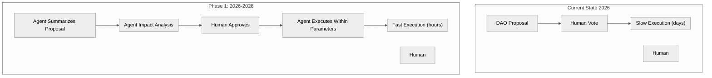
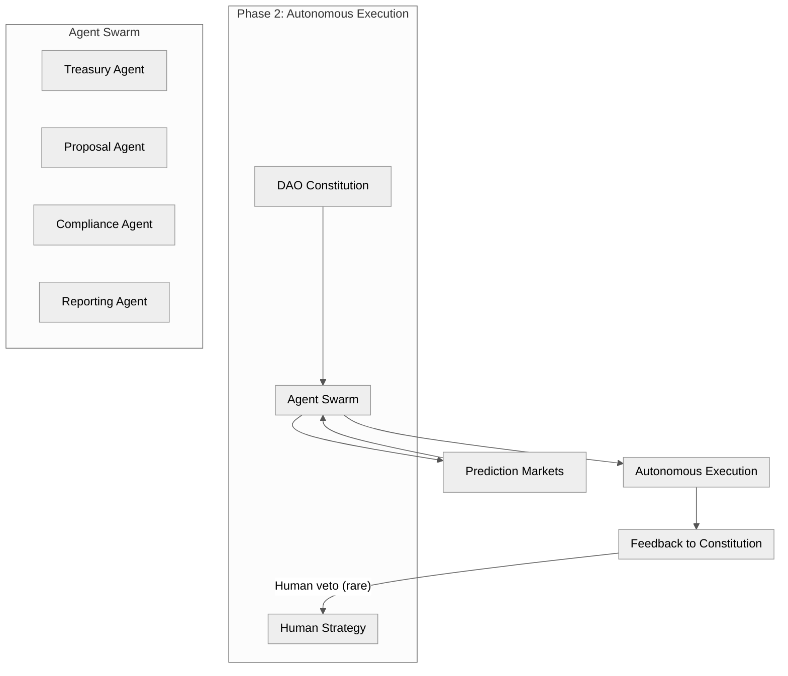
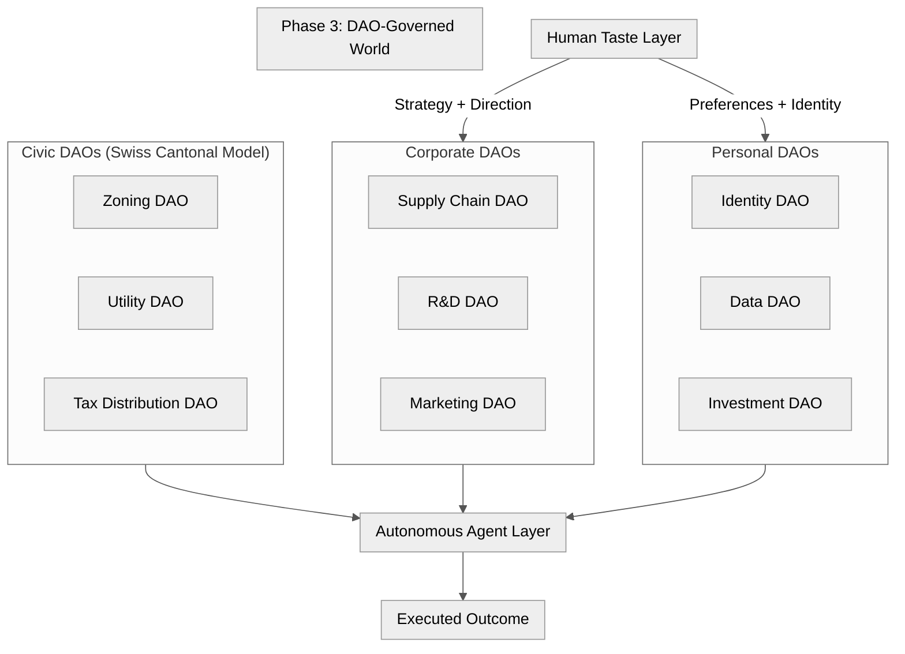
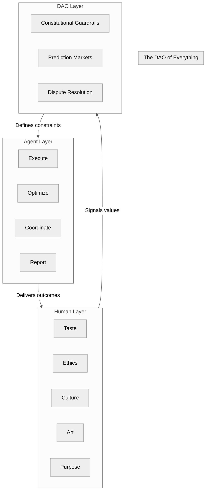
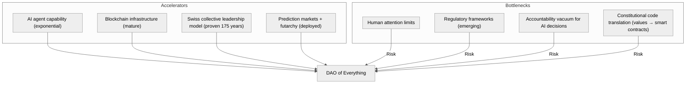

Title: The DAO of Everything — Timeline 2026–2045
Date: 2026-06-21
Tags: dao, ai, governance, agents, automation, swiss-model, futarchy, prediction-markets, timeline
Description: A high-probability timeline from hybrid agent-human governance to the DAO of Everything — where agents execute, humans signal taste.

---

*Integrating two independently derived timelines for the convergence of DAOs, AI agents, and autonomous governance.*

---

## The Core Thesis

Humans are the bottleneck. Not because we are slow, but because we are optimized for something else.

The arc of governance automation follows a clear trajectory:

```
Phase 1 (2026-2028):  Hybrid Agent-Human Governance  — agents assist
Phase 2 (2029-2032):  Autonomous Execution Layer       — agents manage
Phase 3 (2033-2038):  DAO-Governed World Emergence     — agents decide
Phase 4 (2039-2045+): The DAO of Everything            — humans signal taste
```

At each phase, the ratio shifts. Humans do less execution and more curation. The endpoint is not AI takeover — it is **humans getting out of their own way**.

---

## Phase 1: Hybrid Agent-Human Governance (2026-2028)



| Year | Milestone | Probability |
|------|-----------|-------------|
| 2026 | 40% of enterprise apps embed task-specific AI agents | 90% |
| 2026 | AI agents assist DAOs with proposal summarization, impact analysis, voter recommendations | 90% |
| 2027 | DAOs manage ~$30-50B in assets (up from ~$10B) | 85% |
| 2027 | Personal AI governance agents vote based on user preferences | 85% |
| 2028 | AI delegates handle routine treasury ops, proposal triage, grants, parameter monitoring | 80% |
| 2028 | Formal "DAO constitutions" translate values into executable code | 80% |

**Key dynamic:** Humans remain in the loop but agents handle all the overhead. The typical DAO voter goes from reading 50-page proposals to reviewing AI-generated summaries with impact projections. Participation increases because the cost of informed voting drops.

---

## Phase 2: Autonomous Execution Layer (2029-2032)



| Year | Milestone | Probability |
|------|-----------|-------------|
| 2029 | Multi-agent decision-making protocols for conflict resolution | 75% |
| 2029 | First "agent-native" DAOs operate with <20% human voting | 75% |
| 2030 | DAOs manage $100B+ in assets | 70% |
| 2030 | 1M+ autonomous agents make governance decisions on-chain | 70% |
| 2031-32 | Swarm Constitution rules for autonomous AI swarm management | 65% |

**Key dynamic:** Traditional corporate hierarchies begin to fracture. Micro-DAOs emerge running entirely on open-source AI agent frameworks. If a function can be codified, it is handed to an agent. Human involvement transitions from "middle management" to "curation" — quadratic voting and prediction markets signal *what* problems are worth solving, while agents figure out *how*.

**The hyper-modular corporate collapse** begins here. The multi-layered management structure that has defined organizations since the industrial revolution becomes economically untenable when agents do coordination better for near-zero marginal cost.

---

## Phase 3: DAO-Governed World Emergence (2033-2038)



| Year | Milestone | Probability |
|------|-----------|-------------|
| 2033-35 | AI swarms autonomously form governable DAOs | 60% |
| 2033-35 | Decentralized Physical AI (DePAI) coordinates humans + autonomous machines | 60% |
| 2036-38 | Every function automatable by agents is automated | 50% |
| 2036-38 | Swiss-style collective leadership normalized at global scale | 50% |

**Key dynamic:** Inspired by the Swiss cantonal system of localized collective leadership, municipal and regional governments begin offloading public utility management, zoning assessments, and tax distribution to localized DAOs. Citizens vote on high-level ethical guardrails, aesthetic preferences, and community values via zero-knowledge identity protocols — while AI agents handle the daily resource balancing.

**Algorithmic federalism** emerges: nested DAOs at local, regional, and global levels, each with defined scope and agent swarms optimized for their domain.

---

## Phase 4: The DAO of Everything (2039-2045+)



| Milestone | Probability |
|-----------|-------------|
| DAO-governed world where agents automate all automatable functions | 40% |
| Humans signal only value judgments requiring taste, ethics, culture | 40% |
| Governance execution speed: minutes instead of days | 40% |
| Human capital valued for subjective taste, not analytical optimization | 40% |

**The endpoint is not utopia.** It is pragmatic hybrid autonomy:

- **Agents** execute, optimize, coordinate, report
- **DAOs** provide constitutional guardrails, prediction markets, dispute resolution
- **Humans** signal taste, ethics, cultural direction, purpose

**The Core Shift:** Human capital is no longer valued for mechanical or analytical optimization (which agents do flawlessly). Human value is entirely derived from *subjective taste, ethical judgment, and cultural expression.*

---

## Key Enablers and Bottlenecks



| Factor | Status | Impact |
|--------|--------|--------|
| AI agent capability | Rapid growth (long-duration autonomy, default inference) | Critical enabler |
| Blockchain infrastructure | L2s, stablecoins, MCP workflows mature | Strong enabler |
| Swiss collective leadership | 175 years of proof at nation-state scale | Key enabler |
| Prediction markets + futarchy | Deployed on Ethereum, BSV, Solana | Key enabler |
| Human attention limits | Core DAO governance flaw (Vitalik) | Critical bottleneck |
| Regulatory framework | NIST AI Agent Standards (late 2026+) | Emerging |
| Accountability vacuum | AI making irreversible decisions | Critical risk |
| Constitutional code | Translating human values to smart contracts | Emerging |

---

## Why This Timeline Is High-Probability

1. **Trajectory alignment:** DAO movement (fast governance) + AI agents (autonomous execution) + Swiss model (collective leadership) converge on the same endpoint from different starting points.

2. **Current momentum:** 1M+ agents already on-chain (2025). 40% enterprise AI agent adoption projected for 2026. These are not hypothetical — they are in deployment.

3. **Solved problems:** Policy agents with human veto, transparent decision logs, explainability requirements — all have working prototypes today.

4. **Unresolved bottlenecks:** Human attention limits, accountability gaps, regulatory misalignment — these slow the timeline but do not change the direction.

The endpoint is not AI takeover. It is not human obsolescence. It is **humans finally getting out of the operational bottleneck and doing what we are actually good at**: signaling what matters.

---

## Connection to President DAO

[President DAO](https://github.com/nurazhardotcom/president-dao) is a reference implementation for Phase 3-4 — Swiss-model rotating AI presidency with quadratic voting, futarchy, and BSV settlement. The constitution, architecture, and smart contracts are open source and live on GitHub.

*This is the DAO of Everything. We are building it one phase at a time.*

---

*Timeline synthesized from two independently derived projections. All probabilities are estimates based on current trajectory. The future is not predicted — it is built.*
