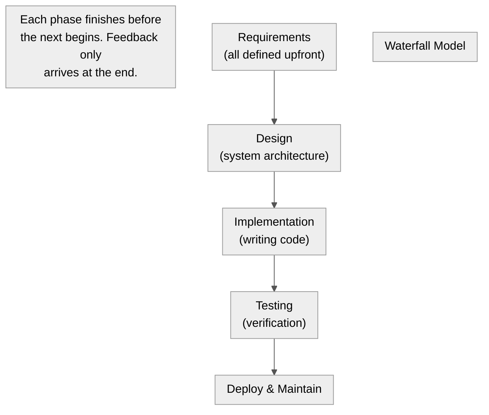
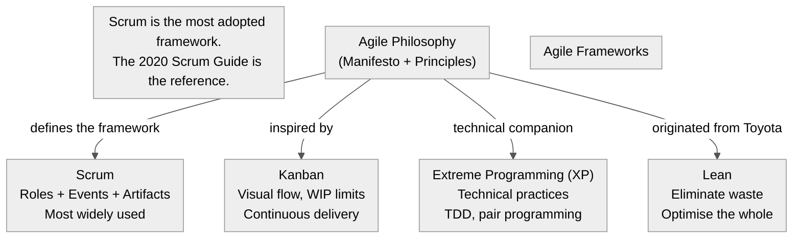

Title: Why Agile? — The Problem That Waterfall Couldn't Solve
Date: 2026-06-22
Tags: agile, scrum, project-management, methodology, waterfall, lithan
Description: Why did software development shift from Waterfall to Agile? The core problem, the Agile Manifesto, and why "responding to change" won over "following a plan."

---

Before Agile, most software projects used **Waterfall**: plan everything upfront, build in sequence, deliver at the end. It worked for bridges and buildings. It failed for software.

This post covers the foundation you need before studying Scrum: why the old model broke, what Agile replaced it with, and the principles that Scrum implements.

---

## The Waterfall Model

Waterfall has five sequential phases:

This works when:
- Requirements are fully known upfront
- The problem is well-understood
- Change is expensive (bridges, buildings)

It fails when:
- Requirements change (they always do)
- Users don't know what they want until they see it
- The market shifts during development

---

## Why Software Is Different

A bridge is built once. The requirements are physics: span this distance, support this load, survive this wind. You can't pour concrete and then decide to move the bridge 50 metres.

Software has no concrete. You *can* change your mind after building. The cost of change is low — a few keystrokes, not demolition.

The Standish Group's Chaos Report (1990s-2000s) consistently found that **70%+ of software projects using Waterfall failed** — late, over budget, or never delivered. The root cause: requirements gathered at the start were wrong by the time the software shipped, 12-24 months later.

---

## The Agile Manifesto (2001)

Seventeen software practitioners met in Snowbird, Utah, and wrote four value statements:

> **Individuals and interactions** over processes and tools
> **Working software** over comprehensive documentation
> **Customer collaboration** over contract negotiation
> **Responding to change** over following a plan

These are *value shifts*, not absolutes. You still need processes, documentation, contracts, and plans. But when forced to choose, Agile prioritises the left side.

The Manifesto also has 12 Principles. The most relevant for understanding Scrum:

> **"Deliver working software frequently, from a couple of weeks to a couple of months, with a preference to the shorter timescale."**
>
> **"Welcome changing requirements, even late in development. Agile processes harness change for the customer's competitive advantage."**
>
> **"Business people and developers must work together daily throughout the project."**
>
> **"At regular intervals, the team reflects on how to become more effective, then tunes and adjusts its behaviour accordingly."**

Scrum implements these principles through its events and artefacts.

---

## From 12 Months to 2 Weeks

The critical shift is **cycle time**:

| Model | Planning horizon | Feedback arrives | Cost of change |
|-------|-----------------|------------------|----------------|
| Waterfall | Entire project (months) | At delivery (too late) | Very high |
| Agile | One iteration (1-4 weeks) | Every iteration | Low |

A 2-week Sprint means you never go more than 14 days without showing working software to a stakeholder. If you're building the wrong thing, you find out in 2 weeks, not 12 months.

---

## Common Agile Frameworks

Waterfall is a methodology. Agile is a philosophy. Multiple frameworks implement Agile principles:

Your course covers **Scrum** specifically, with the 2020 Scrum Guide as the definitive reference.

---

## Why This Matters for Your Course

Your APM module starts with "Fundamentals of Agile Project Management and Scrum" because you need to understand:

1. **The problem**: Waterfall assumes requirements are stable. They aren't.
2. **The solution**: Iterative delivery with frequent feedback loops.
3. **The philosophy**: Agile values (individuals, working software, collaboration, responding to change).
4. **The framework**: Scrum implements Agile through specific roles, events, and artefacts.

The rest of the module builds on this foundation.

---

## Key Takeaways for Study Notes

- Waterfall fails for software because requirements change during development
- Agile delivers in short cycles (1-4 weeks) to get feedback early
- The Agile Manifesto prioritises working software and responding to change
- Scrum is the most widely used Agile framework
- Your course covers Scrum via the 2020 Scrum Guide

---

*Sources: Agile Manifesto (2001), Standish Group Chaos Report, 2020 Scrum Guide.*
