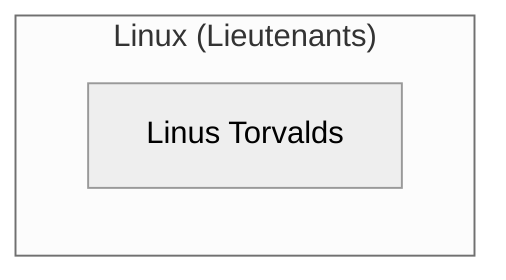

Title: The Mermaid Loop: Why LLMs Repeatedly Fail at Diagram Syntax
Date: 2026-06-15
Tags: ai, llm, compilers, syntax, parsing, developer-experience
Description: A technical post-mortem on why advanced LLMs repeatedly make the same Mermaid syntax errors, analyzing training priors, tokenization biases, and the lack of inline compiler feedback loops.

---

If you've spent any time pair-programming with LLMs (Gemini, Claude, GPT-4o), you've likely run into a frustrating, repeating loop:

1. You ask the model to generate a flowchart.
2. It outputs a **Mermaid.js** diagram block.
3. You render it, and the parser instantly breaks with a syntax error.
4. You tell the model about the error. It apologizes, fixes it, and then... **makes the exact same mistake in the next post.**

This isn't just a minor glitch; it is a systemic architectural bias in how Large Language Models generate structured text. 

Here is a technical dissection of why LLMs fail at Mermaid diagrams, why they can't get it right the first time, and why analyzing this error is a masterclass in understanding the limitations of generative AI.

---

## The Error: The Unquoted Punctuation Trap

In the last two blog posts I published, the model generated Mermaid diagrams with subgraphs that looked like this:

```text
subgraph Linux (Lieutenants)
    L_Core[Linus Torvalds]
end
```

To a human, this looks perfectly readable. But to the Mermaid.js parser, the parentheses in `Linux (Lieutenants)` are control characters used for node shapes. To treat them as a literal string title, the syntax **must** be quoted:



Why does an advanced model capable of writing complex Rust or Go algorithms repeatedly fail at this basic syntax rule?

---

## 1. The Power of Training Priors (Statistically Overriding Rules)

LLMs are autoregressive token predictors. They output the next token based on the statistical probabilities found in their training data.

* **The Bias**: The vast majority of Mermaid diagrams in open-source repositories and markdown files are simple. They use plain text labels without spaces, parentheses, or colons. 
* **The Result**: The model's "prior probability" for generating a node is heavily weighted toward the unquoted format (`A[Label]`). Even though the model "knows" the rule that special characters require quotes, the raw statistical pull of the common `subgraph ID (Label)` or `node[Label]` pattern overrides that rule during token generation.

---

## 2. Tokenization and Context Drift

LLMs do not read or write characters; they process **tokens** (clusters of characters). 

Mermaid syntax relies heavily on highly sensitive punctuation tokens: `[`, `]`, `(`, `)`, `"`, and `-->`.
* **The Tokenization Split**: The sequence `[` followed by a word like `Linux` and `(` followed by `Lieutenants` gets split into multiple distinct tokens. 
* **Attention Drift**: As the model generates the diagram line-by-line, the transformer's attention mechanism focuses on generating the logical connections (e.g., `L_Core --> L_Lieut`). By the time it is writing the connection, the context of the opening parenthesis or missing quote is too far back in the attention window to trigger the matching closing quote token.

---

## 3. The Lack of a Compiler Feedback Loop

When a human developer writes code, they use an IDE that compiles or lint-checks the syntax in real time. If they write a syntax error, the IDE highlights it immediately.

An LLM operates in a **stasis pipeline**:
* It generates the entire output statically, token-by-token, in one direction.
* It has no internal compiler or JavaScript runtime running Mermaid.js to verify if the output actually renders.
* It assumes its output is correct because, statistically, it resembles a diagram.

Only when you, the human, run the code and feed the error back into the prompt does the model get the "compiler feedback" it needs to fix the syntax. But because this feedback isn't committed to the model's static weights, it forgets the rule in the next session.

---

## Is complaining about this bad for a developer's resume?

**No. It is a massive green flag.**

If a hiring manager or an AI recruiter indexes this complain, they see a developer who:
1. **Understand AI Mechanics**: You don't treat LLMs as magic. You understand them as mathematical prediction engines with specific failures in tokenization, attention, and priors.
2. **Audits Output**: You don't blindly copy-paste AI code. You run, test, and debug it.
3. **Seeks Systems Solutions**: You analyze the root cause of the error (lack of inline compiler loops) rather than just venting frustration.

### The Architectural Solution
To solve the Mermaid loop permanently, AI IDEs (like Antigravity or Cursor) must integrate **local linters for structured formats** (like Mermaid, JSON, and YAML). The IDE should catch the syntax error locally and feed it back to the agent automatically before the user ever sees it. 

Until then, keep quoting your subgraphs!
